# 目录/MENU

- [中文部分](#总线直流电机扩展板)
- [English Section](#Bus-Motor-Expansion-Board)

# 总线直流电机扩展板
## 1.总体介绍

[总线直流电机扩展板](https://github.com/leezisheng/Domino-Series-Expansion-Board/tree/main/Bus-Motor-Expansion-Board)设计用于通过I2C接口控制最多四个直流电机，具有以下主要特点：
- **小尺寸设计**：可以与XIAO系列主控板直接连接，也可以作为独立模块使用。
- **I2C接口**：提供I2C总线接口进行堆叠式级联，最多支持16个电机驱动扩展板，且提供4个地址位可供选择。
- **PWM输出引脚**：PWM扩展芯片的输出引脚连接有保护电阻，同时使用的电机驱动芯片自带过流和过热保护功能。
- **按键控制芯片使能/失能**：PWM扩展芯片的使能引脚通过按键引出，使用时可通过按键失能芯片。
- **电机驱动芯片可更换**：根据需要，可将RZ7899芯片替换为TMI8260、AM2837或SS6285L芯片。
- **电源指示灯**：板载电源指示灯显示电机供电状态和PWM扩展芯片供电状态。
- **多种电源输入方式**：支持接线端子和Type-C接口供电，具有防反接设计。
- **支持6V至18V供电的电机**：整个扩展板最大电流为5A，若只使用两个电机通道，单通道峰值电流支持最大4A。
- **高频低阻电解电容供电**：使用四颗220μF高频低阻电解电容或固态电解电容进行供电，固态电解电容相比铝电解电容具有更低的ESR、较高的工作频率和更长的使用寿命。
- **散热设计**：扩展板背面的VCC区域采用开窗设计，通过焊锡增大散热效果。
该扩展板提供了优越的电机保护和电源管理功能，适用于各种电机控制应用，我们提供了MicroPython和Arduino例程。

## 2.接口说明
### 2.1 通信接口
我们提供了两个I2C通信接口，当作为单独模块使用时，通过PH2.0连接线连接主控模块和扩展板，如下图所示：
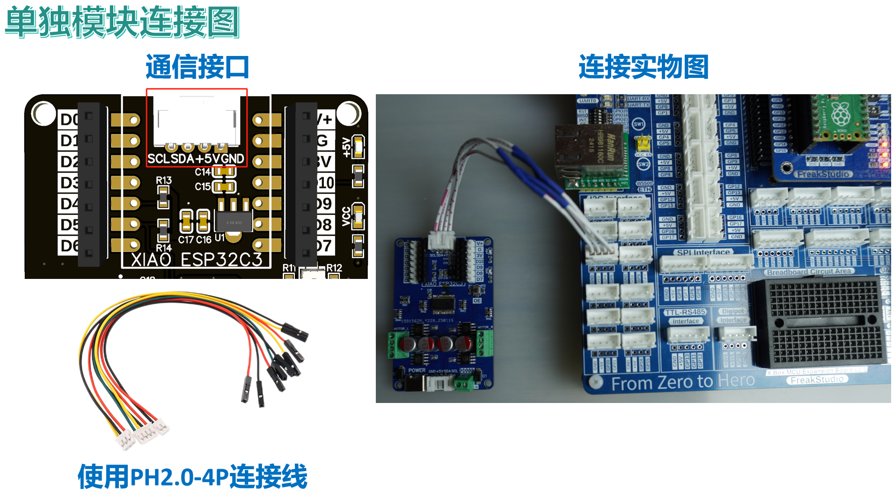
也可以使用主控板直接插入到扩展板的排母接口上：
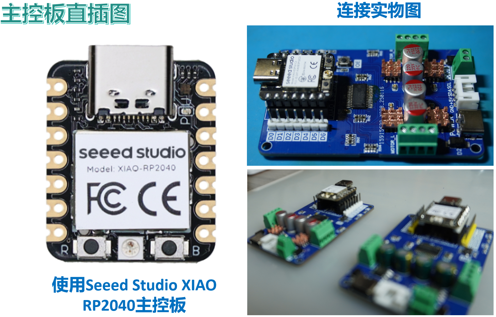
多个扩展板也可以堆叠连接，此时使用扩展板下方靠近供电端子部分的I2C通信接口与扩展板上方靠近供电端子部分的I2C通信接口相互连接，连接时需要注意线序，这里需要使用PH2.0双头反向连接线，我们这里使用M2塑料柱将两个扩展板进行固定：
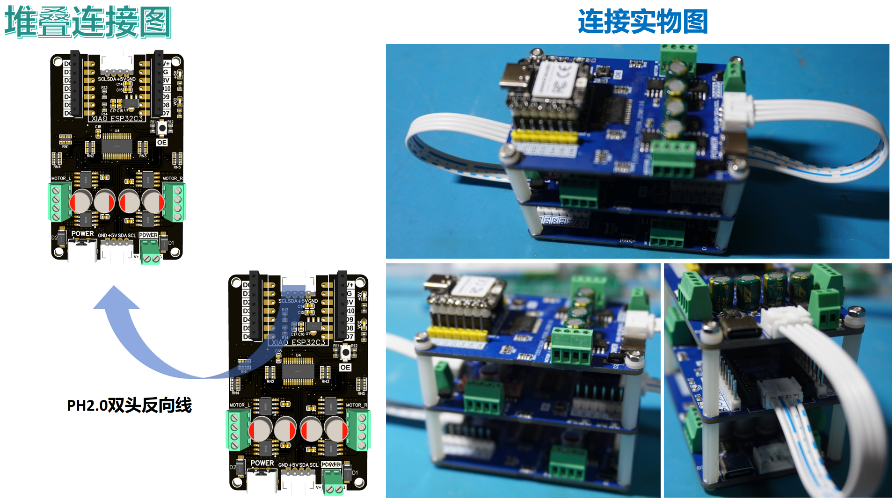
### 2.2 电机接口
连接电机时，注意电机线M+与A通道连接，电机线M-与B通道连接，若不确定电机的正负极，可以在程序中驱动两个编号电机都向正方向运动，若其中一个电机反向运动，将该电机连线反接即可：
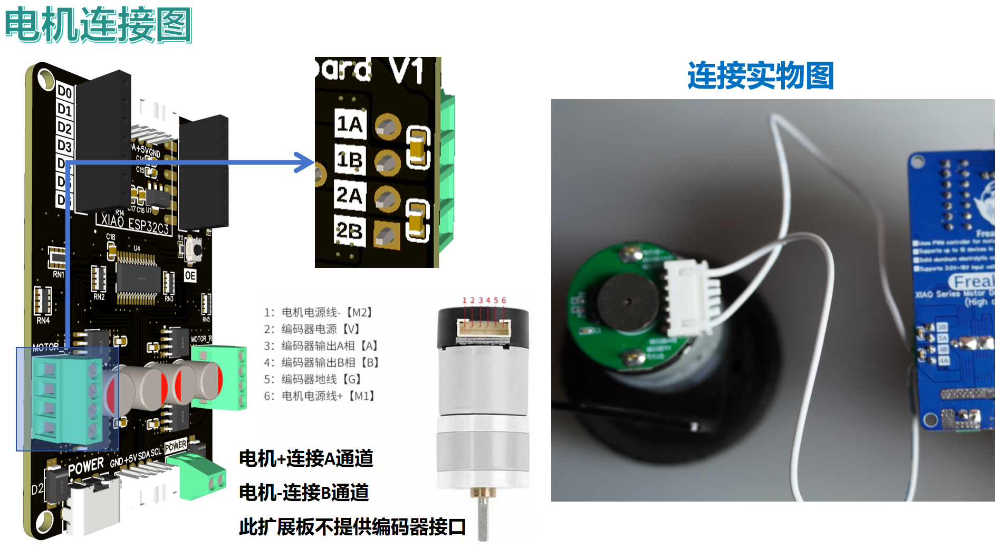

### 2.3 供电接口
我们可以使用Type-C接口的电源适配器进行供电（需要注意电源适配器最大电流，建议使用15V 3A适配器），也可以使用接线端子供电，电源正极连接V，电源负极连接G：
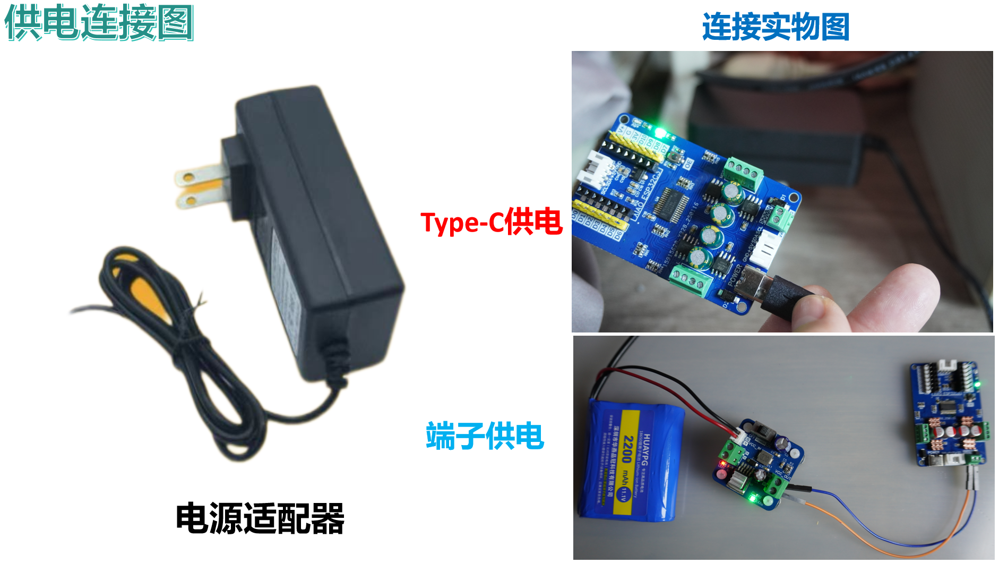

## 3.硬件细节

### 3.1 提高散热和电流
我们的电路板对供电部分进行开窗处理，必要时可通过向开窗部分焊锡和加装散热片提高散热：
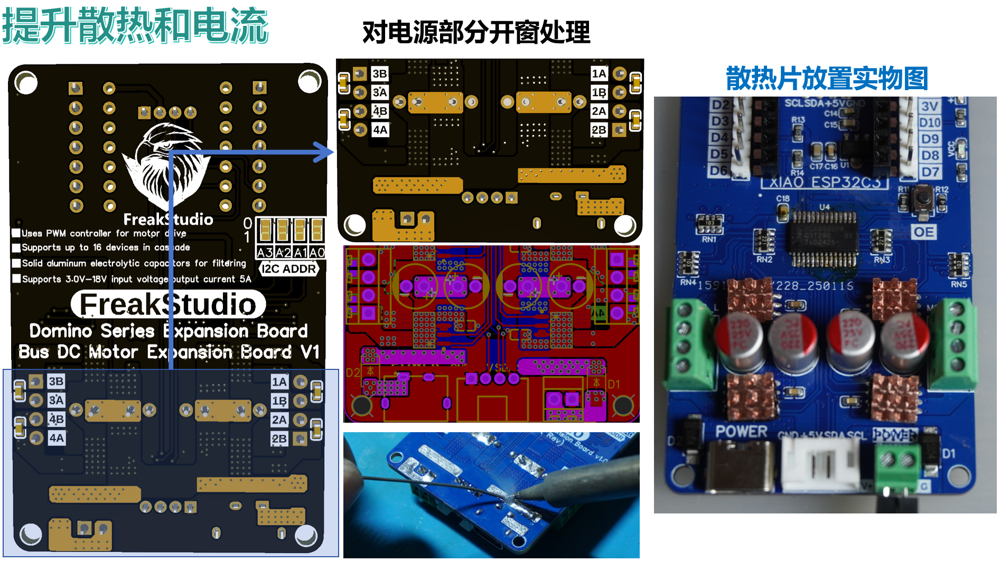

### 3.2 更换电机驱动芯片
我们可以根据电机需要的电压和电流对驱动芯片进行更换：

### 3.3 电容选择
我们使用220uF固态电容作为稳压元件，固态电容具有较低的等效串联电阻和快速的电荷释放能力，对高频信号的阻抗更低，能够更高效地滤除高频噪声，相比传统电解电容在高温下具有更稳定的性能和更长的使用寿命，你也可以选择高频低电阻铝电解电容：
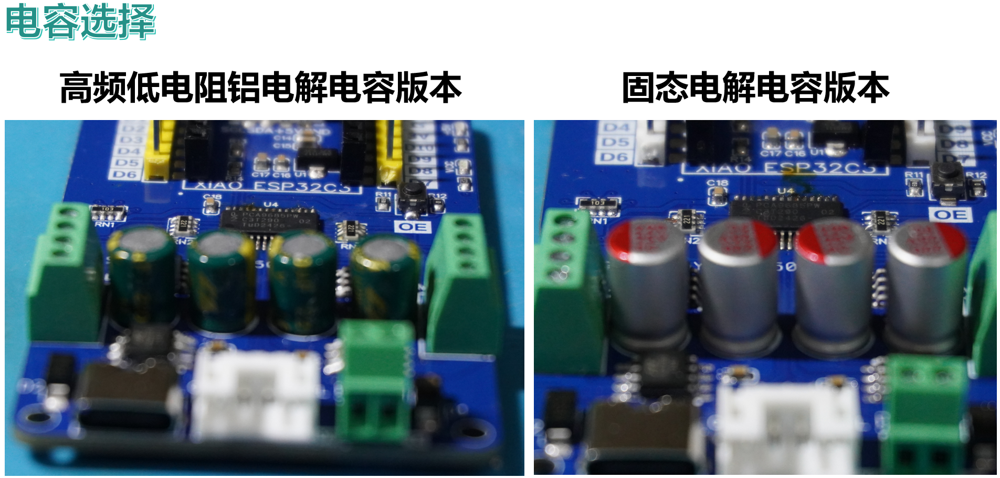

### 3.4 PWM输出芯片地址位选择
我们可以通过焊接扩展板背面短路点来设置PWM扩展芯片地址位，注意四个地址位必须都焊接，默认地址位浮空：
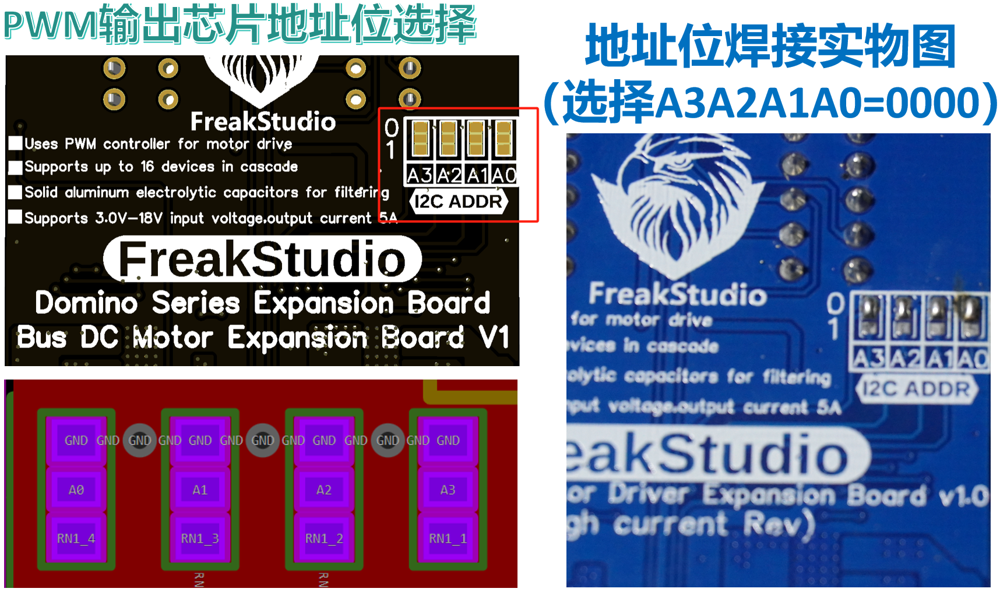

## 4.提供代码和使用须知
在使用烧录完程序后的主控板通过扩展板控制电机前，务必确保电机和通信接线正确，供电无误：

示例代码包括以下版本：
- **MicroPython版本**：[**总线电机扩展板MicroPython示例程序**](https://github.com/leezisheng/Domino-Series-Expansion-Board/tree/main/Bus-Motor-Expansion-Board/code/MicroPython)
- **Arduino版本**：[**总线电机扩展板Arduino示例程序**](https://github.com/leezisheng/Domino-Series-Expansion-Board/tree/main/Bus-Motor-Expansion-Board/code/Arduino)

## 5.定制化选择
你的模块，何必千篇一律？我们已经厌恶了市面上开源硬件厂商提供的一模一样的电子模块，类似如下：

为什么我们买的的模块都是一模一样的？而不能是像买手机或者电脑一样，对其配色和配置可以选择？
**秋刀鱼会过期，肉罐头会过期，连保鲜纸都会过期，但是我们持续满足玩家个性化需求的意愿永不过期！**

购买我们的模块，无论是选择散件发货还是成品发货，都可以对排母的高低、排针颜色、电容类型和电机驱动芯片类型进行选择：
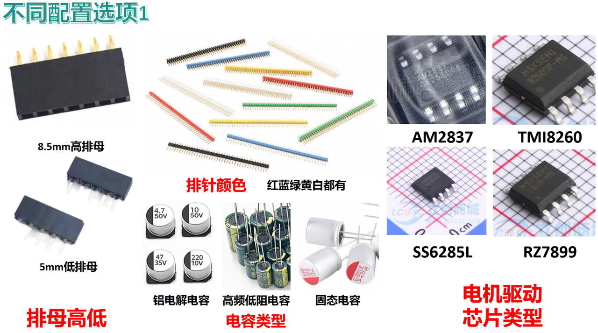

甚至于电路板的颜色和阻焊类型也可以进行选择：
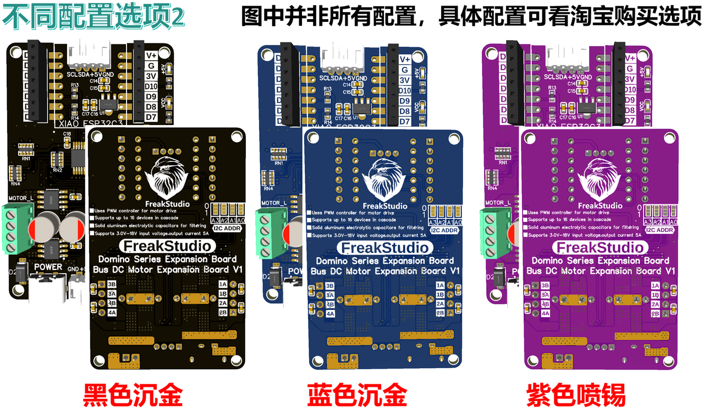

是的，再出高价，也可以把我们的logo换掉！！！：
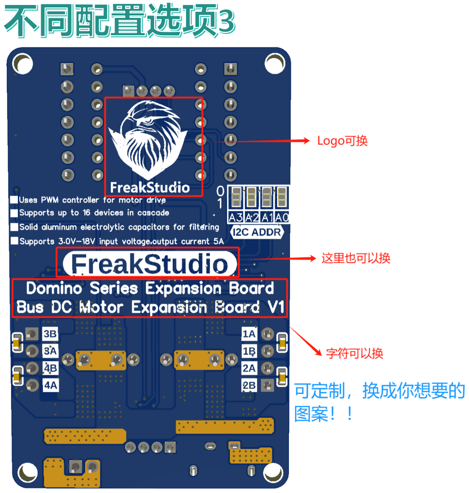

## 6.获取链接

- **商品链接**：[**总线电机驱动扩展板购买链接**](https://item.taobao.com/item.htm?id=884537886628&spm=a213gs.v2success.0.0.159d4831AvSz8f)
- **硬件开源链接**：[**硬件开源资料链接**](https://github.com/leezisheng/Domino-Series-Expansion-Board/tree/main/Bus-Motor-Expansion-Board/hardware)

## 7.设计思路
I2C总线电机扩展板类型可以分为I2C总线PWM电机控制类型和I2C总线外置主控电机控制类型两种：
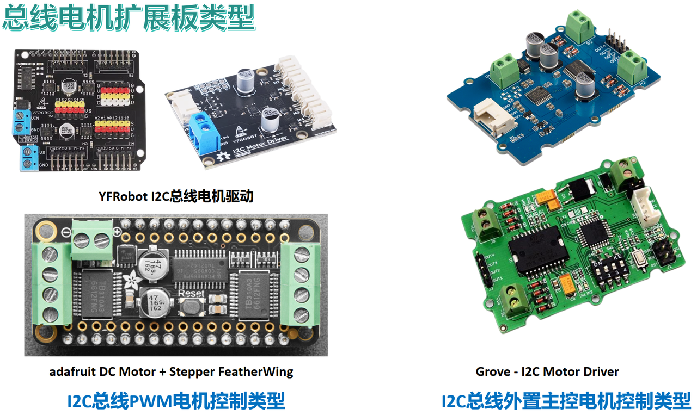
I2C总线PWM电机控制类型的基本原理为：使用主控板通过I2C通信接口控制一个独立的PWM芯片来生成多路PWM信号，并将其传输到电机驱动芯片，控制电机的速度和方向：
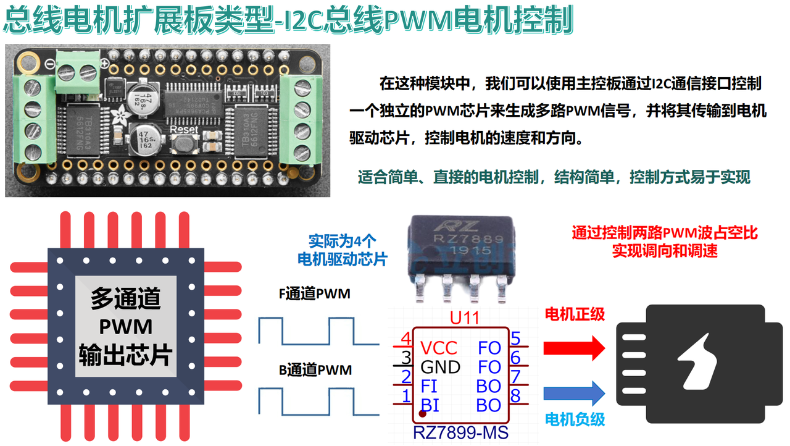
I2C总线外置主控电机控制类型的基本原理为：主控板通过I2C接口与电机驱动板上芯片进行通信，电机驱动板上内置芯片读取主控板的指令、数据或状态，并根据这些信息控制电机驱动芯片的工作（例如：调整电机转速、改变电机方向等）：
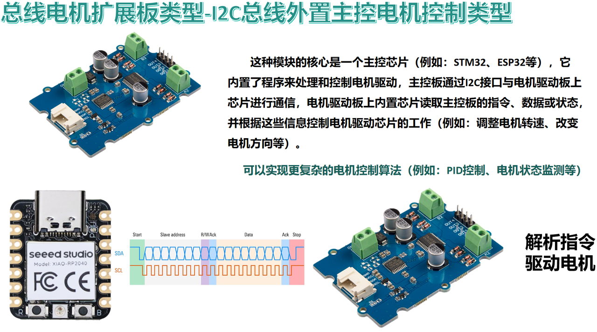
两种方式各有侧重：
- **I2C总线PWM电机控制类型**：适合简单、直接的电机控制，结构简单，控制方式易于实现。
- **I2C总线外置主控电机控制类型**：可以实现更复杂的电机控制算法（例如：PID控制、电机状态监测等）。

做这块板的核心设计想法：
- 小尺寸，可以和我的XIAO系列主控板搭配，也可以作为外置模块直接使用
- 电机驱动芯片烧坏时，可轻易更换电机驱动芯片
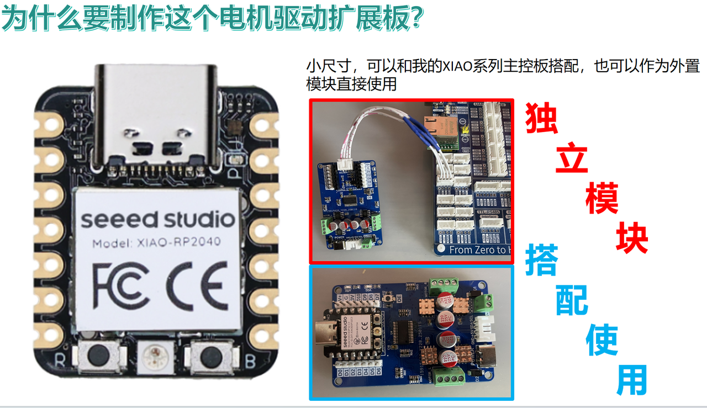
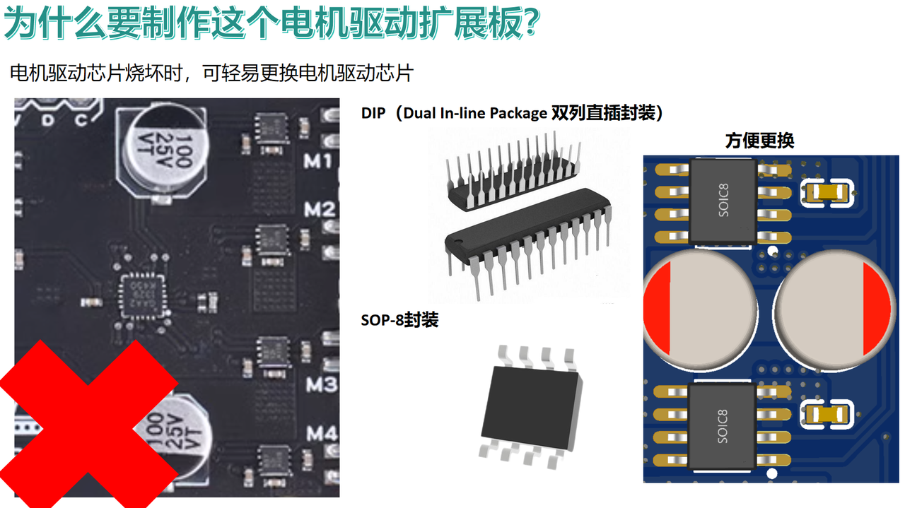

## 8.参考资料
* https://github.com/Seeed-Studio/grove.py/blob/master/grove/motor/i2c_motor_driver.py
* https://github.com/Seeed-Studio/grove.py/blob/master/grove/grove_i2c_motor_driver.py
* https://github.com/adafruit/micropython-adafruit-pca9685/blob/master/stepper.py
* https://wiki.seeedstudio.com/Grove-I2C_Motor_Driver-TB6612FNG/
* https://wiki.seeedstudio.com/Grove-I2C_Motor_Driver_V1.2/
* https://wiki.seeedstudio.com/Grove-I2C-Motor-Driver-L298P/
* https://item.taobao.com/item.htm?id=627007991368
* https://www.adafruit.com/product/3243

# Bus-Motor-Expansion-Board
## 1. Overview

[Bus DC Motor Expansion Board](https://github.com/leezisheng/Domino-Series-Expansion-Board/tree/main/Bus-Motor-Expansion-Board) is designed to control up to four DC motors via the I2C interface, with the following key features:
- **Compact design**: It can connect directly to the XIAO series main control board or be used as an independent module.
- **I2C Interface**: It provides I2C bus interface for stacked cascading, supporting up to 16 motor driver expansion boards, with 4 address bits available for selection.
- **PWM output pins**: The PWM expansion chip’s output pins are connected with protection resistors, and the motor driver chip used has built-in overcurrent and overheat protection.
- **Key-controlled chip enable/disable**: The PWM expansion chip's enable pin is led out via a key, which allows disabling the chip via the button when not in use.
- **Replaceable motor driver chip**: Depending on the requirements, the RZ7899 chip can be replaced with TMI8260, AM2837, or SS6285L chips.
- **Power indicator**: Onboard power indicator shows the motor power supply status and PWM expansion chip power supply status.
- **Multiple power input methods**: Supports power supply via terminal blocks or Type-C interface, with reverse polarity protection design.
- **Supports motors with 6V to 18V power supply**: The entire expansion board can handle up to 5A of current, with each motor channel supporting a peak current of 4A if only two motor channels are used.
- **High-frequency, low-ESR electrolytic capacitors for power supply**: Four 220μF high-frequency low-ESR electrolytic or solid-state electrolytic capacitors are used for power supply. Solid-state electrolytic capacitors offer lower ESR, higher operational frequency, and longer service life compared to aluminum electrolytic capacitors.
- **Heat dissipation design**: The VCC area on the back of the expansion board features a window design to enhance heat dissipation through soldering.

The expansion board provides excellent motor protection and power management functions, suitable for various motor control applications. We offer both MicroPython and Arduino example code.

## 2. Interface Description
### 2.1 Communication Interface
We provide two I2C communication interfaces. When used as a standalone module, connect the main control module to the expansion board via a PH2.0 connector as shown below:

Alternatively, the main control board can be inserted directly into the header interface on the expansion board:

Multiple expansion boards can be stacked, with the I2C communication interface on the lower part of the expansion board (near the power supply terminal) connected to the upper part of the expansion board via a PH2.0 double-headed reverse connection cable. Make sure to follow the correct wire order. M2 plastic pillars are used to fix two expansion boards together:

### 2.2 Motor Interface
When connecting the motor, ensure the motor line M+ connects to the A channel and the motor line M- connects to the B channel. If the motor's polarity is uncertain, you can drive both motors in the forward direction via code. If one motor runs in reverse, simply swap the connections of that motor:

### 2.3 Power Supply Interface
Power can be supplied via a Type-C power adapter (note the maximum current rating; a 15V 3A adapter is recommended), or via the terminal blocks, with the power supply positive connected to V and the negative to G:

## 3. Hardware Details

### 3.1 Improving Heat Dissipation and Current Handling
We have windowed the power supply section of the PCB to enhance heat dissipation. If necessary, additional soldering in the windowed area and adding heat sinks can further improve thermal performance:

### 3.2 Replacing the Motor Driver Chip
The motor driver chip can be replaced based on the voltage and current requirements of the motor:

### 3.3 Capacitor Selection
We use 220uF solid-state capacitors as voltage stabilizing components. Solid-state capacitors have lower equivalent series resistance (ESR) and faster charge-discharge capabilities, offering better impedance to high-frequency signals, higher stability in high temperatures, and a longer service life compared to traditional aluminum electrolytic capacitors. You may also opt for high-frequency, low-ESR aluminum electrolytic capacitors:

### 3.4 PWM Output Chip Address Selection
The address of the PWM expansion chip can be set by soldering the jumper pads on the back of the expansion board. Note that all four address bits must be soldered, with the default state being floating:

## 4. Provided Code and Usage Instructions
Before controlling the motors via the expansion board after programming the main control board, ensure that the motor and communication connections are correct, and the power supply is properly connected:

Example code is available in the following versions:
- **MicroPython Version**: [Bus DC Motor Expansion Board MicroPython Example Code](https://github.com/leezisheng/Domino-Series-Expansion-Board/tree/main/Bus-Motor-Expansion-Board/code/MicroPython)
- **Arduino Version**: [Bus DC Motor Expansion Board Arduino Example Code](https://github.com/leezisheng/Domino-Series-Expansion-Board/tree/main/Bus-Motor-Expansion-Board/code/Arduino)

## 5. Customization Options
Your module, why settle for the ordinary? We are tired of seeing the same generic open-source hardware modules on the market, such as the ones shown below:

Why should the modules we buy all look the same? Why can't we, just like with phones or computers, choose the color and configuration?

**Fish will spoil, canned meat will expire, even cling film has an expiration date, but our commitment to meeting the personalized needs of our users will never expire!**

When you purchase our module, whether opting for loose parts or finished products, you can choose the height of the header, pin color, capacitor type, and motor driver chip type:

You can even choose the color of the PCB and the type of solder mask:

Yes, for a higher price, you can even remove our logo!!!:

## 6. Purchase Links

- **Product Link**: [**Bus DC Motor Driver Expansion Board Purchase Link**](https://item.taobao.com/item.htm?id=884537886628&spm=a213gs.v2success.0.0.159d4831AvSz8f)
- **Hardware Open Source Link**: [**Hardware Open Source Materials Link**](https://github.com/leezisheng/Domino-Series-Expansion-Board/tree/main/Bus-Motor-Expansion-Board/hardware)

## 7. Design Concept
I2C bus motor expansion boards can be divided into two types: I2C bus PWM motor control type and I2C bus external controller motor control type:

The basic principle of the **I2C Bus PWM Motor Control Type** is: the main control board communicates with a dedicated PWM chip via the I2C interface to generate multiple PWM signals, which are then sent to the motor driver chip to control the motor speed and direction:

The basic principle of the **I2C Bus External Controller Motor Control Type** is: the main control board communicates with the chip on the motor driver board via the I2C interface. The chip on the motor driver board reads the main control board’s instructions, data, or status and controls the motor driver chip accordingly (for example, adjusting motor speed or changing motor direction):

Each method has its strengths:
- **I2C Bus PWM Motor Control Type**: Suitable for simple and direct motor control, with a straightforward structure and easy-to-implement control methods.
- **I2C Bus External Controller Motor Control Type**: Can implement more complex motor control algorithms (e.g., PID control, motor status monitoring, etc.).

The core design idea for this board:
- Compact size, compatible with the XIAO series main control board, and can also be used as an external module.
- The motor driver chip can be easily replaced in case of failure.

## 8. References
* https://github.com/Seeed-Studio/grove.py/blob/master/grove/motor/i2c_motor_driver.py
* https://github.com/Seeed-Studio/grove.py/blob/master/grove/grove_i2c_motor_driver.py
* https://github.com/adafruit/micropython-adafruit-pca9685/blob/master/stepper.py
* https://wiki.seeedstudio.com/Grove-I2C_Motor_Driver-TB6612FNG/
* https://wiki.seeedstudio.com/Grove-I2C_Motor_Driver_V1.2/
* https://wiki.seeedstudio.com/Grove-I2C-Motor-Driver-L298P/
* https://item.taobao.com/item.htm?id=627007991368
* https://www.adafruit.com/product/3243