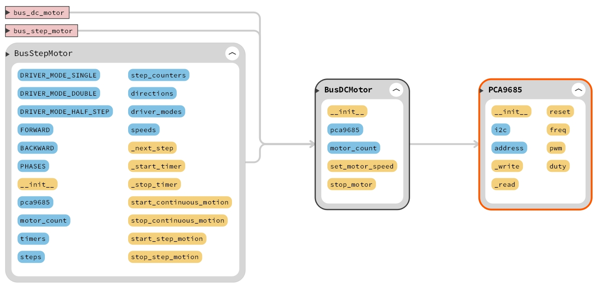
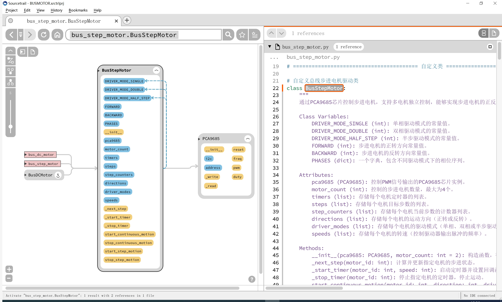

# 目录/MENU

- [中文部分](#总线电机扩展板（FreakStudio）示例程序-MicroPython版本)
- [English Section](#Bus-Motor-Expansion-Board-(FreakStudio)-Example-Program)

# 总线电机扩展板（FreakStudio）示例程序-MicroPython版本

该示例程序展示了如何使用总线电机扩展板控制多台电机。该扩展板通过I2C总线控制PCA9685芯片生成16路PWM信号，并通过这些信号控制直流电机和步进电机的转动。支持控制最多4个直流电机或2个步进电机。程序通过三个Python文件实现功能：

- `pca9685.py`: 提供对PCA9685芯片的控制，能够设置和获取PWM频率，并控制PWM波形占空比。
- `bus_dc_motor.py`: 用于控制四个直流电机的正反转和调速。
- `bus_step_motor.py`: 用于控制步进电机的正反转、角度控制以及定步运动。

该软件必须在提供的总线电机驱动扩展板（由FreakStudio开发设计）上运行，才能确保其正常工作。请参阅硬件开源链接和商品链接获取详细信息。
  - **商品链接**：[总线电机驱动扩展板购买链接]
  - **硬件开源链接**：[硬件开源资料链接]

## 主要特性

- **多电机控制**：支持通过I2C总线同时控制多个电机。最多可以控制4个直流电机或2个步进电机，且每个电机的速度、方向和运动模式都可以独立配置。
- **PWM控制**：通过PCA9685芯片生成16路PWM信号，精确控制电机的转速、方向和稳定性。
- **支持多种电机类型**：包括直流电机和步进电机，满足不同应用场景的需求。
- **驱动模式选择**：步进电机支持单相、双相和半步驱动模式，允许根据精度和扭矩要求选择合适的模式。
- **非阻塞式控制**：通过软件定时器实现非阻塞式方法，允许在电机运动过程中执行其他任务，提高系统的响应能力。
- **定步运动**：步进电机支持定步运动功能，能够按照用户设定的步数精确控制电机位置。
- **扩展性强**：程序框架易于扩展，用户可以根据具体需求调整电机控制的参数，进一步开发复杂的控制逻辑。

## 文件说明

### 软件设计核心思想

通过整合 PCA9685 PWM控制芯片与 RZ7899 电机驱动芯片，实现对直流电机和步进电机的控制，通过 I²C通信（PCA9685控制）来生成PWM信号，进一步控制电机的调速、方向和步进操作，
分别设计了 `PCA9685`、`BusDCMotor` 和 `BusStepMotor` 类：
- `PCA9685`类负责控制不同PWM通道生成波形频率和占空比。
- `BusDCMotor`类通过进一步封装负责通过PWM信号的占空比来调节直流电机的转速和转向。
- `BusStepMotor`类通过调整PWM波形占空比实现不同引脚高低电平的输出，按照设定的步进模式控制步进电机的旋转。

### `pca9685.py`
该文件实现了对PCA9685芯片的控制，允许设置PWM频率，控制PWM波形的占空比，以及通过PWM信号控制舵机或其他设备。

#### 主要类
**PCA9685**：
- 该类提供了对PCA9685芯片的控制，能够设置和获取PWM频率，并控制PWM波形的占空比。
  
  **方法**：
  - `reset()`：重置PCA9685模块，恢复默认设置。
  - `freq(freq: float)`：设置或获取PCA9685的PWM频率。
  - `pwm(index: int, on: int, off: int)`：设置或获取指定通道的PWM信号。
  - `duty(index: int, value: int, invert: bool = False)`：设置指定通道的占空比，并提供反转功能。

### `bus_dc_motor.py`
该文件实现了对直流电机的控制。通过PCA9685生成的PWM信号，用户可以控制4个电机的速度和转向。

#### 主要类
**BusDCMotor**：
- 用于控制直流电机的正转、反转和调速。通过与PCA9685接口交互，使用PWM信号控制电机。

  **方法**：
  - `set_motor_speed(motor_id: int, speed: int, direction: int = 0)`：设置指定电机的速度和转向。
  - `stop_motor(motor_id: int)`：停止指定电机。

#### 主要功能
* 控制电机的正转、反转和调速：通过调整PWM信号的占空比（duty），来实现电机的速度控制。同时可以根据方向标志来设置电机的旋转方向。
* 最多支持控制 4 个电机：类设计上支持最多控制四个电机。通过控制多个PWM通道，可以实现对多个电机的独立控制。
* 电机停止功能：通过设置PWM信号为0来停止电机的转动。

### `bus_step_motor.py`
该文件实现了对步进电机的控制。通过PCA9685芯片，可以实现多个步进电机的独立控制，支持正反转、角度控制及定步运动。

#### 主要类
**BusStepMotor**：
- 控制步进电机的正反转、角度控制和定步运动。通过PCA9685芯片控制PWM信号。

  **方法**：
  - `__init__(pca9685: PCA9685, motor_count: int = 2)`：构造函数，初始化电机控制类。
  - `_next_step(motor_id: int)`：计算并更新指定电机的步进状态。
  - `_start_timer(motor_id: int, speed: int)`：启动定时器并设置回调函数，以控制电机连续运动。
  - `_stop_timer(motor_id: int)`：停止指定电机的定时器，停止运动。
  - `start_continuous_motion(motor_id: int, direction: int, driver_mode: int, speed: int)`：启动电机进行连续运动。
  - `stop_continuous_motion(motor_id: int)`：停止电机的连续运动。
  - `start_step_motion(motor_id: int, direction: int, driver_mode: int, speed: int, steps: int)`：启动步进电机的定步运动，按照指定步数执行。

- 支持多种步进电机的驱动模式（单相、双相、半步驱动），并且通过使用定时器和回调机制精确控制每个电机的步进过程。每个电机的状态（包括方向、步进模式、速度等）都被单独管理，使得电机的控制更加灵活，并且能够精确地执行定步运动或连续运动。

#### 主要功能
* **多电机控制：** 支持同时控制最多4个步进电机，独立配置每个电机的转速、方向和驱动模式。
* **驱动模式：** 提供单相、双相和半步三种驱动模式，以满足不同精度和扭矩需求。
* **角度和步数控制：** 该类支持连续步进和定步控制，可以根据用户设定的步数进行精确的定位。
* **非阻塞式方法：** 通过软件定时器实现在控制电机时继续执行其他任务

## 如何使用

### 安装依赖
在运行示例程序之前，确保你的环境中安装了`machine`和`time`等模块。你可以通过MicroPython的包管理器安装依赖。

### 使用示例

## 注意事项
- **电源要求**：确保为电机提供足够的电源，以支持多个电机同时运行。过低的电源电压可能导致电机无法正常启动或工作不稳定。
- **I2C通信稳定性**：由于多个电机通过I2C总线共享PCA9685芯片，确保I2C通信线路的稳定性，避免出现信号干扰或通信丢失。
- **PWM频率设置**：设置PWM频率时，请确保其适合所控制的电机类型。过高的PWM频率可能会导致电机过热或效率下降。
- **电机驱动模式选择**：选择合适的驱动模式对步进电机至关重要。不同的驱动模式会影响电机的精度、扭矩和功率消耗，建议根据应用需求选择适合的模式。
- **过载保护**：为避免电机驱动电路过载，使用合适的限流保护措施，并确保电机的工作在其额定负载范围内。
- **步进电机步数控制**：步进电机的定步控制应确保在实际使用中不会超过最大步数范围，以避免电机跳步或位置错误。

## 结语
此示例程序为使用总线电机扩展板控制电机提供了基本的框架。可以根据需求调整电机控制的参数，进行更复杂的控制逻辑开发。

## 联系开发者
- 如有任何问题或需要帮助，请通过 [10696531183@qq.com](mailto:10696531183@qq.com) 联系开发者。

# Bus-Motor-Expansion-Board-(FreakStudio)-Example-Program

This example program demonstrates how to control multiple motors using the Bus Motor Expansion Board. The expansion board controls the PCA9685 chip via the I2C bus to generate 16 PWM signals, which are then used to control the rotation of DC motors and stepper motors. The program supports controlling up to 4 DC motors or 2 stepper motors. The functionality is implemented through three Python files:

- `pca9685.py`: Provides control over the PCA9685 chip, enabling the setting and retrieval of PWM frequency and controlling the duty cycle of the PWM waveform.
- `bus_dc_motor.py`: Controls the forward/reverse motion and speed of four DC motors.
- `bus_step_motor.py`: Controls the forward/reverse motion, angle control, and stepwise motion of stepper motors.

This software must run on the provided Bus Motor Driver Expansion Board (designed by FreakStudio) to ensure proper operation. Please refer to the hardware open-source link and product link for more details.
  - **Product Link**: [Bus Motor Driver Expansion Board Purchase Link]
  - **Hardware Open-Source Link**: [Hardware Open-Source Documentation Link]

## Main Features

- **Multi-motor Control**: Supports controlling multiple motors simultaneously via the I2C bus. Up to 4 DC motors or 2 stepper motors can be controlled, with independent configuration of speed, direction, and motion mode for each motor.
- **PWM Control**: Generates 16 PWM signals through the PCA9685 chip to accurately control the motor speed, direction, and stability.
- **Supports Multiple Motor Types**: Includes both DC motors and stepper motors, meeting the requirements for different application scenarios.
- **Driver Mode Selection**: Stepper motors support single-phase, double-phase, and half-step driving modes, allowing for selection based on precision and torque requirements.
- **Non-blocking Control**: Non-blocking methods are implemented using software timers, allowing other tasks to execute while the motor is running, improving system responsiveness.
- **Stepwise Motion**: Stepper motors support stepwise motion, enabling precise control of the motor's position according to the specified number of steps.
- **High Expandability**: The software framework is easily extendable, allowing users to adjust motor control parameters and further develop complex control logic.

## File Description

### Core Software Design Concept

By integrating the PCA9685 PWM control chip with the RZ7899 motor driver chip, we can control both DC and stepper motors. The program communicates with the PCA9685 via I²C to generate PWM signals, controlling motor speed, direction, and stepping operations. The classes `PCA9685`, `BusDCMotor`, and `BusStepMotor` are designed:

- The `PCA9685` class is responsible for controlling the generation of waveform frequency and duty cycle for different PWM channels.
- The `BusDCMotor` class encapsulates the control of DC motors, adjusting speed and direction using PWM duty cycles.
- The `BusStepMotor` class controls the rotation of stepper motors by adjusting the duty cycle of the PWM waveform, generating high and low levels for motor pins in accordance with the set stepper mode.

### `pca9685.py`
This file implements control over the PCA9685 chip, allowing for the setting of PWM frequency, controlling the duty cycle of PWM waveforms, and driving servos or other devices using PWM signals.

#### Main Class
**PCA9685**:
- This class provides control over the PCA9685 chip, enabling the setting and retrieval of PWM frequencies and controlling the duty cycle of PWM waveforms.
  
  **Methods**:
  - `reset()`: Resets the PCA9685 module, restoring default settings.
  - `freq(freq: float)`: Sets or retrieves the PWM frequency of the PCA9685.
  - `pwm(index: int, on: int, off: int)`: Sets or retrieves the PWM signal for the specified channel.
  - `duty(index: int, value: int, invert: bool = False)`: Sets the duty cycle for the specified channel and provides an option to invert the signal.

### `bus_dc_motor.py`
This file controls DC motors. The PWM signals generated by the PCA9685 chip allow for control of the speed and direction of up to 4 DC motors.

#### Main Class
**BusDCMotor**:
- This class controls the forward, reverse, and speed of DC motors through the PWM signals generated by PCA9685.
  
  **Methods**:
  - `set_motor_speed(motor_id: int, speed: int, direction: int = 0)`: Sets the speed and direction of a specified motor.
  - `stop_motor(motor_id: int)`: Stops the specified motor.

#### Key Features
* **Control Forward/Reverse and Speed**: Adjust the PWM duty cycle to control the speed of the motor. The direction can also be set using a direction flag.
* **Control up to 4 Motors**: The class supports controlling up to four motors. By controlling multiple PWM channels, independent control of multiple motors is achievable.
* **Motor Stop Function**: The motor can be stopped by setting the PWM signal to 0, halting the motor's movement.

### `bus_step_motor.py`
This file controls stepper motors. The PCA9685 chip is used to independently control multiple stepper motors, supporting forward/reverse rotation, angle control, and stepwise motion.

#### Main Class
**BusStepMotor**:
- This class controls the forward/reverse rotation, angle control, and stepwise motion of stepper motors through PWM signals from the PCA9685 chip.

  **Methods**:
  - `__init__(pca9685: PCA9685, motor_count: int = 2)`: Constructor that initializes the motor control class.
  - `_next_step(motor_id: int)`: Calculates and updates the stepping state of the specified motor.
  - `_start_timer(motor_id: int, speed: int)`: Starts the timer and sets the callback function for continuous motor motion.
  - `_stop_timer(motor_id: int)`: Stops the timer for the specified motor, halting motion.
  - `start_continuous_motion(motor_id: int, direction: int, driver_mode: int, speed: int)`: Starts the motor for continuous motion.
  - `stop_continuous_motion(motor_id: int)`: Stops the continuous motion of the specified motor.
  - `start_step_motion(motor_id: int, direction: int, driver_mode: int, speed: int, steps: int)`: Starts the step motion of the motor, executing according to the specified steps.

- Supports multiple stepper motor driving modes (single-phase, double-phase, half-step) and uses timers and callbacks to precisely control each motor's stepping process. Each motor's state (direction, stepping mode, speed, etc.) is managed independently, allowing flexible control and precise execution of step or continuous motions.

#### Key Features
* **Multi-motor Control**: Supports controlling up to 4 stepper motors simultaneously, with independent configuration of speed, direction, and driving mode for each motor.
* **Driver Modes**: Provides single-phase, double-phase, and half-step modes, which can be selected based on precision and torque requirements.
* **Angle and Step Control**: Supports both continuous stepping and defined step control, allowing precise positioning based on the specified number of steps.
* **Non-blocking Methods**: Non-blocking methods using software timers allow other tasks to execute while controlling the motors.

## How to Use

### Install Dependencies
Before running the example program, ensure that your environment has the necessary modules like `machine` and `time`. You can install dependencies via the MicroPython package manager.

### Usage Example

## Notes
- **Power Requirements**: Ensure that sufficient power is provided to the motors for simultaneous operation. Insufficient power may cause the motors to fail to start or operate unstably.
- **I2C Communication Stability**: Since multiple motors share the PCA9685 chip through the I2C bus, ensure the stability of the I2C communication line to prevent signal interference or data loss.
- **PWM Frequency Settings**: When setting the PWM frequency, ensure it is suitable for the type of motors being controlled. Excessively high PWM frequencies may cause motor overheating or reduced efficiency.
- **Motor Driver Mode Selection**: Choosing the correct driver mode is crucial for stepper motors. Different driver modes affect motor precision, torque, and power consumption. Select the appropriate mode based on application needs.
- **Overload Protection**: To prevent motor driver circuits from overloading, use appropriate current-limiting protection measures and ensure the motors are working within their rated load range.
- **Stepper Motor Step Control**: Ensure that the stepper motor's step control does not exceed the maximum step range to avoid step loss or incorrect positioning.

## Conclusion
This example program provides a basic framework for controlling motors using the Bus Motor Expansion Board. You can adjust motor control parameters to develop more complex control logic based on your needs.

## Contact the Developer
- For any inquiries or assistance, feel free to contact the developer at [10696531183@qq.com](mailto:10696531183@qq.com).

