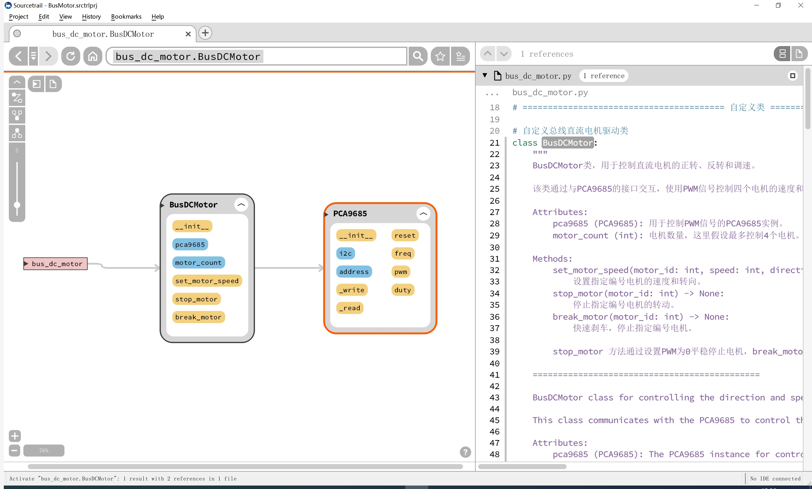

# 目录/MENU

- [中文部分](#总线电机扩展板（FreakStudio-多米诺系列）示例程序-MicroPython版本)
- [English Section](#Bus-Motor-Expansion-Board-(FreakStudio-Domino-Series)-Example-Program)

# 总线电机扩展板（FreakStudio-多米诺系列）示例程序-MicroPython版本

该示例程序展示了如何使用总线电机扩展板控制多台电机。该扩展板通过I2C总线控制PCA9685芯片生成16路PWM信号，并通过这些信号控制直流电机转动。支持控制最多4个直流电机：

- `pca9685.py`: 提供对PCA9685芯片的控制，能够设置和获取PWM频率，并控制PWM波形占空比。
- `bus_dc_motor.py`: 用于控制四个直流电机的正反转和调速。

该软件必须在提供的总线电机驱动扩展板（由FreakStudio开发设计的多米诺系列）上运行，才能确保其正常工作。请参阅硬件开源链接和商品链接获取详细信息。
- **商品链接**：[**总线电机驱动扩展板购买链接**](https://item.taobao.com/item.htm?id=884537886628&spm=a213gs.v2success.0.0.159d4831AvSz8f)
- **硬件开源链接**：[**硬件开源资料链接**](https://github.com/leezisheng/Domino-Series-Expansion-Board/tree/main/Bus-Motor-Expansion-Board/hardware)

## 主要特性

- **多电机控制**：支持通过I2C总线同时控制多个电机。最多可以控制4个直流电机，且每个电机的速度、方向都可以独立配置。
- **PWM控制**：通过PCA9685芯片生成16路PWM信号，精确控制电机的转速、方向和稳定性。
- **支持多种电机类型**：支持6V到18V供电的直流电机，满足不同应用场景的需求。
- **扩展性强**：程序框架易于扩展，用户可以根据具体需求调整电机控制的参数，进一步开发复杂的控制逻辑。

## 文件说明

### 软件设计核心思想

通过整合 PCA9685 PWM控制芯片与 RZ7899 电机驱动芯片，实现对直流电机进行控制，通过 I²C通信（PCA9685控制）来生成PWM信号，进一步控制电机的调速、方向和步进操作，
分别设计了 `PCA9685`和`BusDCMotor`类：
- `PCA9685`类负责控制不同PWM通道生成波形频率和占空比。
- `BusDCMotor`类通过进一步封装负责通过PWM信号的占空比来调节直流电机的转速和转向。

### `pca9685.py`
该文件实现了对PCA9685芯片的控制，允许设置PWM频率，控制PWM波形的占空比，以及通过PWM信号控制舵机或其他设备。

#### 主要类
**PCA9685**：
- 该类提供了对PCA9685芯片的控制，能够设置和获取PWM频率，并控制PWM波形的占空比。
  
  **方法**：
  - `reset()`：重置PCA9685模块，恢复默认设置。
  - `freq(freq: float)`：设置或获取PCA9685的PWM频率。
  - `pwm(index: int, on: int, off: int)`：设置或获取指定通道的PWM信号。
  - `duty(index: int, value: int, invert: bool = False)`：设置指定通道的占空比，并提供反转功能。

### `bus_dc_motor.py`
该文件实现了对直流电机的控制。通过PCA9685生成的PWM信号，用户可以控制4个电机的速度和转向。



#### 主要类

**BusDCMotor**：
- 用于控制直流电机的正转、反转和调速。通过与PCA9685接口交互，使用PWM信号控制电机。

  **方法**：
  - `set_motor_speed(motor_id: int, speed: int, direction: int = 0)`：设置指定电机的速度和转向。
  - `stop_motor(motor_id: int)`：平稳停止指定电机。
  - `break_motor(motor_id: int)`：快速刹车，立即停止指定电机。
  
    **区别**：
    - `stop_motor`：通过设置PWM为0平稳停止电机。
    - `break_motor`：通过设置PWM为最大值迅速刹车电机。

#### 主要功能
* 控制电机的正转、反转和调速：通过调整PWM信号的占空比（duty），来实现电机的速度控制。同时可以根据方向标志来设置电机的旋转方向。
* 最多支持控制 4 个电机：类设计上支持最多控制四个电机。通过控制多个PWM通道，可以实现对多个电机的独立控制。
* 电机停止功能：通过设置PWM信号为0来停止电机的转动。

## 如何使用

### 安装依赖
在运行示例程序之前，确保你的环境中安装了`machine`和`time`等模块。你可以通过MicroPython的包管理器安装依赖。
将两个文件保存到你的主文件夹中，通过以下方式导入：
```python
from pca9685 import PCA9685
from bus_dc_motor import BusDCMotor
```

### 使用示例

```python

# Python env   : MicroPython v1.23.0
# -*- coding: utf-8 -*-        
# @Time    : 2025/1/19 上午10:57   
# @Author  : 李清水            
# @File    : main.py       
# @Description : 总线电机扩展板示例程序

# ======================================== 导入相关模块 =========================================

# 导入硬件相关模块
from machine import Pin, I2C
# 导入时间相关模块
import time
# 导入自定义模块
from pca9685 import PCA9685
# 导入直流电机控制模块
from bus_dc_motor import BusDCMotor

# ======================================== 全局变量 ============================================

# 外置PWM扩展芯片地址
PCA9685_ADDR = 0

# ======================================== 功能函数 ============================================

# ======================================== 自定义类 ============================================

# ======================================== 初始化配置 ==========================================

# 上电延时3s
time.sleep(3)
# 打印调试消息
print("FreakStudio: Using PCA9685 to control dc motor and step motor")

# 创建硬件I2C的实例，使用I2C0外设，时钟频率为400KHz，SDA引脚为4，SCL引脚为5
i2c = I2C(id=0, sda=Pin(4), scl=Pin(5), freq=400000)

# 开始扫描I2C总线上的设备，返回从机地址的列表
devices_list = i2c.scan()
print('START I2C SCANNER')

# 若devices_list为空，则没有设备连接到I2C总线上
if len(devices_list) == 0:
    print("No i2c device !")
# 若非空，则打印从机设备地址
else:
    print('i2c devices found:', len(devices_list))
    # 遍历从机设备地址列表
    for device in devices_list:
        # 判断地址是否在0x40到0x4F之间，如果是，则为PCA9685芯片地址
        if 0x40 <= device <= 0x4F:
            print("PCA9685 I2C hexadecimal address: ", hex(device))
            PCA9685_ADDR = device

# 创建PCA9685实例，使用I2C0外设
pca9685 = PCA9685(i2c, PCA9685_ADDR)
# 创建BusDCMotor实例，使用PCA9685实例，电机数量为2
motor = BusDCMotor(pca9685, 2)

# ========================================  主程序  ===========================================

# 控制电机1正转，速度为4000，方向为0（前进）
motor.set_motor_speed(1, 1000, 0)
# 控制电机2反转，速度为3000，方向为0（前进）
motor.set_motor_speed(2, 1000, 0)

# 延时10s
time.sleep(10)

# 停止电机1
motor.stop_motor(1)
# 刹车电机2
motor.break_motor(2)
```

## 注意事项
- **电源要求**：确保为电机提供足够的电源，以支持多个电机同时运行。过低的电源电压可能导致电机无法正常启动或工作不稳定。
- **I2C通信稳定性**：由于多个电机通过I2C总线共享PCA9685芯片，确保I2C通信线路的稳定性，避免出现信号干扰或通信丢失。
- **PWM频率设置**：设置PWM频率时，请确保其适合所控制的电机类型。过高的PWM频率可能会导致电机过热或效率下降。

## 结语
此示例程序为使用总线电机扩展板控制电机提供了基本的框架。可以根据需求调整电机控制的参数，进行更复杂的控制逻辑开发。

## 联系开发者
- 如有任何问题或需要帮助，请通过 [10696531183@qq.com](mailto:10696531183@qq.com) 联系开发者。


## 许可协议
本代码中，`pca9685.py` 部分由 Adafruit 发布，使用 MIT 许可证；而 `bus_dc_motor.py`部分由作者 leeqingshui 扩展，采用 CC BY-NC 4.0 许可证。

本项目扩展部分采用 **[知识共享署名-非商业性使用 4.0 国际版 (CC BY-NC 4.0)](https://creativecommons.org/licenses/by-nc/4.0/)** 许可协议。

# Bus-Motor-Expansion-Board-(FreakStudio-Domino-Series)-Example-Program

This example program demonstrates how to control multiple motors using the Bus Motor Expansion Board. The expansion board controls the PCA9685 chip via the I2C bus to generate 16 PWM signals, which are then used to control the rotation of DC motors. The program supports controlling up to 4 DC motors:

- `pca9685.py`: Provides control over the PCA9685 chip, enabling the setting and retrieval of PWM frequency and controlling the duty cycle of the PWM waveform.
- `bus_dc_motor.py`: Controls the forward/reverse motion and speed of four DC motors.

This software must run on the provided Bus Motor Driver Expansion Board (Domino Series designed by FreakStudio) to ensure proper operation. Please refer to the hardware open-source link and product link for more details.
- **Product Link**: [**Bus DC Motor Driver Expansion Board Purchase Link**](https://item.taobao.com/item.htm?id=884537886628&spm=a213gs.v2success.0.0.159d4831AvSz8f)
- **Hardware Open Source Link**: [**Hardware Open Source Materials Link**](https://github.com/leezisheng/Domino-Series-Expansion-Board/tree/main/Bus-Motor-Expansion-Board/hardware)


## Main Features

- **Multi-motor Control**: Supports controlling multiple motors simultaneously via I2C bus. Up to 4 DC motors can be controlled, with each motor's speed and direction independently configurable.
- **PWM Control**: Uses the PCA9685 chip to generate 16 PWM channels, precisely controlling motor speed, direction, and stability.
- **Supports Multiple Motor Types**: Compatible with DC motors powered from 6V to 18V, catering to various application scenarios.
- **Strong Expandability**: The program framework is easy to extend, allowing users to adjust motor control parameters based on specific needs and further develop complex control logic.

## File Description

### Core Software Design Concept

By integrating the PCA9685 PWM control chip with the RZ7899 motor driver chip, we can control DC motors. The program communicates with the PCA9685 via I²C to generate PWM signals, controlling motor speed, direction. The classes `PCA9685` and `BusDCMotor` are designed:

- The `PCA9685` class is responsible for controlling the generation of waveform frequency and duty cycle for different PWM channels.
- The `BusDCMotor` class encapsulates the control of DC motors, adjusting speed and direction using PWM duty cycles.


### `pca9685.py`
This file implements control over the PCA9685 chip, allowing for the setting of PWM frequency, controlling the duty cycle of PWM waveforms, and driving servos or other devices using PWM signals.

#### Main Class
**PCA9685**:
- This class provides control over the PCA9685 chip, enabling the setting and retrieval of PWM frequencies and controlling the duty cycle of PWM waveforms.
  
  **Methods**:
  - `reset()`: Resets the PCA9685 module, restoring default settings.
  - `freq(freq: float)`: Sets or retrieves the PWM frequency of the PCA9685.
  - `pwm(index: int, on: int, off: int)`: Sets or retrieves the PWM signal for the specified channel.
  - `duty(index: int, value: int, invert: bool = False)`: Sets the duty cycle for the specified channel and provides an option to invert the signal.

### `bus_dc_motor.py`
This file controls DC motors. The PWM signals generated by the PCA9685 chip allow for control of the speed and direction of up to 4 DC motors.


#### Main Class
**BusDCMotor**:
- Used to control the forward, reverse, and speed of DC motors. It interacts with the PCA9685 interface to control the motors via PWM signals.

  **Methods**:
  - `set_motor_speed(motor_id: int, speed: int, direction: int = 0)`: Set the speed and direction of the specified motor.
  - `stop_motor(motor_id: int)`: Smoothly stop the specified motor.
  - `break_motor(motor_id: int)`: Quickly brake and immediately stop the specified motor.

    **Difference**:
    - `stop_motor`: Smoothly stops the motor by setting PWM to 0.
    - `break_motor`: Quickly brakes the motor by setting PWM to the maximum value.

#### Key Features
* **Control Forward/Reverse and Speed**: Adjust the PWM duty cycle to control the speed of the motor. The direction can also be set using a direction flag.
* **Control up to 4 Motors**: The class supports controlling up to four motors. By controlling multiple PWM channels, independent control of multiple motors is achievable.
* **Motor Stop Function**: The motor can be stopped by setting the PWM signal to 0, halting the motor's movement.

## How to Use

### Install Dependencies
Before running the example program, ensure that your environment has the necessary modules like `machine` and `time`. You can install dependencies via the MicroPython package manager.
Save the two files to your main folder and import them as follows:
```python
from pca9685 import PCA9685
from bus_dc_motor import BusDCMotor
```

### Usage Example
```python

# Python env   : MicroPython v1.23.0
# -*- coding: utf-8 -*-        
# @Time    : 2025/1/19 上午10:57   
# @Author  : 李清水            
# @File    : main.py       
# @Description : 总线电机扩展板示例程序

# ======================================== 导入相关模块 =========================================

# 导入硬件相关模块
from machine import Pin, I2C
# 导入时间相关模块
import time
# 导入自定义模块
from pca9685 import PCA9685
# 导入直流电机控制模块
from bus_dc_motor import BusDCMotor

# ======================================== 全局变量 ============================================

# 外置PWM扩展芯片地址
PCA9685_ADDR = 0

# ======================================== 功能函数 ============================================

# ======================================== 自定义类 ============================================

# ======================================== 初始化配置 ==========================================

# 上电延时3s
time.sleep(3)
# 打印调试消息
print("FreakStudio: Using PCA9685 to control dc motor and step motor")

# 创建硬件I2C的实例，使用I2C0外设，时钟频率为400KHz，SDA引脚为4，SCL引脚为5
i2c = I2C(id=0, sda=Pin(4), scl=Pin(5), freq=400000)

# 开始扫描I2C总线上的设备，返回从机地址的列表
devices_list = i2c.scan()
print('START I2C SCANNER')

# 若devices_list为空，则没有设备连接到I2C总线上
if len(devices_list) == 0:
    print("No i2c device !")
# 若非空，则打印从机设备地址
else:
    print('i2c devices found:', len(devices_list))
    # 遍历从机设备地址列表
    for device in devices_list:
        # 判断地址是否在0x40到0x4F之间，如果是，则为PCA9685芯片地址
        if 0x40 <= device <= 0x4F:
            print("PCA9685 I2C hexadecimal address: ", hex(device))
            PCA9685_ADDR = device

# 创建PCA9685实例，使用I2C0外设
pca9685 = PCA9685(i2c, PCA9685_ADDR)
# 创建BusDCMotor实例，使用PCA9685实例，电机数量为2
motor = BusDCMotor(pca9685, 2)

# ========================================  主程序  ===========================================

# 控制电机1正转，速度为4000，方向为0（前进）
motor.set_motor_speed(1, 1000, 0)
# 控制电机2反转，速度为3000，方向为0（前进）
motor.set_motor_speed(2, 1000, 0)

# 延时10s
time.sleep(10)

# 停止电机1
motor.stop_motor(1)
# 刹车电机2
motor.break_motor(2)
```

## Notes
- **Power Requirements**: Ensure that sufficient power is provided to the motors for simultaneous operation. Insufficient power may cause the motors to fail to start or operate unstably.
- **I2C Communication Stability**: Since multiple motors share the PCA9685 chip through the I2C bus, ensure the stability of the I2C communication line to prevent signal interference or data loss.
- **PWM Frequency Settings**: When setting the PWM frequency, ensure it is suitable for the type of motors being controlled. Excessively high PWM frequencies may cause motor overheating or reduced efficiency.

## Conclusion
This example program provides a basic framework for controlling motors using the Bus Motor Expansion Board. You can adjust motor control parameters to develop more complex control logic based on your needs.

## Contact the Developer
- For any inquiries or assistance, feel free to contact the developer at [10696531183@qq.com](mailto:10696531183@qq.com).


## License
This project is licensed under the **[Creative Commons Attribution-NonCommercial 4.0 International License (CC BY-NC 4.0)](https://creativecommons.org/licenses/by-nc/4.0/)**.

This project includes code originally licensed under the MIT License (for pca9685.py) and modified code licensed under the Creative Commons Attribution-NonCommercial 4.0 International License (CC BY-NC 4.0) (for bus_dc_motor.py).

MIT License:
- pca9685.py: Originally published by Adafruit and licensed under the MIT License.

CC BY-NC 4.0 License:
- bus_dc_motor.py: Extensions by leeqingshui and licensed under the CC BY-NC 4.0 License.