# 目录/MENU

- [中文部分](#总线单极性步进电机扩展板)
- [English Section](#Bus-StepMotor-Expansion-Board)

# 总线单极性步进电机扩展板

---

## 1.总体介绍
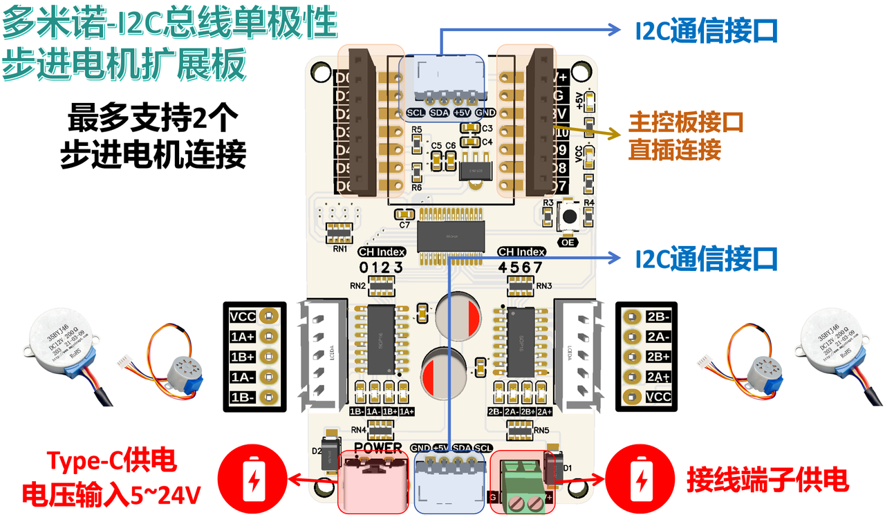

[总线单极性步进电机扩展板](https://github.com/leezisheng/Domino-Series-Expansion-Board/tree/main/Bus-StepMotor-Expansion-Board)是一种用于通过串行通信接口I2C来控制多个单极性步进电机（例如28BYJ48、35BYJ46、35BY412L等五线四相步进电机）的扩展模块，具有以下主要特点：
- **小尺寸设计：** 可以与XIAO系列主控板、Adafruit Qt Py系列主控直接连接，也可以作为独立模块使用。
- **I2C接口：** 提供I2C总线接口，可堆叠式进行级联，同时4个地址位可选择，理论上可级联16个步进电机驱动扩展板。
- **板载供电指示灯：** 电机供电和PWM扩展芯片供电。
- **供电保护设计：** 支持接线端子和Type-C接口供电，防反接设计。
- **可靠供电稳压：** 使用2颗220UF 固态电解电容供电稳压，相比于铝电解电容，固态电解电容具有更低的ESR（等效串联电阻）、更高的工作频率和更长的使用寿命。
- **支持多种单极性步进电机：** 可用于驱动不同外径、减速比、供电电压的5线4相单极性步进电机（例如28BYJ-48），电压范围支持5V~24V，ULN2003达林顿管芯片每个通道的最大输出电流为 500mA，单个芯片的总电流限制为 2.5A
- **不同驱动模式支持：** 支持单步驱动、全步驱动和半步驱动方式、带有多个步进电机通道的LED指示灯。

总线单极性步进电机扩展板采用紧凑型设计，兼容XIAO系列主控板直连或独立使用，支持级联16个模块。板载ULN2003达林顿管驱动芯片（单通道500mA/整片2.5A），可适配28BYJ-48等5线4相步进电机（5-24V宽压供电），提供单步/全步/半步三种驱动模式，配备双固态电容稳压、防反接保护和可视化状态指示灯，兼具堆叠扩展能力与高可靠性。

我们提供了MicroPython的示例代码，具有完善的异常检测机制，支持多电机独立控制。

设计原因如下所示：
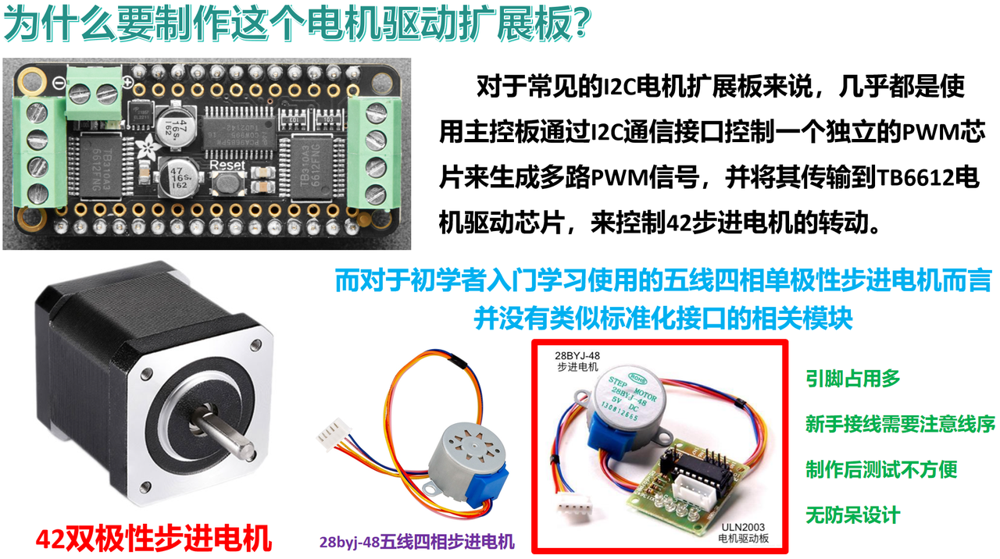

设计思路类似I2C总线电机驱动板：
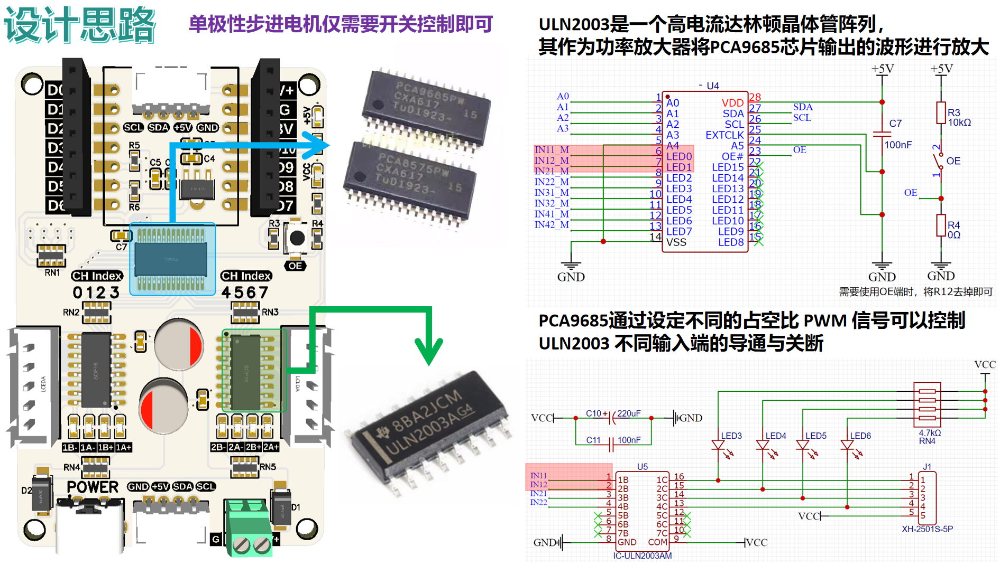
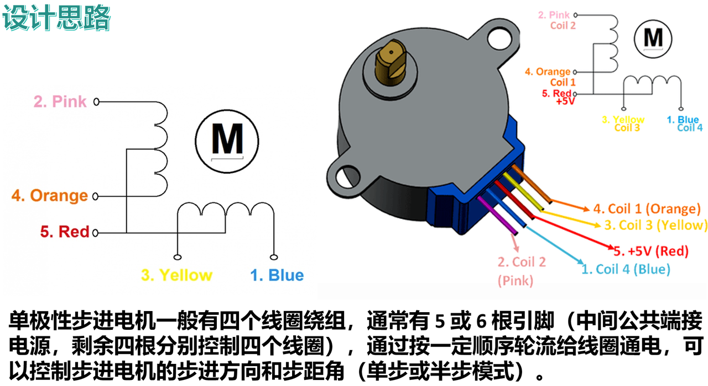

设计时考虑的因素：
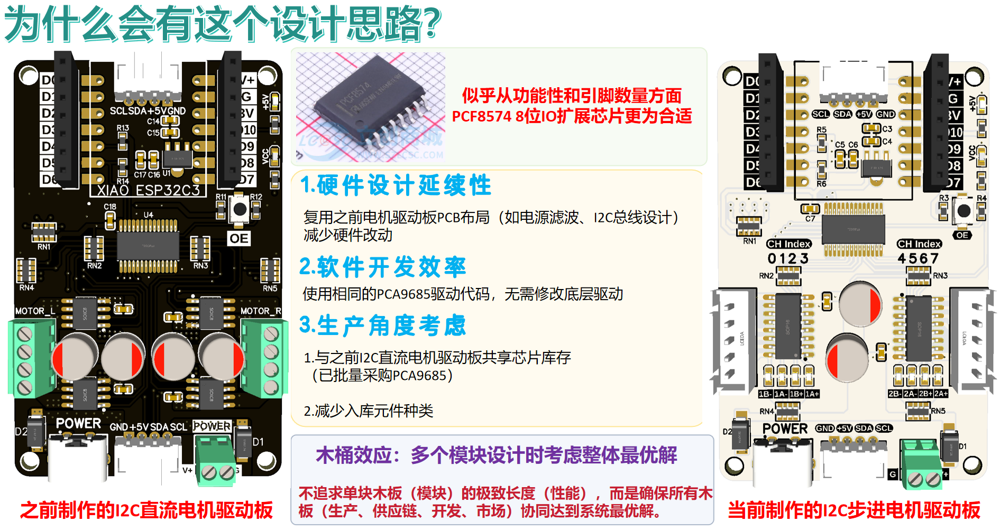

步进电机的基础知识点包括以下内容：
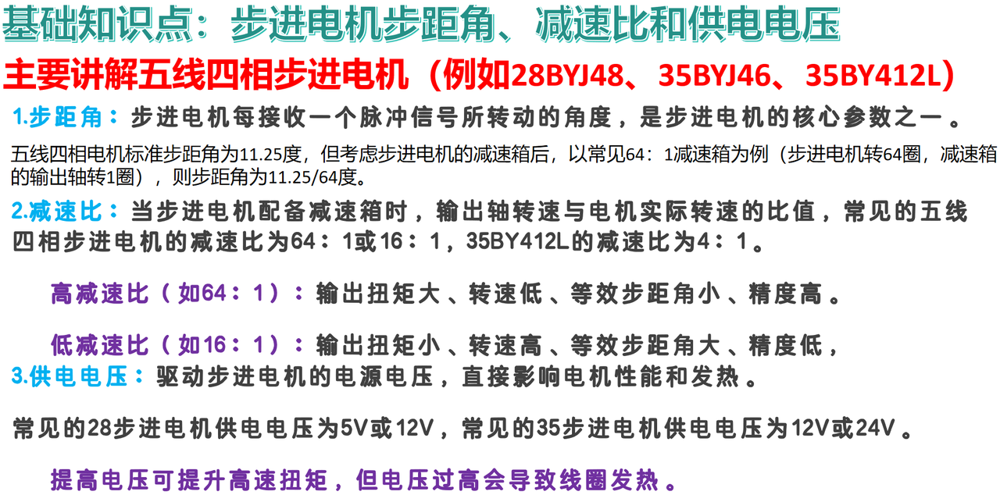
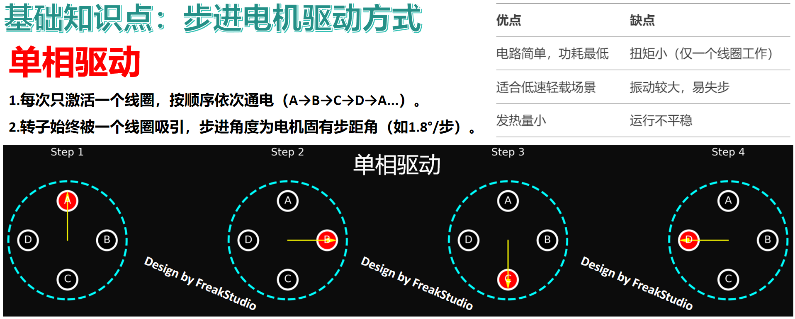
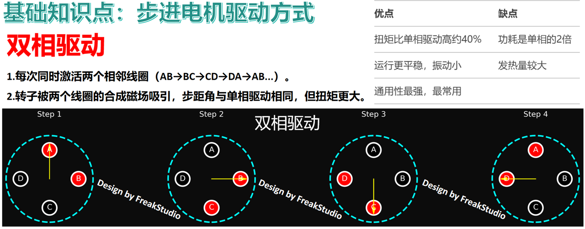
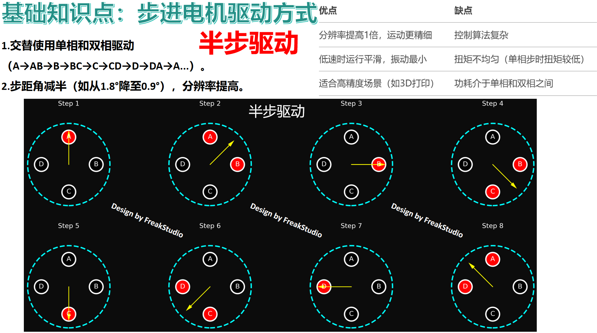

---

## 2.接口说明
### 2.1 通信接口
我们提供了两个I2C通信接口，当作为单独模块使用时，通过PH2.0连接线连接主控模块和扩展板，如下图所示：
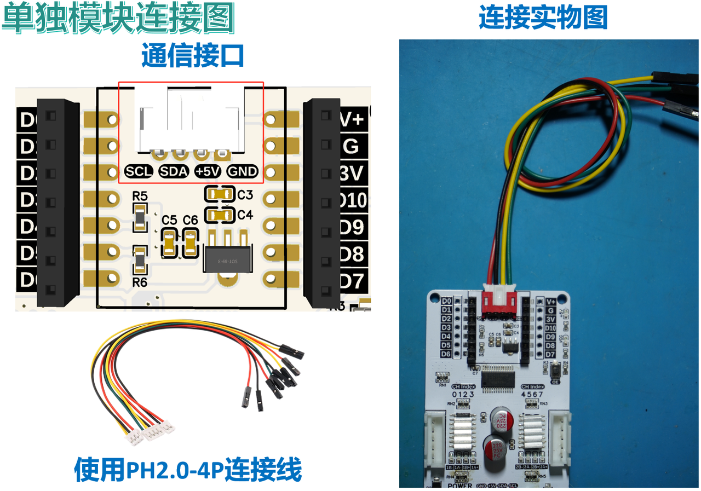
也可以使用主控板直接插入到扩展板的排母接口上：
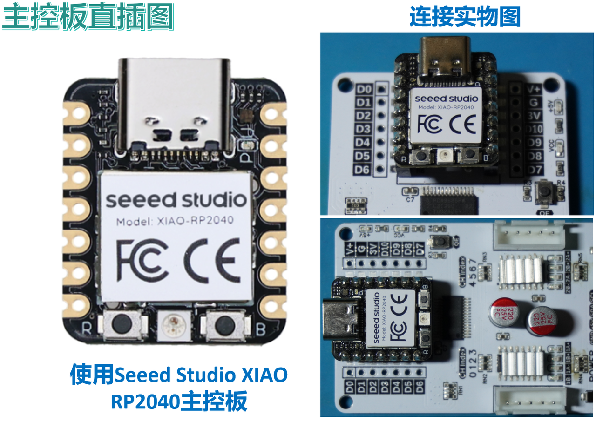
多个扩展板也可以堆叠连接，此时使用扩展板下方靠近供电端子部分的I2C通信接口与扩展板上方靠近供电端子部分的I2C通信接口相互连接，连接时需要注意线序，这里需要使用PH2.0双头反向连接线，我们这里使用M2塑料柱将两个扩展板进行固定：
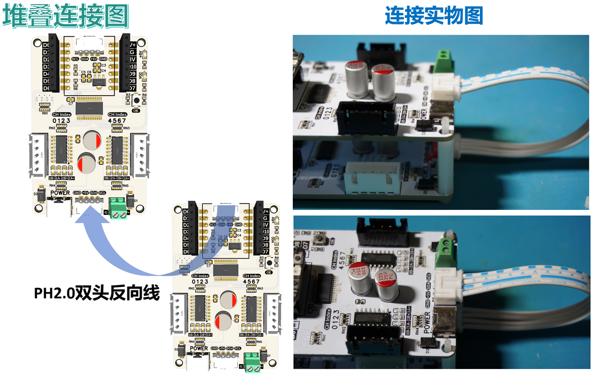

### 2.2 步进电机接口
本扩展板采用XH2.54-5P接口连接5线4相单极性步进电机（如28BYJ-48），此标准化接口设计可兼容市面上常见的5线4相步进电机，公共端（红色线）需连接至电机供电，如下图所示：
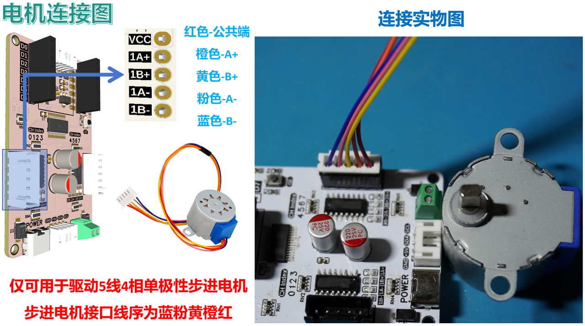

### 2.3 供电接口
我们可以使用Type-C接口的电源适配器进行供电（需要注意电源适配器最大电流，建议使用15V 3A适配器），也可以使用接线端子供电，电源正极连接V，电源负极连接G，如下图所示：
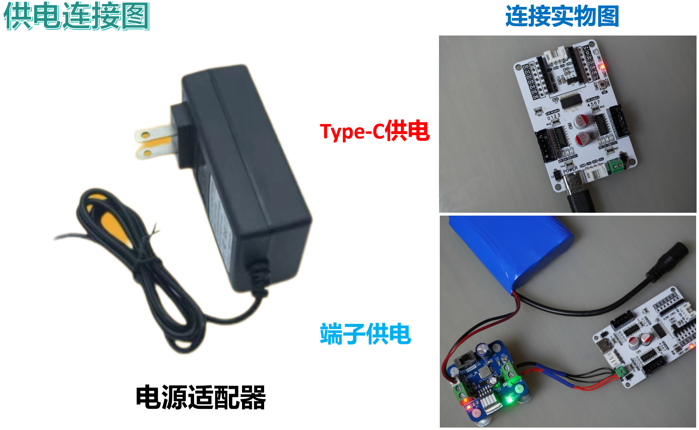

---

## 3.硬件细节
### 3.1 供电保护
我们使用220uF固态电容作为稳压元件，固态电容具有较低的等效串联电阻和快速的电荷释放能力，对高频信号的阻抗更低，能够更高效地滤除高频噪声，相比传统电解电容在高温下具有更稳定的性能和更长的使用寿命，配合100nf小电容给达林顿管芯片进行稳压，快速消除达林顿管（ULN2003）开关瞬间的瞬态干扰，适合步进电机启停频繁的应用场景：
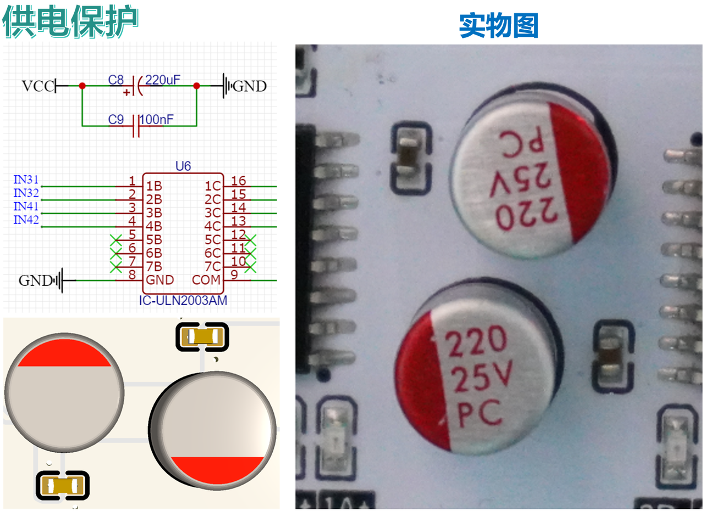

### 3.2 PWM输出芯片地址位选择
我们可以通过焊接扩展板背面短路点来设置PWM扩展芯片地址位，注意四个地址位必须都焊接，默认地址位浮空：
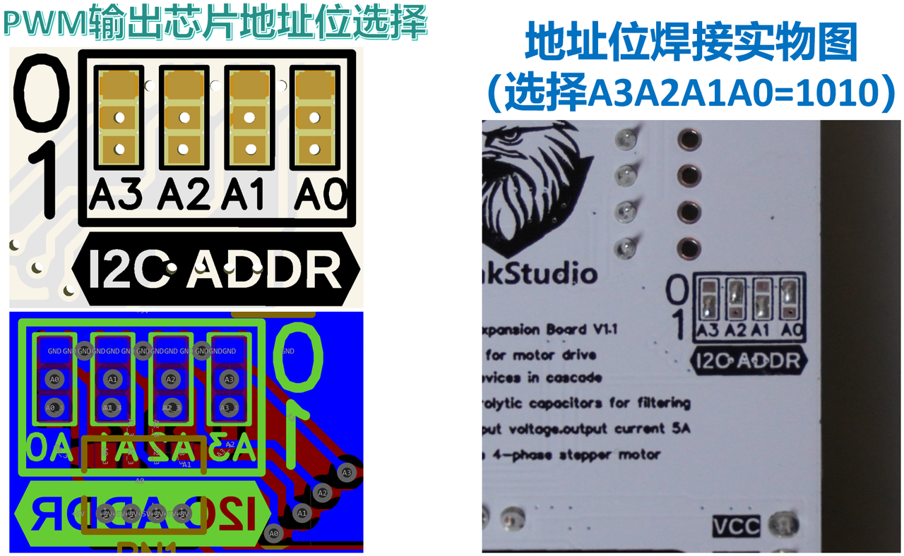

### 3.3 指示灯电路
我们对步进电机驱动的四个控制通道都配备了指示灯，通过4.7K上拉电阻连接到VCC，当某个通道导通时，对应LED指示灯点亮：
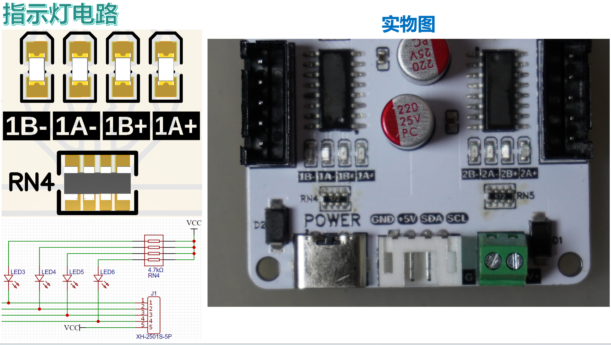

---

## 4.提供代码和使用须知
在使用烧录完程序后的主控板通过扩展板控制舵机前，务必确保电机和通信接线正确，供电无误：
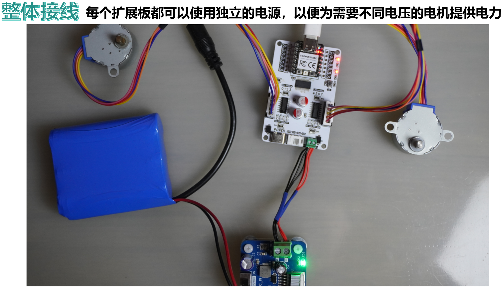

示例代码包括以下版本：
- MicroPython版本：[总线单极性步进电机驱动板](https://github.com/leezisheng/Domino-Series-Expansion-Board/tree/main/Bus-StepMotor-Expansion-Board/code)

这里，需要注意，MicroPython 相关程序经过我们的优化处理，以便更好地适配硬件，提高易用性，以第三方库形式在Github进行发布，并附带知识共享署名-非商业性使用 4.0 国际版 (CC BY-NC 4.0) 许可，侵权必纠，敢线下直接来揪你！

---

## 5.获取链接

- 商品链接：[总线单极性步进电机驱动板购买链接](https://item.taobao.com/item.htm?ft=t&id=904560263580)
- 硬件开源链接：[硬件开源资料链接](https://github.com/leezisheng/Domino-Series-Expansion-Board/tree/main/Bus-StepMotor-Expansion-Board/hardware)

---

# Bus-StepMotor-Expansion-Board

## 1. Overview
  
  
  
  

The [Bus Unipolar Stepper Motor Expansion Board](https://github.com/leezisheng/Domino-Series-Expansion-Board/tree/main/Bus-StepMotor-Expansion-Board) is a module designed to control multiple unipolar stepper motors (e.g., 5-wire 4-phase stepper motors like 28BYJ48, 35BYJ46, 35BY412L) via the I2C serial communication interface. Key features include:  
- **Compact Design:** Compatible with XIAO series and Adafruit Qt Py series main control boards, or usable as a standalone module.  
- **I2C Interface:** Supports daisy-chaining with stackable expansion. Four address bits allow theoretical cascading of up to 16 driver boards.  
- **Onboard Power Indicators:** LEDs for motor power and PWM expansion chip power.  
- **Power Protection:** Supports power input via terminal blocks or Type-C port with reverse-polarity protection.  
- **Stable Power Regulation:** Utilizes two 220μF solid-state capacitors for lower ESR, higher frequency performance, and longer lifespan compared to aluminum electrolytic capacitors.  
- **Broad Compatibility:** Drives various 5-wire 4-phase unipolar stepper motors (e.g., 28BYJ-48) at 5V–24V. ULN2003 Darlington array provides 500mA per channel (2.5A total per chip).  
- **Multiple Driving Modes:** Supports single-step, full-step, and half-step modes, with per-channel LED indicators.  

This expansion board combines a compact footprint (directly attachable to XIAO mainboards or standalone use) with ULN2003 drivers (500mA/channel, 2.5A total) for 5-wire 4-phase steppers (5–24V input). Dual solid capacitors ensure stable power, while reverse-polarity protection and visual status LEDs enhance reliability in stacked configurations.  

We provide MicroPython sample code with robust error handling for multi-motor independent control.  

  
  

**Design Rationale:**  
  

**Conceptual Approach (Similar to I2C Bus Motor Driver):**  
  
  

**Design Considerations:**  
  

**Stepper Motor Basics:**  
  
  
  
  

---

## 2. Interface Specifications  
### 2.1 Communication Interface  
Two I2C ports are provided. For standalone use, connect the main controller via PH2.0 cables:  
  

Alternatively, directly plug the mainboard into the expansion board's female headers:  
  

For stacked configurations, link the lower I2C port (near power terminals) of one board to the upper port of another using a **PH2.0 reverse cable**. Secure boards with M2 plastic spacers:  
  

### 2.2 Stepper Motor Interface  
Standard XH2.54-5P connectors accommodate 5-wire 4-phase unipolar steppers (e.g., 28BYJ-48). The common wire (red) must connect to motor power:  
  

### 2.3 Power Supply  
Use either a Type-C adapter (recommended: 15V 3A) or terminal blocks (V+/GND):  
  

---

## 3. Hardware Details  
### 3.1 Power Protection  
220μF solid capacitors provide low-ESR voltage regulation, with 100nF capacitors suppressing ULN2003 switching transients for high-frequency noise immunity:  
  

### 3.2 PWM Chip Address Selection  
Solder jumpers on the board’s rear to set PWM chip addresses (all 4 bits must be configured; default is floating):  
  

### 3.3 LED Indicator Circuit  
Each motor channel has an LED indicator with 4.7K pull-up resistors to VCC, illuminating when the channel is active:  
  

---

## 4. Code and Usage Notes  
Before operation, verify motor wiring, communication, and power supply:  
  

Sample code includes:  
- **MicroPython Version:** [Bus Stepper Motor Driver](https://github.com/leezisheng/Domino-Series-Expansion-Board/tree/main/Bus-StepMotor-Expansion-Board/code)  

**Important:** Optimized MicroPython libraries are released as third-party packages under **CC BY-NC 4.0 License**. Unauthorized commercial use is prohibited.  

---

## 5. Purchase and Resources  
- **Product Link:** [Stepper Motor Driver Board](https://item.taobao.com/item.htm?ft=t&id=904560263580)  
- **Open-Source Hardware:** [Hardware Files](https://github.com/leezisheng/Domino-Series-Expansion-Board/tree/main/Bus-StepMotor-Expansion-Board/hardware)  