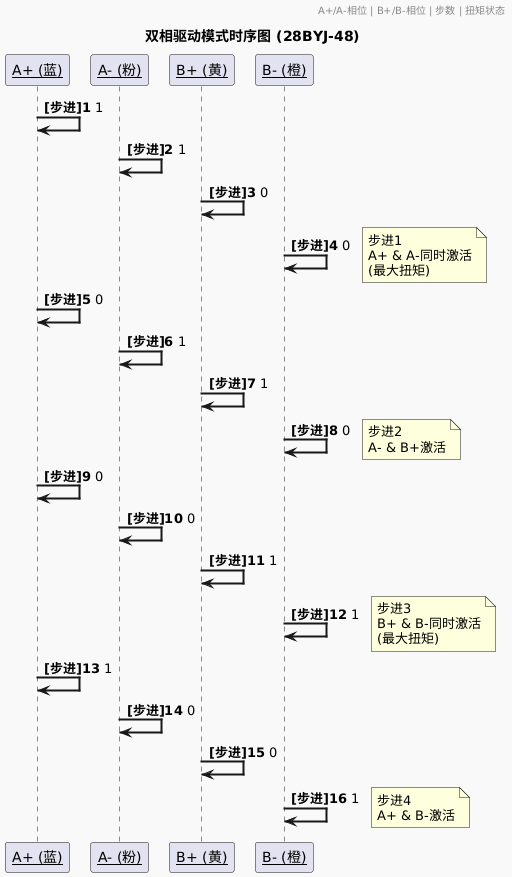

# 目录/MENU

- [中文部分](#总线单极性步进电机扩展板（FreakStudio-多米诺系列）示例程序-MicroPython版本)
- [English Section](#Bus-StepMotor-Expansion-Board-(FreakStudio-Domino-Series)-Example-Program)

# 总线单极性步进电机扩展板（FreakStudio-多米诺系列）示例程序-MicroPython版本

该示例程序展示了如何使用总线单极性步进电机扩展板控制两个单极性步进电机。该扩展板通过I2C总线控制PCA9685芯片生成8路PWM信号，并通过这些信号控制步进电机转动，最多支持两个步进电机（可通过多个扩展板堆叠式排布扩展增加可以驱动的步进电机数量），支持单相、双相、半步驱动模式：

- `pca9685.py`: 提供对PCA9685芯片的控制，能够设置和获取PWM频率，并控制PWM波形占空比。
- `bus_step_motor.py`: 用于控制两个直流电机的正反转、调速和不同驱动模式。
- `main.py`:简单测试相关驱动库。

该软件必须在提供的总线电机驱动扩展板（由FreakStudio开发设计的多米诺系列）上运行，才能确保其正常工作。请参阅硬件开源链接和商品链接获取详细信息。
- **商品链接**：[**总线单极性步进电机驱动板购买链接**](https://item.taobao.com/item.htm?ft=t&id=904560263580)
- **硬件开源链接**：[**硬件开源资料链接**](https://github.com/leezisheng/Domino-Series-Expansion-Board/tree/main/Bus-StepMotor-Expansion-Board/hardware)

## 主要特性

- **多电机独立控制**：单块PCA9685最多支持2个步进电机（每个电机占用4个PWM通道），每个电机可独立设置方向、速度、驱动模式和运动模式。
- **灵活的运动模式**：可以设置其进行连续运动（电机持续旋转，直到手动停止）和定步运动（精确控制电机旋转指定步数后自动停止）。
- **三种驱动方式**：单相驱动（Single Phase），低功耗，扭矩较小；双相驱动（Double Phase），高扭矩，适合重负载；半步驱动（Half Step），更高分辨率，运动更平滑。
- **硬件优化**：使用 `micropython.native` 装饰器提升关键函数执行效率。
- **非阻塞式控制**：定时器中断驱动步进脉冲，减少主程序阻塞。

## 文件说明

### 软件设计核心思想

通过 PCA9685 PWM控制器 与 ULN2003达林顿阵列 的协同工作，构建高效步进电机控制系统，分别设计了 `PCA9685`和`BusStepMotor`类：
- `PCA9685`类负责控制不同PWM通道生成波形频率和占空比。
- `BusStepMotor`类通过进一步封装，实现步进电机运动学控制，包括相位序列生成、定时中断调度、运动状态管理。

### `pca9685.py`
该文件实现了对PCA9685芯片的控制，允许设置PWM频率，控制PWM波形的占空比，以及通过PWM信号控制舵机或其他设备。

#### 主要类
**PCA9685**：
- 该类提供了对PCA9685芯片的控制，能够设置和获取PWM频率，并控制PWM波形的占空比。
  
  **方法**：
  - `reset()`：重置PCA9685模块，恢复默认设置。
  - `freq(freq: float)`：设置或获取PCA9685的PWM频率。
  - `pwm(index: int, on: int, off: int)`：设置或获取指定通道的PWM信号。
  - `duty(index: int, value: int, invert: bool = False)`：设置指定通道的占空比，并提供反转功能。

### `bus_step_motor.py`
该文件实现了对步进电机的控制。通过PCA9685生成的PWM信号，用户可以控制2个步进电机的速度、转向和驱动模式。


#### 主要类

**BusStepMotor**：
* 用于控制5线4相步进电机（如28BYJ-48）的运动控制，支持三种驱动模式和两种运动方式。

  **方法**：
    - `__init__(pca9685: PCA9685, motor_count: int = 2)`: 构造函数，初始化电机控制类。
    - `_next_step(motor_id: int)`: 计算并更新指定电机的步进状态。
    - `_start_timer(motor_id: int, speed: int)`: 启动定时器并设置回调函数，以控制电机连续运动。
    - `_stop_timer(motor_id: int)`: 停止指定电机的定时器，停止运动。
    - `start_continuous_motion(motor_id: int, direction: int, driver_mode: int, speed: int)`: 启动电机进行连续运动。
    - `stop_continuous_motion(motor_id: int)`: 停止电机的连续运动。
    - `start_step_motion(motor_id: int, direction: int, driver_mode: int, speed: int, steps: int)`: 启动步进电机的定步运动，按照指定步数执行。
  
  **属性**：
    - `pca9685 (PCA9685)`: 控制PWM信号输出的PCA9685芯片实例。
    - `motor_count (int)`: 控制的步进电机数量，最大为4个。
    - `timers (list)`: 存储每个电机定时器的列表。
    - `steps (list)`: 存储每个电机目标步数的列表。
    - `step_counters (list)`: 存储每个电机当前步数的计数器列表。
    - `directions (list)`: 存储每个电机的运动方向（正转或反转）。
    - `driver_modes (list)`: 存储每个电机的驱动模式（单相、双相或半步驱动）。
    - `speeds (list)`: 存储每个电机的转速（控制驱动器输出脉冲的频率）。

  **类变量**：
    - `DRIVER_MODE_SINGLE (int)`: 单相驱动模式的常量值。
    - `DRIVER_MODE_DOUBLE (int)`: 双相驱动模式的常量值。
    - `DRIVER_MODE_HALF_STEP (int)`: 半步驱动模式的常量值。
    - `FORWARD (int)`: 步进电机的正转方向常量值。
    - `BACKWARD (int)`: 步进电机的反转方向常量值。
    - `PHASES (dict)`: 一个字典，包含不同驱动模式下的相位序列。


以驱动一号步进电机为例，单相驱动模式时序图如下所示：

  

双相驱动模式时序如下：

  

半步驱动模式时序如下：

  

不同驱动模式情况下，通道驱动顺序如下表所示：

### 步进电机驱动模式对比表

| 步进 | 单相模式 (A+/A-/B+/B-) | 双相模式 (A+/A-/B+/B-) | 半步模式 (A+/A-/B+/B-) | 扭矩特性               |
|------|-------------------------|-------------------------|-------------------------|------------------------|
| 1    | `[1, 0, 0, 0]`          | `[1, 1, 0, 0]`          | `[1, 0, 0, 0]`          | 单相：★☆☆<br>双相：★★★<br>半步：★☆☆ |
| 2    | `[0, 1, 0, 0]`          | `[0, 1, 1, 0]`          | `[1, 0, 1, 0]`          | 单相：★☆☆<br>双相：★★☆<br>半步：★★★ |
| 3    | `[0, 0, 1, 0]`          | `[0, 0, 1, 1]`          | `[0, 0, 1, 0]`          | 单相：★☆☆<br>双相：★★★<br>半步：★☆☆ |
| 4    | `[0, 0, 0, 1]`          | `[1, 0, 0, 1]`          | `[0, 0, 1, 1]`          | 单相：★☆☆<br>双相：★★☆<br>半步：★★★ |
| 5    | -                       | -                       | `[0, 0, 0, 1]`          | 半步：★☆☆               |
| 6    | -                       | -                       | `[0, 1, 0, 1]`          | 半步：★★★               |
| 7    | -                       | -                       | `[0, 1, 0, 0]`          | 半步：★☆☆               |
| 8    | -                       | -                       | `[1, 1, 0, 0]`          | 半步：★★★               |

**相位说明**：
- `1`表示激活，`0`表示关闭
- 扭矩等级：★☆☆(低) ★★☆(中) ★★★(高)

#### 主要功能
* 多模式驱动控制：单相驱动（低功耗）、双相驱动（高扭矩）和半步驱动（高精度）。
* 多电机独立控制：单个驱动板支持驱动2个步进电机，级联扩展支持最多16个步进电机。
* 运动状态监测：可以完成实时步数计数，并打印当前步数和驱动通道。

## 如何使用

### 安装依赖
在运行示例程序之前，确保你的环境中安装了`machine`和`time`等模块。你可以通过MicroPython的包管理器安装依赖。
将两个文件保存到你的主文件夹中，通过以下方式导入：
```python
# 导入硬件相关模块
from machine import Pin, I2C
# 导入时间相关模块
import time
# 导入自定义模块
from pca9685 import PCA9685
# 导入直流电机控制模块
from bus_step_motor import BusStepMotor
```

### 使用示例

```python
# Python env   : MicroPython v1.23.0 on Raspberry Pi Pico
# -*- coding: utf-8 -*-
# @Time    : 2025/1/19 上午10:57
# @Author  : 李清水
# @File    : main.py
# @Description : 总线步进电机扩展板示例程序

# ======================================== 导入相关模块 =========================================

# 导入硬件相关模块
from machine import Pin, I2C
# 导入时间相关模块
import time
# 导入自定义模块
from pca9685 import PCA9685
# 导入直流电机控制模块
from bus_step_motor import BusStepMotor

# ======================================== 全局变量 ============================================

# 外置PWM扩展芯片地址
PCA9685_ADDR = 0

# ======================================== 功能函数 ============================================

# ======================================== 自定义类 ============================================

# ======================================== 初始化配置 ==========================================

# 上电延时3s
time.sleep(3)
# 打印调试消息
print("FreakStudio: Using PCA9685 to control step motor")

# 创建硬件I2C的实例，使用I2C1外设，时钟频率为400KHz，SDA引脚为6，SCL引脚为7
i2c = I2C(id=1, sda=Pin(6), scl=Pin(7), freq=400000)

# 开始扫描I2C总线上的设备，返回从机地址的列表
devices_list = i2c.scan()
print('START I2C SCANNER')

# 若devices_list为空，则没有设备连接到I2C总线上
if len(devices_list) == 0:
    print("No i2c device !")
# 若非空，则打印从机设备地址
else:
    print('i2c devices found:', len(devices_list))
    # 遍历从机设备地址列表
    for device in devices_list:
        # 判断地址是否在0x40到0x4F之间，如果是，则为PCA9685芯片地址
        if 0x40 <= device <= 0x4F:
            print("PCA9685 I2C hexadecimal address: ", hex(device))
            PCA9685_ADDR = device

# 创建PCA9685实例，使用I2C0外设
pca9685 = PCA9685(i2c, PCA9685_ADDR)

# 创建步进电机实例，使用PCA9685实例，电机数量为4
bus_step_motor = BusStepMotor(pca9685, 4)

# ========================================  主程序  ===========================================

# 开启步进电机连续运动模式：电机编号为1，方向为正转，驱动模式为单相驱动，速度为10
bus_step_motor.start_continuous_motion(1, BusStepMotor.FORWARD, BusStepMotor.DRIVER_MODE_SINGLE, 10)
# 延时10s
time.sleep(10)
# 停止步进电机连续运动模式
bus_step_motor.stop_continuous_motion(1)

# 开启步进电机步进运动模式：电机编号为1，方向为正转，驱动模式为单相驱动，速度为10，步数为10
bus_step_motor.start_step_motion(1, 1, 0, 100, 1000)
```

## 注意事项
- **电源要求**：确保为步进电机提供足够的电源，以支持多个电机同时运行。过低的电源电压可能导致电机无法正常启动或工作不稳定。
- **I2C通信稳定性**：由于多个电机通过I2C总线共享PCA9685芯片，确保I2C通信线路的稳定性，避免出现信号干扰或通信丢失。
- **PWM频率设置**：设置PWM频率时，请确保其适合所控制的电机类型。过高的PWM频率可能会导致电机过热或效率下降。

## 结语
此示例程序为使用I2C总线驱动单极性步进电机提供了基本的框架。可以根据需求调整电机控制的参数，进行更复杂的控制逻辑开发。

## 联系开发者
- 如有任何问题或需要帮助，请通过 [10696531183@qq.com](mailto:10696531183@qq.com) 联系开发者。


## 许可协议
本代码中，`pca9685.py` 部分由 Adafruit 发布，使用 MIT 许可证；而 `bus_step_motor.py`部分由作者 leeqingshui 扩展，采用 CC BY-NC 4.0 许可证。

本项目扩展部分采用 **[知识共享署名-非商业性使用 4.0 国际版 (CC BY-NC 4.0)](https://creativecommons.org/licenses/by-nc/4.0/)** 许可协议。

# Bus-StepMotor-Expansion-Board-(FreakStudio-Domino-Series)-Example-Program

This example program demonstrates how to control two unipolar stepper motors using the bus stepper motor expansion board. The expansion board controls the PCA9685 chip via the I2C bus to generate 8-channel PWM signals, which in turn control the stepper motors. It supports up to two stepper motors per board, with the option to expand by stacking multiple expansion boards. Three driving modes are supported: 

- `pca9685.py`: Provides control over the PCA9685 chip, including setting and retrieving PWM frequency and controlling the PWM duty cycle.
- `bus_step_motor.py`: Controls the forward/reverse motion, speed, and different drive modes of two stepper motors.
- `main.py`: A simple test for the related driver libraries.

This software must run on the provided bus motor driver expansion board (developed and designed by FreakStudio's Domino series) to ensure proper operation. Please refer to the hardware open-source links and product links for more details.

- **Product Link**: [**Bus Unipolar Stepper Motor Driver Board Purchase Link**](https://item.taobao.com/item.htm?ft=t&id=904560263580)
- **Hardware Open-Source Link**: [**Hardware Open-Source Materials**](https://github.com/leezisheng/Domino-Series-Expansion-Board/tree/main/Bus-StepMotor-Expansion-Board/hardware)

## Main Features

- **Independent Multi-Motor Control**: A single PCA9685 chip supports up to 2 stepper motors (each motor occupies 4 PWM channels). Each motor can independently set direction, speed, drive mode, and motion mode.
- **Flexible Motion Modes**: Supports continuous motion (motor keeps rotating until manually stopped) and step motion (precisely controls motor to rotate a specified number of steps before stopping).
- **Three Drive Modes**: Single-phase drive (low power consumption, lower torque), dual-phase drive (high torque, suitable for heavy loads), and half-step drive (higher resolution, smoother motion).
- **Hardware Optimization**: Uses `micropython.native` decorator to improve execution efficiency of critical functions.
- **Non-Blocking Control**: Timer interrupts drive step pulses, reducing program blocking.

## File Description

### Core Software Design Concept

By integrating the PCA9685 PWM control chip with the RZ7899 motor driver chip, we can control DC motors. The program communicates with the PCA9685 via I²C to generate PWM signals, controlling motor speed, direction. The classes `PCA9685` and `BusDCMotor` are designed:

- The `PCA9685` class is responsible for controlling the generation of waveform frequency and duty cycle for different PWM channels.
- The `BusDCMotor` class encapsulates the control of DC motors, adjusting speed and direction using PWM duty cycles.


### `pca9685.py`
This file implements control over the PCA9685 chip, allowing for the setting of PWM frequency, controlling the duty cycle of PWM waveforms, and driving servos or other devices using PWM signals.

#### Main Class
**PCA9685**:
- This class provides control over the PCA9685 chip, enabling the setting and retrieval of PWM frequencies and controlling the duty cycle of PWM waveforms.
  
  **Methods**:
  - `reset()`: Resets the PCA9685 module, restoring default settings.
  - `freq(freq: float)`: Sets or retrieves the PWM frequency of the PCA9685.
  - `pwm(index: int, on: int, off: int)`: Sets or retrieves the PWM signal for the specified channel.
  - `duty(index: int, value: int, invert: bool = False)`: Sets the duty cycle for the specified channel and provides an option to invert the signal.

### `bus_step_motor.py`
This file controls DC motors. The PWM signals generated by the PCA9685 chip allow for control of the speed and direction of up to 4 DC motors.


#### Main Class
**BusStepMotor**:
- Controls **5-wire, 4-phase stepper motors** (such as **28BYJ-48**), supporting three drive modes and two motion modes.

  **Methods**:
  - `__init__(pca9685: PCA9685, motor_count: int = 2)`: Initializes the stepper motor control class.
  - `_next_step(motor_id: int)`: Computes and updates the stepper motor state for the specified motor.
  - `_start_timer(motor_id: int, speed: int)`: Starts a timer and sets a callback function to control continuous motor motion.
  - `_stop_timer(motor_id: int)`: Stops the timer for the specified motor, stopping its motion.
  - `start_continuous_motion(motor_id: int, direction: int, driver_mode: int, speed: int)`: Starts continuous motion for a motor.
  - `stop_continuous_motion(motor_id: int)`: Stops the continuous motion of a motor.
  - `start_step_motion(motor_id: int, direction: int, driver_mode: int, speed: int, steps: int)`: Starts step motion, rotating a motor for a specified number of steps.

  **Attributes**:  
  - `pca9685 (PCA9685)`: Instance of the PCA9685 chip that controls PWM signal output.  
  - `motor_count (int)`: Number of stepper motors controlled, with a maximum of 4.  
  - `timers (list)`: List storing the timers for each motor.  
  - `steps (list)`: List storing the target steps for each motor.  
  - `step_counters (list)`: List storing the current step counters for each motor.  
  - `directions (list)`: List storing the movement direction of each motor (forward or backward).  
  - `driver_modes (list)`: List storing the drive mode of each motor (single-phase, dual-phase, or half-step drive).  
  - `speeds (list)`: List storing the speed of each motor (controlling the pulse frequency of the driver output).  

  **Class Variables**:  
  - `DRIVER_MODE_SINGLE (int)`: Constant value for the single-phase drive mode.  
  - `DRIVER_MODE_DOUBLE (int)`: Constant value for the dual-phase drive mode.  
  - `DRIVER_MODE_HALF_STEP (int)`: Constant value for the half-step drive mode.  
  - `FORWARD (int)`: Constant value for the forward direction of the stepper motor.  
  - `BACKWARD (int)`: Constant value for the backward direction of the stepper motor.  
  - `PHASES (dict)`: A dictionary containing phase sequences for different drive modes.  

Taking Motor 1 as an example, the timing diagram in single-phase drive mode is as follows:  
  
  

The timing diagram in dual-phase drive mode is as follows:  
  
  

The timing diagram in half-step drive mode is as follows:  
  
  

The channel drive sequence under different drive modes is shown in the table below:

| Step | Single-phase (A+/A-/B+/B-) | Dual-phase (A+/A-/B+/B-) | Half-step (A+/A-/B+/B-) | Torque Characteristics      |
|------|----------------------------|--------------------------|-------------------------|-----------------------------|
| 1    | `[1, 0, 0, 0]`             | `[1, 1, 0, 0]`           | `[1, 0, 0, 0]`          | Single:★☆☆<br>Dual:★★★<br>Half:★☆☆ |
| 2    | `[0, 1, 0, 0]`             | `[0, 1, 1, 0]`           | `[1, 0, 1, 0]`          | Single:★☆☆<br>Dual:★★☆<br>Half:★★★ |
| 3    | `[0, 0, 1, 0]`             | `[0, 0, 1, 1]`           | `[0, 0, 1, 0]`          | Single:★☆☆<br>Dual:★★★<br>Half:★☆☆ |
| 4    | `[0, 0, 0, 1]`             | `[1, 0, 0, 1]`           | `[0, 0, 1, 1]`          | Single:★☆☆<br>Dual:★★☆<br>Half:★★★ |
| 5    | -                          | -                        | `[0, 0, 0, 1]`          | Half-step:★☆☆               |
| 6    | -                          | -                        | `[0, 1, 0, 1]`          | Half-step:★★★               |
| 7    | -                          | -                        | `[0, 1, 0, 0]`          | Half-step:★☆☆               |
| 8    | -                          | -                        | `[1, 1, 0, 0]`          | Half-step:★★★               |

**Phase Notation**:  
- `1`: Active  
- `0`: Inactive  
**Torque Levels**:  
- ★☆☆: Low  
- ★★☆: Medium  
- ★★★: High  

#### Key Features
* **Control Forward/Reverse and Speed**: Adjust the PWM duty cycle to control the speed of the motor. The direction can also be set using a direction flag.
* **Control up to 4 Motors**: The class supports controlling up to four motors. By controlling multiple PWM channels, independent control of multiple motors is achievable.
* **Motor Stop Function**: The motor can be stopped by setting the PWM signal to 0, halting the motor's movement.

## How to Use

### Install Dependencies
Before running the example program, ensure that your environment has the necessary modules like `machine` and `time`. You can install dependencies via the MicroPython package manager.
Save the two files to your main folder and import them as follows:

```python
# 导入硬件相关模块
from machine import Pin, I2C
# 导入时间相关模块
import time
# 导入自定义模块
from pca9685 import PCA9685
# 导入直流电机控制模块
from bus_step_motor import BusStepMotor
```

### Usage Example
```python
# Python env   : MicroPython v1.23.0 on Raspberry Pi Pico
# -*- coding: utf-8 -*-
# @Time    : 2025/1/19 上午10:57
# @Author  : 李清水
# @File    : main.py
# @Description : 总线步进电机扩展板示例程序

# ======================================== 导入相关模块 =========================================

# 导入硬件相关模块
from machine import Pin, I2C
# 导入时间相关模块
import time
# 导入自定义模块
from pca9685 import PCA9685
# 导入直流电机控制模块
from bus_step_motor import BusStepMotor

# ======================================== 全局变量 ============================================

# 外置PWM扩展芯片地址
PCA9685_ADDR = 0

# ======================================== 功能函数 ============================================

# ======================================== 自定义类 ============================================

# ======================================== 初始化配置 ==========================================

# 上电延时3s
time.sleep(3)
# 打印调试消息
print("FreakStudio: Using PCA9685 to control step motor")

# 创建硬件I2C的实例，使用I2C1外设，时钟频率为400KHz，SDA引脚为6，SCL引脚为7
i2c = I2C(id=1, sda=Pin(6), scl=Pin(7), freq=400000)

# 开始扫描I2C总线上的设备，返回从机地址的列表
devices_list = i2c.scan()
print('START I2C SCANNER')

# 若devices_list为空，则没有设备连接到I2C总线上
if len(devices_list) == 0:
    print("No i2c device !")
# 若非空，则打印从机设备地址
else:
    print('i2c devices found:', len(devices_list))
    # 遍历从机设备地址列表
    for device in devices_list:
        # 判断地址是否在0x40到0x4F之间，如果是，则为PCA9685芯片地址
        if 0x40 <= device <= 0x4F:
            print("PCA9685 I2C hexadecimal address: ", hex(device))
            PCA9685_ADDR = device

# 创建PCA9685实例，使用I2C0外设
pca9685 = PCA9685(i2c, PCA9685_ADDR)

# 创建步进电机实例，使用PCA9685实例，电机数量为4
bus_step_motor = BusStepMotor(pca9685, 4)

# ========================================  主程序  ===========================================

# 开启步进电机连续运动模式：电机编号为1，方向为正转，驱动模式为单相驱动，速度为10
bus_step_motor.start_continuous_motion(1, BusStepMotor.FORWARD, BusStepMotor.DRIVER_MODE_SINGLE, 10)
# 延时10s
time.sleep(10)
# 停止步进电机连续运动模式
bus_step_motor.stop_continuous_motion(1)

# 开启步进电机步进运动模式：电机编号为1，方向为正转，驱动模式为单相驱动，速度为10，步数为10
bus_step_motor.start_step_motion(1, 1, 0, 100, 1000)
```

## Notes
- **Power Requirements**: Ensure that the stepper motor receives sufficient power to support multiple motors running simultaneously. Insufficient power voltage may cause the motor to fail to start or operate unstably.
- **I2C Communication Stability**: Since multiple motors share the PCA9685 chip via the I2C bus, ensure the stability of the I2C communication lines to avoid signal interference or communication loss.
- **PWM Frequency Settings**: When setting the PWM frequency, ensure it is suitable for the type of motor being controlled. An excessively high PWM frequency may cause the motor to overheat or reduce efficiency.

## Conclusion
This example program provides a basic framework for driving unipolar stepper motors using the I2C bus. You can adjust motor control parameters as needed to develop more complex control logic.

## Contact the Developer
- For any inquiries or assistance, feel free to contact the developer at [10696531183@qq.com](mailto:10696531183@qq.com).


## License
This project is licensed under the **[Creative Commons Attribution-NonCommercial 4.0 International License (CC BY-NC 4.0)](https://creativecommons.org/licenses/by-nc/4.0/)**.

This project includes code originally licensed under the MIT License (for pca9685.py) and modified code licensed under the Creative Commons Attribution-NonCommercial 4.0 International License (CC BY-NC 4.0) (for bus_dc_motor.py).

MIT License:
- pca9685.py: Originally published by Adafruit and licensed under the MIT License.

CC BY-NC 4.0 License:
- bus_step_motor.py: Extensions by leeqingshui and licensed under the CC BY-NC 4.0 License.