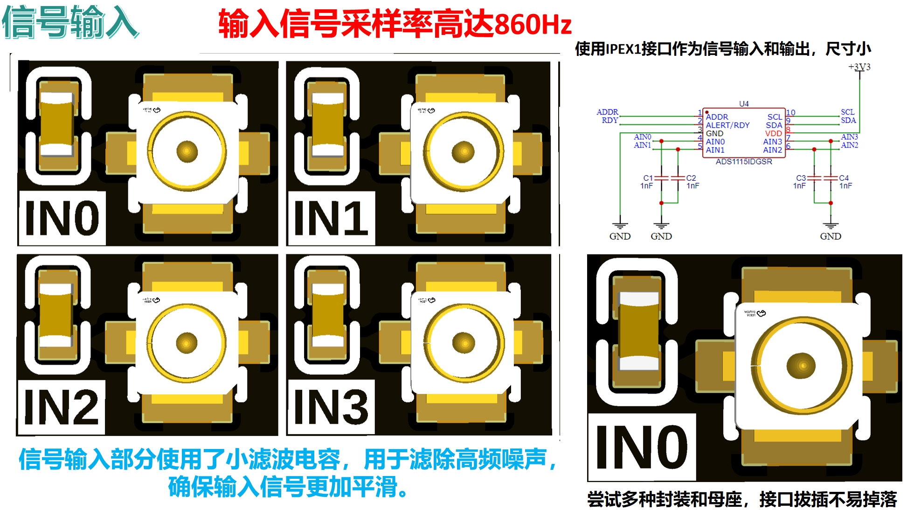

# 目录/MENU

- [中文部分](#数据转换扩展板)
- [English Section](#Data-Conversion-Board)

# 数据转换扩展板
## 1.总体介绍

数据转换板是一种用于通过串行通信I2C接口来采集信号波形或输出信号的扩展模块，具有以下主要特点：
- **小尺寸设计**：可以与XIAO系列主控板直接连接，也可以作为独立模块使用；使用IPEX1接口作为信号输入和输出，尺寸小。
- **I2C接口**：提供I2C总线接口进行堆叠式级联，最多支持4个扩展板连接，支持高达16通道的信号输入和2通道的信号输出。
- **信号输入与输出**：输入信号采样率高达860Hz，输出信号最高频率为50KHz，单个扩展板支持4通道信号输入和1通道信号输出。
- **信号输入滤波**：信号输入部分使用了小滤波电容，用于滤除高频噪声，确保输入信号更加平滑。
- **信号输出缓冲隔离**：在信号输出端放置了电压跟随器，提高输出信号的驱动能力，同时隔离电路前后级。
- **稳定供电**：在运放部分加入钽电容进行滤波，保证供电稳定。

## 2.接口说明
### 2.1 通信接口
我们提供了一个I2C通信接口，当作为单独模块使用时，通过PH2.0连接线连接主控模块和扩展板，如下图所示：

也可以使用主控板直接插入到扩展板的排母接口上：

多个扩展板也可以通过更改外侧插孔中排针排母方向实现堆叠连接，此种情况主要用于需要更多输入通道进行信号采样和波形输出，最多可以使用两个扩展板进行堆叠连接，堆叠放置最多支持8通道信号输入和2通道信号输出；若使用I2C扩展板，可以使用四个扩展板，支持16通道信号输入和2通道信号输出：

### 2.2 信号接口
在信号输入和输出部分，我们可以使用不同类型的IPEX连接线与示波器、信号发生器或者其他信号处理模块连接：

## 3.硬件细节
### 3.1 稳定供电
在运算放大器部分，我们使用钽电容滤波，帮助平滑电源中的噪声，并稳定运放的工作电压；在芯片供电部分，我们使用了多种不同大小的电容，对高低频噪声进行有效滤除：

### 3.2 信号输入
信号输入部分使用了小滤波电容，用于滤除高频噪声，确保输入信号更加平滑，同时使用IPEX1接口作为信号输入和输出，尺寸小，我们也尝试了多种封装和母座，保证接口拔插不易掉落：

### 3.3 信号输出
在信号输出部分，我们放置了电压跟随器，提高输出信号的驱动能力，同时隔离电路前后级：

### 3.4 地址设置
通过焊接背面短路点可以设置芯片地址位，通过对不同芯片设置不同地址位能够完成多个扩展板的级联和芯片区分，并且在这里不同短路点对应地址位在丝印中标出：

## 4.提供代码和使用须知
在使用烧录完程序后的主控板通过扩展板输入或输出信号前，务必确保示波器、信号发生器或其他信号调理模块和信号输入或输出端子接线正确，供电无误：

示例代码包括以下版本：
- **MicroPython版本**：[**数据转换板MicroPython示例程序**](https://github.com/leezisheng/Domino-Series-Expansion-Board/tree/main/Data-Conversion-Board/code/MicroPython)
- **Arduino版本**：[**数据转换板Arduino示例程序**](https://github.com/leezisheng/Domino-Series-Expansion-Board/tree/main/Data-Conversion-Board/code/Arduino)

## 5.获取链接
- **商品链接**：[总线电机驱动扩展板购买链接]
- **硬件开源链接**：[硬件开源资料链接]

# Data-Conversion-Board
## 1. Overview

The data conversion board is an expansion module used for acquiring signal waveforms or outputting signals via I2C serial communication interface. The main features are as follows:
- **Compact Design**: Can directly connect to the XIAO series main control board or be used as an independent module; uses an IPEX1 interface for signal input and output, which is compact in size.
- **I2C Interface**: Provides an I2C bus interface for stacking, supporting up to 4 expansion boards, with a maximum of 16 signal input channels and 2 signal output channels.
- **Signal Input and Output**: The input signal sampling rate is up to 860Hz, and the output signal maximum frequency is 50KHz. A single expansion board supports 4 signal input channels and 1 signal output channel.
- **Signal Input Filtering**: The signal input section uses small filter capacitors to eliminate high-frequency noise, ensuring smoother input signals.
- **Signal Output Buffer Isolation**: A voltage follower is placed at the signal output to improve the driving capability of the output signal and isolate the front and rear stages of the circuit.
- **Stable Power Supply**: Tantalum capacitors are used in the operational amplifier section for filtering, ensuring stable power supply.

## 2. Interface Description
### 2.1 Communication Interface
We provide an I2C communication interface. When used as an independent module, it connects the main control module and the expansion board via a PH2.0 connecting wire, as shown in the figure below:

It can also be directly inserted into the expansion board's female header interface:

Multiple expansion boards can be stacked by changing the pin header and socket direction on the outermost connector. This configuration is mainly used when more input channels are required for signal sampling and waveform output. A maximum of two expansion boards can be stacked, supporting up to 8 signal input channels and 2 signal output channels. If using the I2C expansion board, up to four expansion boards can be used, supporting 16 signal input channels and 2 signal output channels:

### 2.2 Signal Interface
For signal input and output, different types of IPEX cables can be used to connect to oscilloscopes, signal generators, or other signal processing modules:

## 3. Hardware Details
### 3.1 Stable Power Supply
In the operational amplifier section, we use tantalum capacitors for filtering to help smooth out noise in the power supply and stabilize the operating voltage of the op-amps. In the chip power supply section, various capacitors of different sizes are used to effectively filter high and low-frequency noise:

### 3.2 Signal Input
The signal input section uses small filter capacitors to eliminate high-frequency noise, ensuring smoother input signals. The IPEX1 interface is used for signal input and output, which is compact. We also tried various packaging and sockets to ensure the interface is secure and not easily disconnected:

### 3.3 Signal Output
In the signal output section, a voltage follower is placed to improve the output signal's driving capability and isolate the front and rear stages of the circuit:

### 3.4 Address Setting
The chip address bits can be set by soldering short-circuit points on the back. By setting different address bits for different chips, multiple expansion boards can be cascaded, and the chips can be distinguished. The corresponding address bits for the short-circuit points are marked on the silkscreen:

## 4. Provided Code and Usage Instructions
Before using the expansion board to input or output signals after programming, make sure that the oscilloscope, signal generator, or other signal conditioning modules are correctly connected to the signal input or output terminals, and that the power supply is correct:

Example code includes the following versions:
- **MicroPython Version**: [**Data Conversion Board MicroPython Example Program**](https://github.com/leezisheng/Domino-Series-Expansion-Board/tree/main/Data-Conversion-Board/code/MicroPython)
- **Arduino Version**: [**Data Conversion Board Arduino Example Program**](https://github.com/leezisheng/Domino-Series-Expansion-Board/tree/main/Data-Conversion-Board/code/Arduino)

## 5. Access Links
- **Product Link**: [Bus Motor Driver Expansion Board Purchase Link]
- **Hardware Open Source Link**: [Hardware Open Source Materials Link]