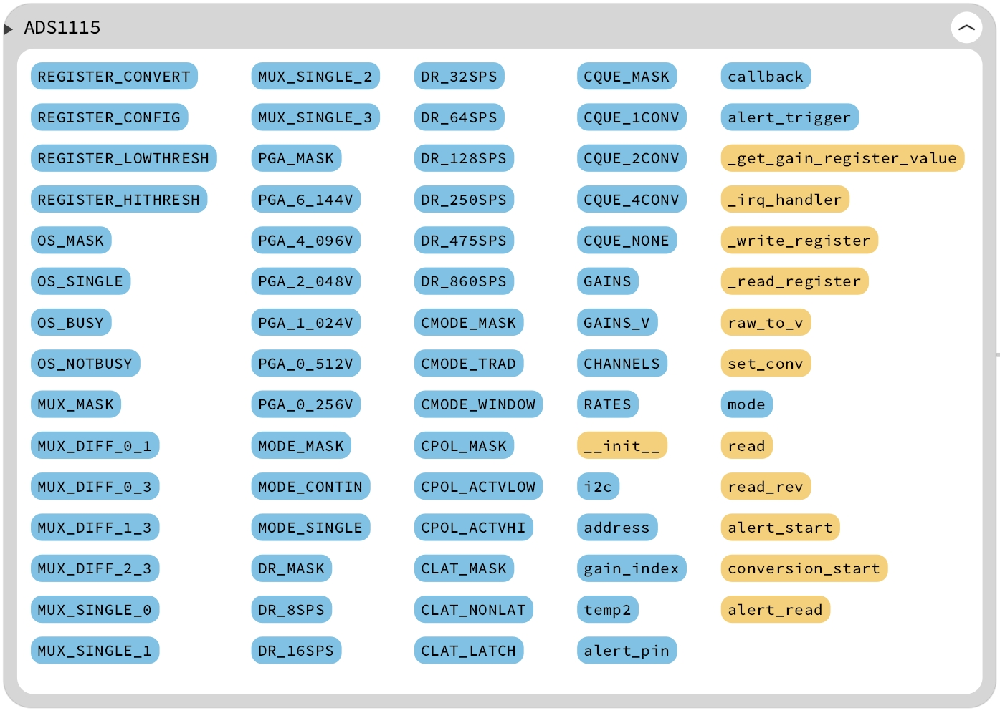

# 目录/MENU
- [中文部分](#串口舵机扩展板（FreakStudio）示例程序-MicroPython版本)
- [English Section](#Data-Conversion-Expansion-Board-(FreakStudio-Domino-Series)-Example-Program-MicroPython-Version)

# 数据转换扩展板（FreakStudio-多米诺系列）示例程序-MicroPython版本

该示例程序展示了如何使用MicroPython控制数据转换板（FreakStudio）。通过主控芯片的I2C通信接口，用户可以使用板载ADS1115模数转换芯片实现四通道信号输入，可以配置采样率、
输入模式（单端输入/差分输入）和转换模式（持续转换或触发转换）；也可以使用板载MCP4725数模转换芯片输出模拟电压值，或在不需要使用DAC时启用电源关断模式降低功耗。
除此之外，我们还提供了一个WaveformGenerator自定义DAC波形发生器类来实现使用DAC芯片生成频率在10Hz内的三角波、矩形波、正弦波，并且可以设置信号幅度、直流偏移或信号频率。

该软件必须在提供的数据转换板（由FreakStudio开发设计的多米诺系列）上运行，才能确保其正常工作。请参阅硬件开源链接和商品链接获取详细信息。
- **商品链接**：[数据转换板购买链接]
- **硬件开源链接**：[硬件开源资料链接]

## 主要特性

- ADC芯片支持增益、采样速率和输入通道配置，提供警报功能，支持阈值设置和回调函数触发。
- DAC芯片支持配置模拟值范围，提供电源关断模式配置（关闭、1k、100k、500k）。
- 内置波形发生器类，基于 MCP4725 DAC 生成正弦波、方波和三角波，可调频率、幅度、偏移，支持三角波的上升斜率调整。
- 完整的异常捕获机制，对入口参数进行详细检查。
- 注释完善，所有方法和类均提供了类型注解。

## 文件说明
- `MCP4725` 类提供了控制 DAC 输出的接口。
- `ADS1115` 类提供了通过 ADC 读取模拟信号的接口。
- `WaveformGenerator` 类通过 MCP4725 控制波形生成，并能根据指定的参数生成不同的波形。


### ADC模数转换相关文件：ads1115.py   

提供了 `ADS1115` 类，支持通过 `I2C` 接口进行模拟信号读取和数字信号转换。



- `__init__(self, i2c: machine.I2C, address: int = 0x48, gain: int = 2, alert_pin: Optional[int] = None, callback: Optional[Callable] = None)`
  - 初始化 `ADS1115` 实例，并设置 I2C 地址、增益、警报引脚和回调函数。

- `_get_gain_register_value(self, gain: float) -> int`
  - 根据增益值返回对应的寄存器配置值。

- `_irq_handler(self, pin: machine.Pin)`
  - 内部分配的中断处理程序，用于警报引脚触发时执行回调函数（如果设置了回调函数）。

- `read(self, rate: int = 4, channel1: int = 0, channel2: Optional[int] = None) -> int`
  - 从指定通道读取 ADC 转换结果，并返回原始值。

- `set_conv(self, rate: int = 4, channel1: int = 0, channel2: Optional[int] = None)`
  - 设置转换速率和通道。配置 ADC 转换速率和所需的输入通道。

- `raw_to_v(self, raw: int) -> float`
  - 将读取到的原始数据转换为对应电压值。

### DAC数模转换相关文件：mcp4725.py 和 dac_waveformgenerator.py    

提供了`MCP4725` 类，通过 I2C 通信控制 MCP4725 数字模拟转换器（DAC）芯片，该类允许用户配置 DAC，并根据数字值输出模拟电压。
MCP4725 DAC 提供 12 位分辨率，意味着它可以输出对应于 0 到 4095 之间的数字值的电压。

同时提供了 `WaveformGenerator` 类，可以通过DAC芯片生成不同频率、幅度、偏移的波形。


#### MCP4725类

##### 类属性
- `BUS_ADDRESS`（列表）：MCP4725 芯片可能的 I2C 地址列表，默认值为 `[0x62, 0x63]`。
- `POWER_DOWN_MODE`（字典）：一个字典，映射不同的电源关断模式及其对应的字符串表示。可用的模式有：
  - `'Off'`：关闭电源。
  - `'1k'`：电源关闭后，DAC输出端保持1kΩ电阻。
  - `'100k'`：电源关闭后，DAC输出端保持100kΩ电阻。
  - `'500k'`：电源关闭后，DAC输出端保持500kΩ电阻。

##### 方法介绍
- `__init__(self, i2c: machine.I2C, address: int = 0x62)`  
  初始化 `MCP4725` 实例，并设置 I2C 地址。

- `write(self, value: int) -> bool`  
  向 MCP4725 写入模拟值，模拟值范围为 0 至 4095。

- `read(self) -> tuple`  
  从 MCP4725 读取状态信息，包括电源关断模式和 DAC 输出值。

- `config(self, power_down: str = 'Off', value: int = 0, eeprom: bool = False) -> bool`  
  配置 MCP4725 的电源关断模式和输出值，并可选择是否写入 EEPROM。

- `_powerDownKey(self, value: int) -> str`  
  将电源关断模式编码值转换为字符串模式名称。

#### WaveformGenerator类

##### 核心设计思想
初始化时，用户可设置信号的频率、幅度、偏移量、波形类型及三角波的上升斜率等参数，并进行有效性检查，
该类内部通过生成采样点数据来表示波形信号，并利用定时器回调函数周期性地将这些数据写入 DAC 输出从而实现波形的连续输出，
用户可以通过 start 方法启动波形生成，通过 stop 方法停止输出。

需要注意的是，由于MicroPython的定时器频率限制，该类目前固定使用 50 个采样点进行波形的离散化并且限制波形频率在10Hz之内，如果需要更多采样点或更高的频率，
可以通过直接读写寄存器方式控制芯片内置寄存器实现更高的时钟中断频率。

##### 方法介绍
- `__init__(self, timer_freq: float, amplitude: float = 3.3, offset: float = 0.0, wave_type: str = 'sine', triangle_slope: float = 0.1)`  
  初始化 `WaveformGenerator` 实例，设置定时器频率、幅度、直流偏移、波形类型和三角波上升斜率。

- `start(self)`  
  启动波形生成，开始周期性地输出设定的波形信号到 DAC。

- `stop(self)`  
  停止波形生成，暂停波形输出。

- `set_frequency(self, frequency: float)`  
  设置生成波形的频率，并进行有效性检查，确保频率不超过定时器限制。

- `set_amplitude(self, amplitude: float)`  
  设置波形的幅度，并确保其范围在 0 至 3.3V 之间。

- `set_offset(self, offset: float)`  
  设置波形的直流偏移，并确保其范围在 0 至 3.3V 之间。

- `set_wave_type(self, wave_type: str)`  
  设置波形的类型，可以是 `sine`、`square` 或 `triangle`。

- `set_triangle_slope(self, slope: float)`  
  设置三角波的上升或下降斜率。

- `_generate_samples(self)`  
  根据设定的频率、幅度、直流偏移和波形类型生成采样数据。

- `_timer_callback(self)`  
  定时器回调函数，周期性地将生成的采样数据写入 DAC 输出。
  
## 如何使用
### 安装依赖
1. 首先需要安装MicroPython必要的依赖库：
   * MCP4725 类 和 ADS1115 类 都依赖于 machine.I2C 进行通信。
   * WaveformGenerator 类 依赖于 machine.Timer 来控制波形的周期输出，并可以使用 machine.DAC 来输出波形数据。
   * struct 和 math 是辅助工具，用于数据处理和数学计算。
2. 其次需要将三个Python文件放到主文件所在文件夹中，并进行导入：
在你的 `main.py` 文件中，导入这三个文件中的类。例如：

```python
from mcp4725 import MCP4725
from ads1115 import ADS1115
from dac_waveformgenerator import WaveformGenerator
```

### 使用示例


## 注意事项
* **值设置**：在设置频率、幅度和偏移时，确保它们的值符合范围要求，否则可能导致设备无法正常工作。
* **I2C通信**：确保I2C通信正确配置，地址设置无误。
* **波形生成频率**：在使用WaveformGenerator生成波形时，频率最好在0到10 Hz范围内，以避免过高频率造成信号异常。

## 结语
通过本示例程序，用户可以快速上手并实现对多个舵机的灵活控制。
此程序支持多种舵机控制模式，提供了强大的舵机状态读取功能，适合需要多舵机控制的项目需求。

## 联系开发者
- 如有任何问题或需要帮助，请通过 [10696531183@qq.com](mailto:10696531183@qq.com) 联系开发者。


## 许可协议
本项目中的部分代码由以下开发者提供，并且使用相应的开源协议：
* **mcp4725.py** ：该部分代码由 [wayoda](https://github.com/wayoda) 开发，采用 [Unlicense](https://unlicense.org/) 协议发布，[mcp4725 GitHub 仓库](https://github.com/wayoda/micropython-mcp4725/blob/master/mcp4725.py)。
* **ads1115.py** ：该部分代码由 [robert-hh](https://github.com/robert-hh) 开发，采用 [MIT License](https://opensource.org/licenses/MIT) 协议发布，[ads1x15 GitHub 仓库](https://github.com/robert-hh/ads1x15)。
* 本项目扩展部分`dac_waveformgenerator.py`采用 **[知识共享署名-非商业性使用 4.0 国际版 (CC BY-NC 4.0)](https://creativecommons.org/licenses/by-nc/4.0/)** 许可协议。


# Data-Conversion-Expansion-Board-(FreakStudio-Domino-Series)-Example-Program-MicroPython-Version

This example program demonstrates how to use MicroPython to control the Data Conversion Board (FreakStudio). Through the I2C communication interface of the main controller chip, users can use the onboard ADS1115 analog-to-digital converter (ADC) chip to achieve four-channel signal input. Users can configure the sampling rate, input mode (single-ended input/differential input), and conversion mode (continuous conversion or triggered conversion). Additionally, the onboard MCP4725 digital-to-analog converter (DAC) chip can be used to output analog voltage values, or the power-down mode can be enabled to reduce power consumption when the DAC is not needed. Furthermore, we provide a custom WaveformGenerator DAC waveform generator class to generate triangle, square, and sine waves with frequencies within 10Hz using the DAC chip. The amplitude, DC offset, and signal frequency can be set.

This software must run on the provided data conversion board (Domino Series designed and developed by FreakStudio) to ensure its proper functioning. Please refer to the hardware open-source link and product link for more details.
- **Product Link**: [Data Conversion Board Purchase Link]
- **Hardware Open-Source Link**: [Hardware Open Source Documentation Link]

## Key Features

- The ADC chip supports gain, sampling rate, and input channel configuration, providing an alarm function with threshold settings and callback function triggers.
- The DAC chip supports configuring the analog output range and provides power-down mode configurations (off, 1k, 100k, 500k).
- A built-in waveform generator class based on the MCP4725 DAC generates sine, square, and triangle waves with adjustable frequency, amplitude, and offset, and supports adjusting the rise slope of the triangle wave.
- A complete exception capture mechanism with detailed checks for input parameters.
- Comprehensive comments with type annotations for all methods and classes.

## File Description
- The `MCP4725` class provides an interface to control the DAC output.
- The `ADS1115` class provides an interface to read analog signals through the ADC.
- The `WaveformGenerator` class controls waveform generation through the MCP4725, generating different waveforms based on specified parameters.


### ADC Analog-to-Digital Conversion Related File: ads1115.py  

Provides the `ADS1115` class, supporting analog signal reading and digital conversion through the I2C interface.


- `__init__(self, i2c: machine.I2C, address: int = 0x48, gain: int = 2, alert_pin: Optional[int] = None, callback: Optional[Callable] = None)`
  - Initializes the `ADS1115` instance and sets the I2C address, gain, alert pin, and callback function.

- `_get_gain_register_value(self, gain: float) -> int`
  - Returns the corresponding register configuration value based on the gain value.

- `_irq_handler(self, pin: machine.Pin)`
  - Internal interrupt handler that executes the callback function when the alert pin is triggered (if a callback is set).

- `read(self, rate: int = 4, channel1: int = 0, channel2: Optional[int] = None) -> int`
  - Reads the ADC conversion result from the specified channel and returns the raw value.

- `set_conv(self, rate: int = 4, channel1: int = 0, channel2: Optional[int] = None)`
  - Configures the conversion rate and channels for ADC conversion.

- `raw_to_v(self, raw: int) -> float`
  - Converts the raw data read from the ADC to the corresponding voltage value.

### DAC Digital-to-Analog Conversion Related Files: mcp4725.py and dac_waveformgenerator.py  

Provides the `MCP4725` class, which controls the MCP4725 DAC chip via the I2C communication interface. This class allows users to configure the DAC and output analog voltage based on digital values.
The MCP4725 DAC provides 12-bit resolution, meaning it can output voltages corresponding to digital values ranging from 0 to 4095.

Additionally, the `WaveformGenerator` class is provided, which can generate different waveforms with adjustable frequency, amplitude, and offset through the DAC chip.


#### MCP4725 Class

##### Class Properties
- `BUS_ADDRESS` (list): The possible I2C addresses for the MCP4725 chip, with a default value of `[0x62, 0x63]`.
- `POWER_DOWN_MODE` (dictionary): A dictionary mapping different power-down modes to their corresponding string representations. Available modes include:
  - `'Off'`: Power off.
  - `'1k'`: Power off, DAC output is held at 1kΩ resistance.
  - `'100k'`: Power off, DAC output is held at 100kΩ resistance.
  - `'500k'`: Power off, DAC output is held at 500kΩ resistance.

##### Method Descriptions
- `__init__(self, i2c: machine.I2C, address: int = 0x62)`  
  Initializes the `MCP4725` instance and sets the I2C address.

- `write(self, value: int) -> bool`  
  Writes an analog value to the MCP4725, where the value is in the range 0 to 4095.

- `read(self) -> tuple`  
  Reads status information from the MCP4725, including the power-down mode and DAC output value.

- `config(self, power_down: str = 'Off', value: int = 0, eeprom: bool = False) -> bool`  
  Configures the MCP4725's power-down mode and output value, with an option to write to EEPROM.

- `_powerDownKey(self, value: int) -> str`  
  Converts the power-down mode's encoded value to a string mode name.

#### WaveformGenerator Class

##### Core Design Concept
When initialized, users can set the frequency, amplitude, offset, waveform type, and rise slope of the triangle wave. The class internally generates sample data to represent the waveform and writes this data to the DAC output periodically using the timer callback function. Users can start waveform generation by calling the `start` method and stop it with the `stop` method.

Due to the frequency limitation of MicroPython's timer, this class currently uses 50 sample points to discretize the waveform and limits the waveform frequency to 10Hz. If more sample points or higher frequencies are needed, the chip's internal registers can be controlled directly to achieve higher interrupt frequencies.

##### Method Descriptions
- `__init__(self, timer_freq: float, amplitude: float = 3.3, offset: float = 0.0, wave_type: str = 'sine', triangle_slope: float = 0.1)`  
  Initializes the `WaveformGenerator` instance, setting the timer frequency, amplitude, DC offset, waveform type, and triangle wave rise slope.

- `start(self)`  
  Starts the waveform generation and begins periodically outputting the set waveform to the DAC.

- `stop(self)`  
  Stops the waveform generation and halts the output of the waveform.

- `set_frequency(self, frequency: float)`  
  Sets the frequency of the generated waveform, with a validity check to ensure the frequency does not exceed the timer's limit.

- `set_amplitude(self, amplitude: float)`  
  Sets the amplitude of the waveform, ensuring it stays within the 0 to 3.3V range.

- `set_offset(self, offset: float)`  
  Sets the DC offset of the waveform, ensuring it stays within the 0 to 3.3V range.

- `set_wave_type(self, wave_type: str)`  
  Sets the waveform type, which can be `sine`, `square`, or `triangle`.

- `set_triangle_slope(self, slope: float)`  
  Sets the rise or fall slope of the triangle wave.

- `_generate_samples(self)`  
  Generates sample data for the waveform based on the frequency, amplitude, DC offset, and waveform type.

- `_timer_callback(self)`  
  The timer callback function, which periodically writes the generated sample data to the DAC output.

## How to Use
### Install Dependencies
1. First, install the necessary MicroPython dependencies:
   - Both the `MCP4725` and `ADS1115` classes depend on the machine.I2C interface for communication.
   - The `WaveformGenerator` class depends on the machine.Timer to control the periodic output of waveforms, and can use machine.DAC to output waveform data.
   - The `struct` and `math` modules are auxiliary tools for data processing and mathematical calculations.
2. Next, place the three Python files in the same folder as your main file and import them:
In your `main.py` file, import the classes from these three files. For example:

```python
from mcp4725 import MCP4725
from ads1115 import ADS1115
from dac_waveformgenerator import WaveformGenerator
```

### Example Usage

## Notes

* **Value Setting**: Ensure that the frequency, amplitude, and offset values are within the required range to avoid malfunctioning.
* **I2C Communication**: Ensure that I2C communication is correctly configured with the proper address.
* **Waveform Generation Frequency**: When using the WaveformGenerator, it's best to keep the frequency within the 0 to 10 Hz range to prevent abnormal signals at higher frequencies.

## Conclusion

This example program allows users to quickly get started with controlling the FreakStudio data conversion board. 
It supports multiple channels for data acquisition and generation of waveforms with configurable parameters, 
making it suitable for a variety of signal processing tasks.

## Contact the Developer
- For any inquiries or assistance, feel free to contact the developer at [10696531183@qq.com](mailto:10696531183@qq.com).


## License Agreement
Some parts of this project are provided by the following developers and are released under the respective open-source licenses:

* **mcp4725.py**: This part of the code was developed by [wayoda](https://github.com/wayoda) and is released under the [Unlicense](https://unlicense.org/) license. [mcp4725 GitHub Repository](https://github.com/wayoda/micropython-mcp4725/blob/master/mcp4725.py).
* **ads1115.py**: This part of the code was developed by [robert-hh](https://github.com/robert-hh) and is released under the [MIT License](https://opensource.org/licenses/MIT). [ads1x15 GitHub Repository](https://github.com/robert-hh/ads1x15).
* The extended part of this project, `dac_waveformgenerator.py`, is released under the **[Creative Commons Attribution-NonCommercial 4.0 International (CC BY-NC 4.0)](https://creativecommons.org/licenses/by-nc/4.0/)** license.