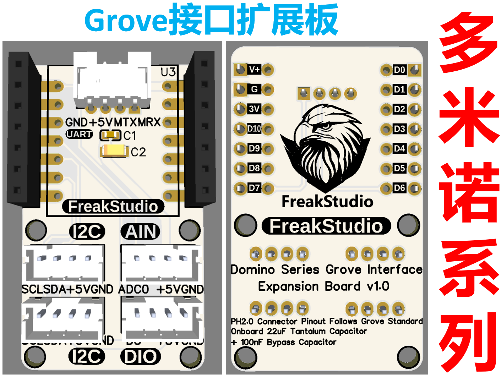
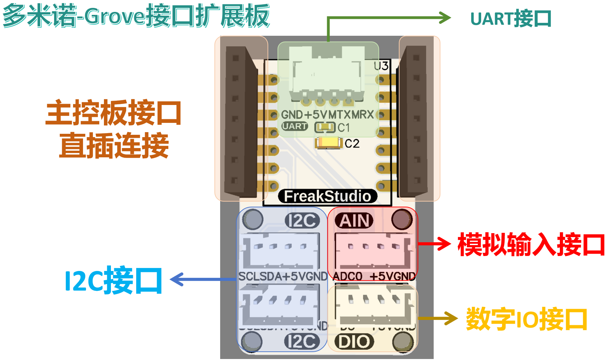
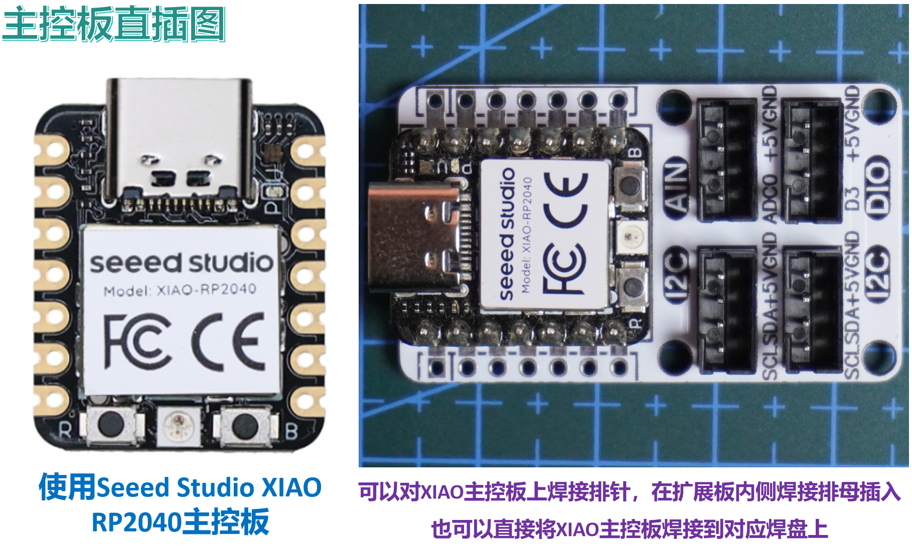
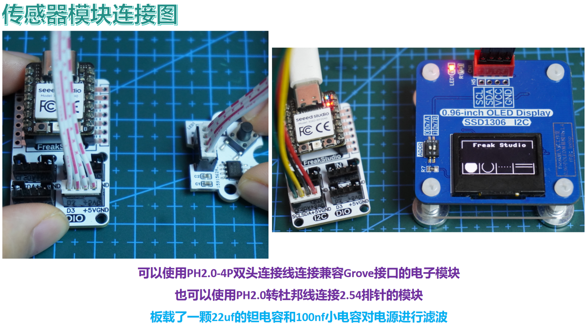
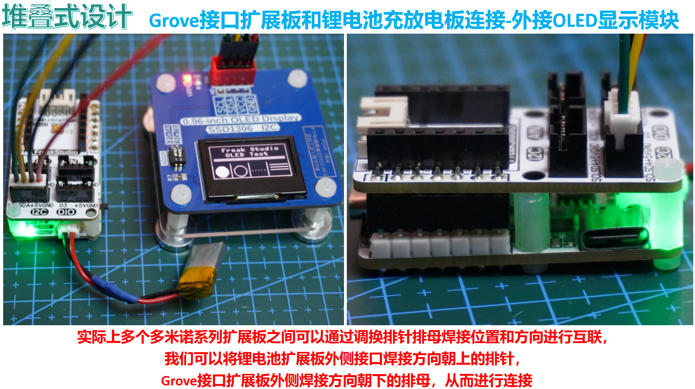

# 目录/MENU

- [中文部分](#Grove接口扩展板)
- [English Section](#Grove-Interface-Expansion-Board)

# Grove接口扩展板
## 1.总体介绍

[Grove接口扩展板](https://github.com/leezisheng/Domino-Series-Expansion-Board/tree/main/Grove-Interface-Expansion-Board)采用小尺寸设计，既可直接连接XIAO系列主控板使用，也可作为独立模块单独应用。板载一个22μF钽电容与100nF小电容，对电源进行有效滤波，提升系统稳定性与抗干扰能力。
扩展板提供丰富的Grove标准接口资源，包括：
- 1个UART串口接口；
- 2个I²C接口，便于连接多个传感器模块；
- 1个模拟输入接口，可采集电压类信号；
- 1个数字IO接口，用于控制开关、读取状态等功能。
所有接口均遵守Grove标准规范，采用PH2.0-4P连接线即可轻松与各类外部Grove传感器模块对接，简化原型开发流程，加快项目落地，适用于教育、创客、智能家居等多种应用场景。

## 2.接口说明
可以对XIAO主控板上焊接排针，在扩展板内侧焊接排母插入，也可以直接将XIAO主控板焊接到对应焊盘上：

我们可以使用PH2.0-4P双头连接线连接兼容Grove接口的电子模块，也可以使用PH2.0转杜邦线连接2.54排针的模块：

实际上，多个多米诺系列扩展板之间可以通过调整排针和排母的焊接位置与方向实现互联。比如，我们可以将锂电池扩展板外侧的接口焊接一个朝上的排针，将Grove接口扩展板外侧焊接一个朝下的排母，从而实现两者的稳固连接；下面是一个示例：通过上述方式连接Grove接口扩展板与锂电池充放电板，并在Grove接口扩展板上外接OLED显示模块，实现显示功能：

## 3.获取链接
- **商品链接**：[**Grove扩展板获取链接**](https://item.taobao.com/item.htm?ft=t&id=932734781277)
- **硬件开源链接**：[**硬件开源资料链接**](https://github.com/leezisheng/Domino-Series-Expansion-Board/tree/main/Grove-Interface-Expansion-Board/hardware)

# Grove-Interface-Expansion-Board
## 1. Overview

The [Grove Interface Expansion Board](https://github.com/leezisheng/Domino-Series-Expansion-Board/tree/main/Grove-Interface-Expansion-Board) features a compact design that can be directly connected to XIAO series main control boards or used as a standalone module. Equipped with a 22μF tantalum capacitor and a 100nF small capacitor, it effectively filters the power supply to enhance system stability and anti-interference capability.

The expansion board provides abundant Grove standard interface resources, including:
- 1 UART serial interface
- 2 I²C interfaces for connecting multiple sensor modules
- 1 analog input interface for voltage signal acquisition
- 1 digital I/O interface for switch control and status reading

All interfaces comply with the Grove standard specification. Using PH2.0-4P connection cables, you can easily interface with various external Grove sensor modules, simplifying the prototyping process and accelerating project implementation. Suitable for education, maker projects, smart home applications, and various other scenarios.

## 2. Interface Description
You can solder pin headers to the XIAO main control board and insert it into the pin sockets on the inner side of the expansion board, or directly solder the XIAO main control board to the corresponding pads:

You can use PH2.0-4P dual-head connection cables to connect compatible Grove interface electronic modules, or use PH2.0 to Dupont cables to connect modules with 2.54mm pin headers:

Multiple Domino Series expansion boards can be interconnected by adjusting the soldering position and orientation of pin headers and sockets. For example:
- Solder upward-facing pin headers on the outer interface of the lithium battery expansion board
- Solder downward-facing pin sockets on the outer side of the Grove interface expansion board

This enables secure connection between the boards. Below is an example: Connecting the Grove Interface Expansion Board to a Lithium Battery Charging/Discharging Board, with an external OLED display module connected to the Grove interface for display functionality:

## 3. Purchase Links
- **Product Link**: [**Grove Expansion Board Purchase Link**](https://item.taobao.com/item.htm?ft=t&id=932734781277)
- **Open-Source Hardware**: [**Hardware Source Files**](https://github.com/leezisheng/Domino-Series-Expansion-Board/tree/main/Grove-Interface-Expansion-Board/hardware)