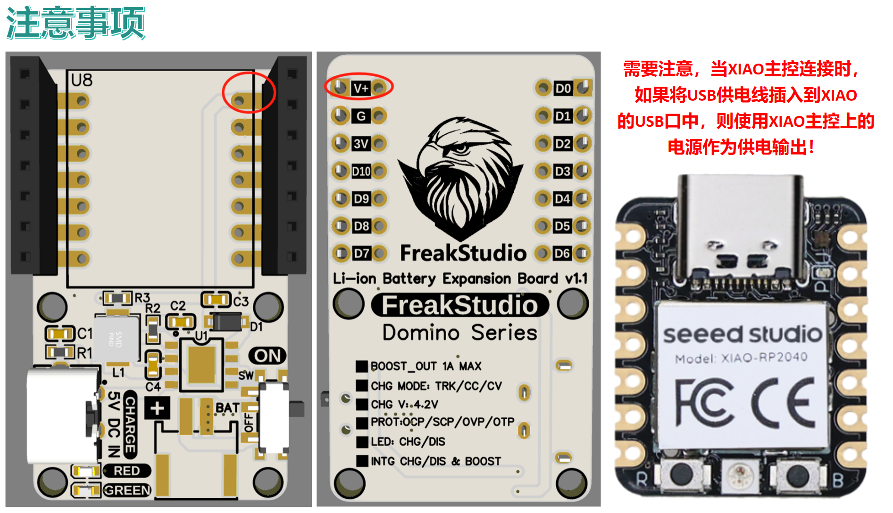

# 目录/MENU

- [中文部分](#锂电池充放电管理板)
- [English Section](#Li-ion-BMS-Board)

# 锂电池充放电管理板
## 1.总体介绍

锂电池充放电管理板采用小尺寸设计，既可直接连接XIAO系列主控板使用，也可作为独立模块单独应用。核心采用SY3501D芯片，具备锂电池充放电管理与5V升压功能，提供稳定的5V/1A输出。

**板载LED指示灯清晰显示工作状态：**
- 放电时绿色灯亮，停止放电时熄灭；
- 充电时红灯闪烁，充满后红灯常亮，绿色灯熄灭。

板子支持0.7A恒流充电，具备涓流、恒流、恒压三阶段智能充电及热调节功能，充电电压预设为4.2V，精度达±1%。为安全考虑，插入USB进行充电时将自动断开输出，避免同充同放，电池需加保护板。模块还集成了过流、短路、过压、过温等多重放电保护机制，保障系统稳定运行。

## 2.接口说明
可以对XIAO主控板上焊接排针，在扩展板内侧焊接排母插入，也可以直接将XIAO主控板焊接到对应焊盘上：

充电时，先打开右侧开关再使用左侧Type-C充电接口进行充电：

放电时，需要注意当XIAO主控连接时，如果将USB供电线插入到XIAO的USB口中，则使用XIAO主控上的电源作为供电输出：

## 3.硬件细节
### 3.1 锂电池充放电管理芯片
板载锂电池充放电管理和升压芯片SY3501D，SY3501是一款专为移动电源设计的单芯片解决方案IC，高度集成了充电管理模块、LED电量显示模块、同步升压放电管理模块的移动电源管理芯片，极大的简化了外围电路与元器件数量。

### 3.2 充放电指示灯
采用红绿两个LED灯作为状态指示：

### 3.3 多个多米诺扩展板插接
实际上多个多米诺系列扩展板直接，可以通过调换排针排母焊接位置和方向进行互联，我们可以将锂电池扩展板
外侧接口焊接方向朝上的排针，其他扩展板外侧焊接方向朝下的排母，从而进行连接：

## 4.获取链接
- **商品链接**：[**锂电池充放电管理扩展板获取链接**](https://item.taobao.com/item.htm?ft=t&id=929302231947)
- **硬件开源链接**：[**硬件开源资料链接**](https://github.com/leezisheng/Domino-Series-Expansion-Board/tree/main/Li-ion-BMS-Board/hardware)

# Li-ion-BMS-Board

## 1. Overview

The compact lithium battery management board can be directly connected to XIAO series main control boards or used as a standalone module. Featuring the SY3501D chip, it integrates lithium battery charge-discharge management and 5V boost functions, delivering stable 5V/1A output.

**Dual-color LED status indication:**
- Green light on during discharging, off when idle
- Red blinking during charging, solid red when fully charged (green light off)

Supports 0.7A constant current charging with three-stage smart charging (trickle/CC/CV) and thermal regulation. Charging voltage preset to 4.2V (±1% accuracy). Safety features include automatic output disconnection during USB charging to prevent simultaneous charge-discharge (requires battery protection circuit). Integrated protections: over-current, short-circuit, over-voltage, and over-temperature.

## 2. Interfaces
Connect via soldered pin headers to XIAO mainboard (inner row) or direct soldering:

**Charging sequence:** 
1. Turn on right-side switch 
2. Use left Type-C port:

**Discharging note:** 
When USB cable is connected to XIAO's port, it prioritizes XIAO's power supply:

## 3. Hardware Details
### 3.1 SY3501D Power Management IC
Integrated mobile power solution chip combining:
- Charging management
- LED power display
- Synchronous boost discharge

### 3.2 Status LEDs
Dual-color indication system:

### 3.3 Domino Expansion Board Stacking
Interconnect Domino expansion boards by alternating pin header orientations:
- Battery board: upward-facing headers (outer row)
- Other boards: downward-facing sockets

## 4. Resources
- **Purchase**: [Lithium BMS Expansion Board](https://item.taobao.com/item.htm?ft=t&id=929302231947)
- **Open Source**: [Hardware Design Files](https://github.com/leezisheng/Domino-Series-Expansion-Board/tree/main/Li-ion-BMS-Board/hardware)