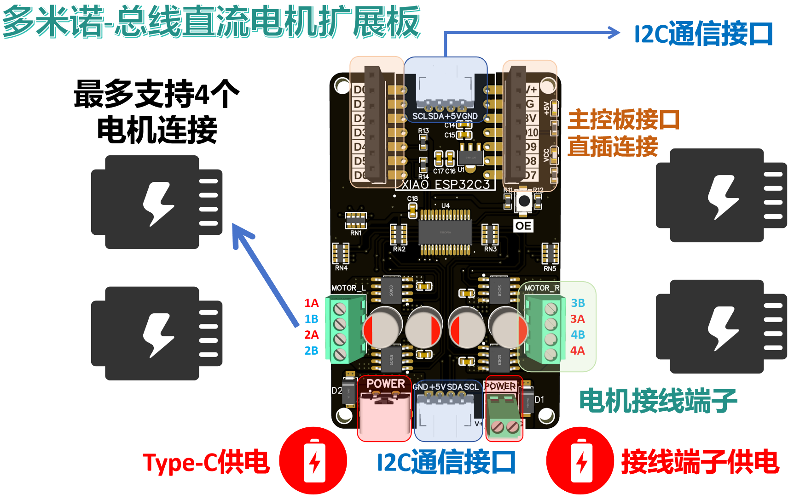

# 目录/MENU

- [中文部分](#多米诺系列扩展板介绍)
- [English Section](#Domino-Series-Expansion-Board-Introduction)

# 多米诺系列扩展板介绍
多米诺系列扩展板是FreakStudio专门为小尺寸主控板设计的扩展模块，既可以使用主控板直插于扩展板上，也可以作为独立模块使用PH2.0连接线与主控板的对应接口相互连接，由于其尺寸形状类似与多米诺骨牌而命名为多米诺系列，主打小尺寸、高集成度、强扩展性，同时兼具美观。

多米诺系列扩展板的对应接口参考了：**[Grove硬件接口规范](https://wiki.seeedstudio.com/cn/Grove_System/#grove--qwiicstemma-qt-interface-to-malefemale-jumper-cables)**，其硬件设计和示例代码具有以下特点：
  - 小尺寸设计，便于集成到你的原型项目中
  - 统一硬件接口，便于接线
  - 对MicroPython支持度最高，所有配套软件代码均做出部分优化同时提供完善注释以进行学习
  - 每个类和方法都有详细的中文和英文注释，并提供文档注释
  - 对输入参数进行严格的检查，确保方法调用时参数合法

我们还将每款多米诺扩展板提供的常用功能模块化的MicroPython软件代码发布到 **[PyPi包管理平台](https://pypi.org/user/leeqingshui/)**。

目前支持的主控板包括：
* [Seeed Studio XIAO 拇指开发板](https://wiki.seeedstudio.com/cn/SeeedStudio_XIAO_Series_Introduction/)

# 类别
## 总线直流电机扩展板

[总线直流电机扩展板](https://github.com/leezisheng/Domino-Series-Expansion-Board/tree/main/Bus-Motor-Expansion-Board)设计用于通过I2C接口控制最多四个直流电机，具有以下主要特点：
- 小尺寸设计：可以与XIAO系列主控板直接连接，也可以作为独立模块使用。
- I2C接口：提供I2C总线接口进行堆叠式级联，最多支持16个电机驱动扩展板，且提供4个地址位可供选择。
- PWM输出引脚：PWM扩展芯片的输出引脚连接有保护电阻，同时使用的电机驱动芯片自带过流和过热保护功能。
- 按键控制芯片使能/失能：PWM扩展芯片的使能引脚通过按键引出，使用时可通过按键失能芯片。
- 电机驱动芯片可更换：根据需要，可将RZ7899芯片替换为TMI8260、AM2837或SS6285L芯片。
- 电源指示灯：板载电源指示灯显示电机供电状态和PWM扩展芯片供电状态。
- 多种电源输入方式：支持接线端子和Type-C接口供电，具有防反接设计。
- 支持6V至18V供电的电机：整个扩展板最大电流为5A，若只使用两个电机通道，单通道峰值电流支持最大4A。
- 高频低阻电解电容供电：使用四颗220μF高频低阻电解电容或固态电解电容进行供电，固态电解电容相比铝电解电容具有更低的ESR、较高的工作频率和更长的使用寿命。
- 散热设计：扩展板背面的VCC区域采用开窗设计，通过焊锡增大散热效果。
该扩展板提供了优越的电机保护和电源管理功能，适用于各种电机控制应用，我们提供了MicroPython和Arduino例程。

# Freak嵌入式工作室介绍
Freak嵌入式工作室位以嵌入式电子套件及相关教程、成品电子模块开发、个人DIY电子作品为主要产品，致力于嵌入式教育📚和大学生创新创业比赛、电子计算机类比赛培训🧑‍💻。

**我们希望为电子DIY爱好者提供全面系统的教程和有趣的电子模块，帮助其快速完成项目相关知识学习和产品原型设计!**

💡如有任何问题或需要帮助，请通过邮件📧： 10696531183@qq.com 联系 **李清水 / Freak** 。

更多信息可在个人主页查看：  
[leezisheng](https://github.com/leezisheng/leezisheng)

# Domino-Series-Expansion-Board-Introduction

The Domino Series Expansion Board is a module designed by FreakStudio specifically for small-sized main control boards. It can either be directly plugged into the main control board or used as a standalone module connected to the main control board via a PH2.0 connector. The series is named "Domino" due to its size and shape, resembling a domino tile. The boards are designed with a focus on compact size, high integration, strong expandability, and aesthetics.

The corresponding interfaces of the Domino Series Expansion Board follow the **[Grove Hardware Interface Standard](https://wiki.seeedstudio.com/cn/Grove_System/#grove--qwiicstemma-qt-interface-to-malefemale-jumper-cables)**, and the hardware design and example code have the following features:
  - Compact design, easy to integrate into your prototype projects.
  - Unified hardware interface, easy wiring.
  - High support for MicroPython, with optimized software code and comprehensive comments for learning.
  - Detailed Chinese and English comments for each class and method, with documentation.
  - Strict input parameter checks to ensure valid method calls.

We have also published modular MicroPython code for common functionalities of each Domino Expansion Board to the **[PyPi Package Management Platform](https://pypi.org/user/leeqingshui/)**.

Currently supported main control boards include:
* [Seeed Studio XIAO Thumb Development Board](https://wiki.seeedstudio.com/cn/SeeedStudio_XIAO_Series_Introduction/)

# Categories
## Bus DC Motor Expansion Board

[Bus DC Motor Expansion Board](https://github.com/leezisheng/Domino-Series-Expansion-Board/tree/main/Bus-Motor-Expansion-Board) is designed to control up to four DC motors via the I2C interface, with the following main features:
- Compact Design: Can be directly connected to the XIAO series main control board or used as a standalone module.
- I2C Interface: Provides I2C bus interface for stacking, supporting up to 16 motor driver expansion boards, with 4 selectable address bits.
- PWM Output Pins: The PWM expansion chip output pins are connected with protective resistors, and the motor driver chip has built-in overcurrent and overheat protection.
- Button-Controlled Chip Enable/Disable: The PWM expansion chip enable pin is drawn out by a button and can be disabled through the button when not in use.
- Replaceable Motor Driver Chips: The RZ7899 chip can be replaced by TMI8260, AM2837, or SS6285L chips as needed.
- Power Indicators: Onboard power indicators show the motor power status and PWM expansion chip power status.
- Multiple Power Input Options: Supports terminal blocks and Type-C interface power input, with reverse connection protection.
- Supports Motors with 6V to 18V Power: The maximum current for the entire expansion board is 5A. If only two motor channels are used, the peak current per channel supports up to 4A.
- High-Frequency Low-ESR Capacitors: Uses four 220μF high-frequency low-ESR electrolytic or solid-state capacitors. Solid-state capacitors have lower ESR, higher operating frequencies, and longer lifespans compared to aluminum electrolytic capacitors.
- Heat Dissipation Design: The VCC area on the back of the expansion board is windowed, allowing soldering to increase heat dissipation.

This expansion board provides excellent motor protection and power management features, suitable for various motor control applications. We provide MicroPython and Arduino examples.

# FreakStudio Introduction
Freak Embedded Studio focuses on embedded electronic kits, related tutorials, finished electronic module development, and personal DIY electronic projects. We are committed to embedded education 📚 and training for university students in innovation and entrepreneurship competitions, as well as electronic and computer-related competitions 🧑‍💻.

**We aim to provide comprehensive tutorials and interesting electronic modules for DIY electronics enthusiasts, helping them quickly learn project-related knowledge and design product prototypes!**

💡 If you have any questions or need assistance, please contact **Li Qingshui / Freak** via email 📧: 10696531183@qq.com.

For more information, visit my personal homepage:  
[leezisheng](https://github.com/leezisheng/leezisheng)