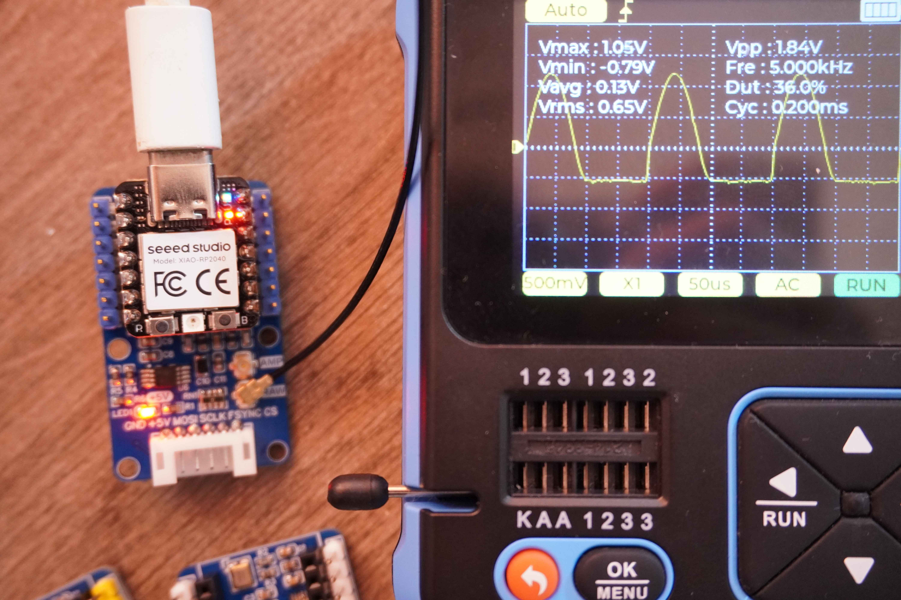
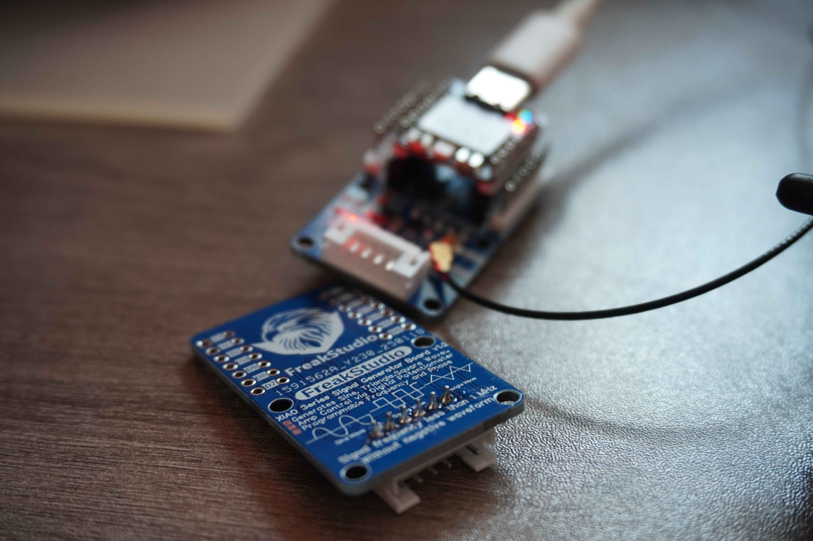

# 目录/MENU

- [中文部分](#多米诺系列扩展板介绍)
- [English Section](#Domino-Series-Expansion-Board-Introduction)

# 多米诺系列扩展板介绍📖
多米诺系列扩展板是FreakStudio专门为小尺寸主控板设计的扩展模块，既可以使用主控板直插于扩展板上，也可以作为独立模块使用PH2.0连接线与主控板的对应接口相互连接，由于其尺寸形状类似与多米诺骨牌而命名为多米诺系列，主打小尺寸、高集成度、强扩展性，同时兼具美观。

多米诺系列扩展板的对应接口参考了：**[Grove硬件接口规范](https://wiki.seeedstudio.com/cn/Grove_System/#grove--qwiicstemma-qt-interface-to-malefemale-jumper-cables)**，其硬件设计和示例代码具有以下特点：
  - 小尺寸设计，便于集成到你的原型项目中。
  - 统一硬件接口，便于接线。
  - 对MicroPython支持度最高，所有配套软件代码均做出部分优化同时提供完善注释以进行学习。
  - 每个类和方法都有详细的中文和英文注释，并提供文档注释。
  - 对输入参数进行严格的检查，确保方法调用时参数合法。

我们还将部分多米诺扩展板提供的常用功能模块化的MicroPython软件代码发布到 **[PyPi包管理平台](https://pypi.org/user/leeqingshui/)**。

目前支持的主控板包括：
* [Seeed Studio XIAO 拇指开发板](https://wiki.seeedstudio.com/cn/SeeedStudio_XIAO_Series_Introduction/)

详细描述可以查看飞书云文档链接：**[Freak嵌入式工作室-多米诺系列开发板-飞书云](https://f1829ryac0m.feishu.cn/docx/ZzA5dIsdyowLUKxJr0fcwYInnhd?from=from_copylink)**。

# 类别📂
## 总线直流电机扩展板⚙️

[**总线直流电机扩展板**](https://github.com/leezisheng/Domino-Series-Expansion-Board/tree/main/Bus-Motor-Expansion-Board)设计用于通过I2C接口控制最多四个直流电机，具有以下主要特点：
- **小尺寸设计**：可以与XIAO系列主控板直接连接，也可以作为独立模块使用。
- **I2C接口**：提供I2C总线接口进行堆叠式级联，最多支持16个电机驱动扩展板，且提供4个地址位可供选择。
- **PWM输出引脚**：PWM扩展芯片的输出引脚连接有保护电阻，同时使用的电机驱动芯片自带过流和过热保护功能。
- **按键控制芯片使能/失能**：PWM扩展芯片的使能引脚通过按键引出，使用时可通过按键失能芯片。
- **电机驱动芯片可更换**：根据需要，可将RZ7899芯片替换为TMI8260、AM2837或SS6285L芯片。
- **电源指示灯**：板载电源指示灯显示电机供电状态和PWM扩展芯片供电状态。
- **多种电源输入方式**：支持接线端子和Type-C接口供电，具有防反接设计。
- **支持6V至18V供电的电机**：整个扩展板最大电流为5A，若只使用两个电机通道，单通道峰值电流支持最大4A。
- **高频低阻电解电容供电**：使用四颗220μF高频低阻电解电容或固态电解电容进行供电，固态电解电容相比铝电解电容具有更低的ESR、较高的工作频率和更长的使用寿命。
- **散热设计**：扩展板背面的VCC区域采用开窗设计，通过焊锡增大散热效果。

该扩展板提供了优越的电机保护和电源管理功能，适用于各种电机控制应用，我们提供了MicroPython和Arduino例程。

## 总线舵机扩展板🤖

[**总线舵机扩展板**](https://github.com/leezisheng/Domino-Series-Expansion-Board/tree/main/Serial-Servo-Driver-Board)是一种用于通过串行通信接口UART来控制多个舵机的扩展模块，具有以下主要特点：
- **小尺寸设计**：可以与XIAO系列主控板直接连接，也可以作为独立模块使用。
- **UART接口**：提供I2C总线接口进行堆叠式级联，最多支持4个电机驱动扩展板
- **全双工转半双工电路设计**：使用三态缓冲器和反相器实现串口通信全双工转半双工设计，一根信号线兼具串口收发功能
- **多个供电指示灯**：板载电源指示灯显示舵机供电状态、芯片供电状态和通信状态。
- **供电保护设计**：使用二极管防止电源反接，保险丝防止舵机堵转过流，支持7V到12V供电。
- **稳定供电**：采用大容量钽电容，保证舵机供电稳定。

总线舵机扩展板通过UART接口控制多个舵机，支持堆叠式级联，具备小尺寸设计、供电保护、全双工转半双工通信、稳定供电等特点，适用于多舵机控制系统，支持幻尔科技旗下所有总线舵机。

我们提供了MicroPython和Arduino的示例代码，并且是**全网首个开源的、基于28条指令实现**的程序。

## 数据转换扩展板📡

[**数据转换板**](https://github.com/leezisheng/Domino-Series-Expansion-Board/tree/main/Data-Conversion-Board)是一种用于通过串行通信I2C接口来采集信号波形或输出信号的扩展模块，具有以下主要特点：
- **小尺寸设计**：可以与XIAO系列主控板直接连接，也可以作为独立模块使用；使用IPEX1接口作为信号输入和输出，尺寸小。
- **I2C接口**：提供I2C总线接口进行堆叠式级联，最多支持4个扩展板连接，支持高达16通道的信号输入和2通道的信号输出。
- **信号输入与输出**：输入信号采样率高达860Hz，输出信号最高频率为50KHz，单个扩展板支持4通道信号输入和1通道信号输出。
- **信号输入滤波**：信号输入部分使用了小滤波电容，用于滤除高频噪声，确保输入信号更加平滑。
- **信号输出缓冲隔离**：在信号输出端放置了电压跟随器，提高输出信号的驱动能力，同时隔离电路前后级。
- **稳定供电**：在运放部分加入钽电容进行滤波，保证供电稳定。

我们提供了MicroPython和Arduino的示例代码，并且**优化了参考代码中触发采样相关代码**，使用更加便利。

## 信号发生扩展板🎶

信号发生扩展板是一种用于产生可调频率和幅度的不同波形的扩展板，具有以下主要特点：
- **小尺寸设计**：可以与XIAO系列主控板直接连接，也可以作为独立模块使用；使用IPEX1接口作为信号输入和输出，尺寸小。
- **SPI接口**：提供SPI总线接口进行通信，也可进行堆叠式放置。
- **信号频率和波形**：支持输出频率小于1MHz的正弦波、方波和三角波，且无负波形输出。
- **幅度调节**：板载数字电位器作为分压器，可通过程序调节信号的幅度。
- **输出接口**：提供原始波形输出和6倍同相放大输出接口，并可根据需要连接，增强信号幅度。
- **低通滤波和噪声抑制**：配备5阶低通滤波器，截止频率为5.43 MHz，有效减少高频噪声，平滑输出波形。
- **稳定性与噪声过滤**：使用补偿电阻优化同相放大器性能，减少寄生效应，且运算放大器供电采用钽电容滤波，平滑电源噪声，确保高频稳定性。

我们提供了MicroPython和Arduino的示例代码，并且**对参考代码中通信部分进行优化，改进了其指令切换卡顿问题**，确保通信无误。

# Freak嵌入式工作室介绍👨‍💻🌟
Freak嵌入式工作室位以嵌入式电子套件及相关教程、成品电子模块开发、个人DIY电子作品为主要产品，致力于嵌入式教育📚和大学生创新创业比赛、电子计算机类比赛培训🧑‍💻。

**我们希望为电子DIY爱好者提供全面系统的教程和有趣的电子模块，帮助其快速完成项目相关知识学习和产品原型设计!**

💡如有任何问题或需要帮助，请通过邮件📧： 10696531183@qq.com 联系 **李清水 / Freak** 。

更多信息可在个人主页查看：  
[leezisheng](https://github.com/leezisheng/leezisheng)

# Domino-Series-Expansion-Board-Introduction📖

The Domino Series Expansion Board is a module designed by FreakStudio specifically for small-sized main control boards. It can either be directly plugged into the main control board or used as a standalone module connected to the main control board via a PH2.0 connector. The series is named "Domino" due to its size and shape, resembling a domino tile. The boards are designed with a focus on compact size, high integration, strong expandability, and aesthetics.

The corresponding interfaces of the Domino Series Expansion Boards refer to the **[Grove hardware interface specification](https://wiki.seeedstudio.com/cn/Grove_System/#grove--qwiicstemma-qt-interface-to-malefemale-jumper-cables)**. Their hardware design and example code have the following features:
  - Compact design, ideal for integration into prototype projects.
  - Unified hardware interfaces for easy wiring.
  - Excellent support for MicroPython, with optimized code and complete comments for learning.
  - Detailed Chinese and English comments for each class and method, along with document annotations.
  - Strict parameter validation to ensure method calls are valid.

We have released part of the common functionality provided by the Domino Series Expansion Boards as MicroPython software packages on the **[PyPi package management platform](https://pypi.org/user/leeqingshui/)**.

Currently supported development boards include:
* [Seeed Studio XIAO Thumb Development Board](https://wiki.seeedstudio.com/cn/SeeedStudio_XIAO_Series_Introduction/)

For more details, check the Feishu cloud document link: **[Freak Embedded Studio - Domino Series Development Boards - Feishu Cloud](https://f1829ryac0m.feishu.cn/docx/ZzA5dIsdyowLUKxJr0fcwYInnhd?from=from_copylink)**.

# Categories 📂
## Bus DC Motor Expansion Board ⚙️

[**Bus DC Motor Expansion Board**](https://github.com/leezisheng/Domino-Series-Expansion-Board/tree/main/Bus-Motor-Expansion-Board) is designed to control up to four DC motors via the I2C interface with the following main features:
- **Compact Design**: Can be directly connected to XIAO series boards or used as a standalone module.
- **I2C Interface**: Provides an I2C bus interface for stacked connection, supporting up to 16 motor driver expansion boards, with 4 address bits available for selection.
- **PWM Output Pins**: The PWM expansion chip's output pins are connected with protection resistors, and the motor driver chip has built-in overcurrent and overheat protection.
- **Button-Controlled Chip Enable/Disable**: The enable pin of the PWM expansion chip is routed via a button, allowing it to be disabled when not in use.
- **Replaceable Motor Driver Chip**: The RZ7899 chip can be replaced with TMI8260, AM2837, or SS6285L chips.
- **Power Indicator Lights**: The onboard power indicator shows the motor and PWM expansion chip's power status.
- **Multiple Power Input Options**: Supports terminal blocks and Type-C connectors for power input with reverse polarity protection.
- **Supports 6V to 18V Motors**: The expansion board can handle a maximum current of 5A; when using only two motor channels, the peak current per channel can reach 4A.
- **High-Frequency Low-Resistance Electrolytic Capacitors for Power Supply**: Uses four 220μF high-frequency low-resistance electrolytic capacitors or solid-state electrolytic capacitors, which offer lower ESR, higher working frequency, and longer lifespan compared to aluminum electrolytic capacitors.
- **Heat Dissipation Design**: The VCC region at the back of the expansion board uses a window design to enhance heat dissipation via soldering.

This expansion board offers excellent motor protection and power management functions, suitable for various motor control applications. MicroPython and Arduino examples are provided.

## Bus Servo Expansion Board 🤖

[**Bus Servo Expansion Board**](https://github.com/leezisheng/Domino-Series-Expansion-Board/tree/main/Serial-Servo-Driver-Board) is an expansion module used to control multiple servos via a UART serial communication interface, with the following main features:
- **Compact Design**: Can be directly connected to XIAO series boards or used as a standalone module.
- **UART Interface**: Provides an I2C bus interface for stacked connection, supporting up to 4 motor driver expansion boards.
- **Full-Duplex to Half-Duplex Circuit Design**: Uses tri-state buffers and inverters to implement full-duplex to half-duplex conversion for serial communication, allowing a single signal line to handle both transmit and receive functions.
- **Multiple Power Indicator Lights**: Onboard power indicator lights show the servo power status, chip power status, and communication status.
- **Power Protection Design**: Diodes prevent power reverse polarity, and fuses protect the servos from overcurrent caused by blocking. Supports 7V to 12V power supply.
- **Stable Power Supply**: Uses large-capacity tantalum capacitors to ensure stable servo power.

The Bus Servo Expansion Board controls multiple servos via the UART interface and supports stacked connections. It features a compact design, power protection, full-duplex to half-duplex communication, and stable power supply. It is compatible with all servos from Faner Technology.

We provide both MicroPython and Arduino example code and offer **the first open-source program based on 28 instructions** in the market.

## Data Conversion Expansion Board 📡

[**Data Conversion Board**](https://github.com/leezisheng/Domino-Series-Expansion-Board/tree/main/Data-Conversion-Board) is an expansion module used for signal waveform acquisition or output via the I2C interface, with the following main features:
- **Compact Design**: Can be directly connected to XIAO series boards or used as a standalone module; uses an IPEX1 interface for signal input and output, compact in size.
- **I2C Interface**: Provides an I2C bus interface for stacked connection, supporting up to 4 expansion boards with up to 16 input channels and 2 output channels.
- **Signal Input and Output**: The signal input sampling rate is up to 860Hz, with an output frequency up to 50KHz. A single expansion board supports 4 input channels and 1 output channel.
- **Signal Input Filtering**: The signal input part uses small filtering capacitors to remove high-frequency noise and ensure smoother input signals.
- **Signal Output Buffer Isolation**: Voltage followers are used at the output end to improve the drive capability of the output signal and isolate the front and rear circuits.
- **Stable Power Supply**: Tantalum capacitors are added to the op-amp section for filtering, ensuring stable power supply.

We provide both MicroPython and Arduino example code, with optimized reference code for more convenient sampling triggering.

## Signal Generator Expansion Board 🎶

The Signal Generator Expansion Board is used to generate adjustable frequency and amplitude waveforms, with the following main features:
- **Compact Design**: Can be directly connected to XIAO series boards or used as a standalone module; uses an IPEX1 interface for signal input and output, compact in size.
- **SPI Interface**: Provides an SPI bus interface for communication and can be stacked for easy installation.
- **Signal Frequency and Waveforms**: Supports output frequencies for sine, square, and triangle waves with frequencies less than 1MHz, with no negative waveform output.
- **Amplitude Adjustment**: Onboard digital potentiometers as voltage dividers allow for program-controlled signal amplitude adjustment.
- **Output Interface**: Provides raw waveform output and 6x in-phase amplified output, which can be connected as needed to enhance signal amplitude.
- **Low-Pass Filtering and Noise Suppression**: Equipped with a 5th-order low-pass filter with a cutoff frequency of 5.43 MHz, effectively reducing high-frequency noise and smoothing the output waveform.
- **Stability and Noise Filtering**: Compensation resistors optimize the performance of the in-phase amplifier to reduce parasitic effects. Tantalum capacitors are used to filter the op-amp power supply, ensuring high-frequency stability.

We provide both MicroPython and Arduino example code, with **improved communication code to resolve instruction switching lag** and ensure smooth communication.

# FreakStudio Introduction👨‍💻🌟
Freak Embedded Studio focuses on embedded electronic kits, related tutorials, finished electronic module development, and personal DIY electronic projects. We are committed to embedded education 📚 and training for university students in innovation and entrepreneurship competitions, as well as electronic and computer-related competitions 🧑‍💻.

**We aim to provide comprehensive tutorials and interesting electronic modules for DIY electronics enthusiasts, helping them quickly learn project-related knowledge and design product prototypes!**

💡 If you have any questions or need assistance, please contact **Li Qingshui / Freak** via email 📧: 10696531183@qq.com.

For more information, visit my personal homepage:  
[leezisheng](https://github.com/leezisheng/leezisheng)