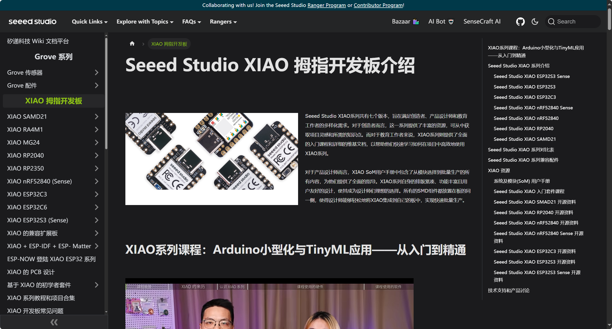
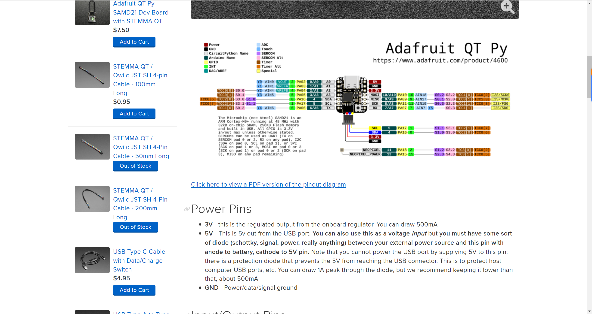
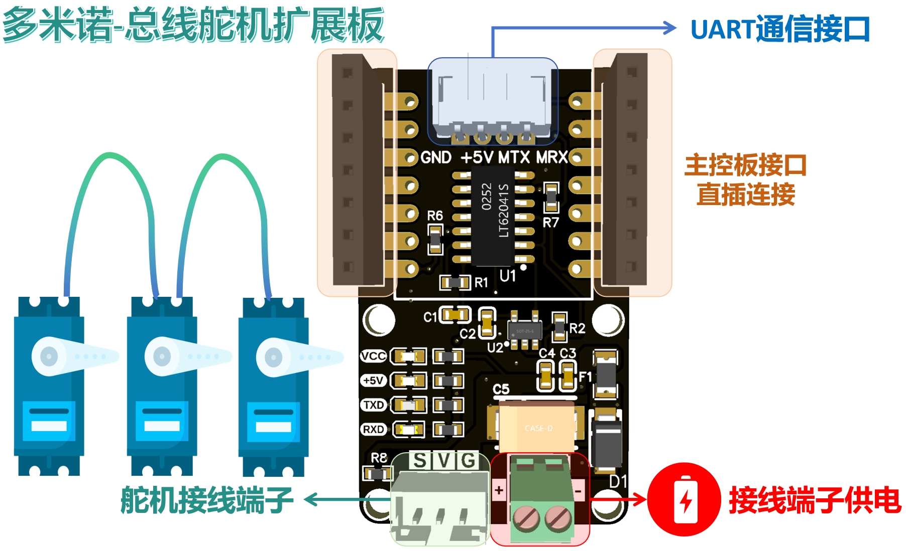
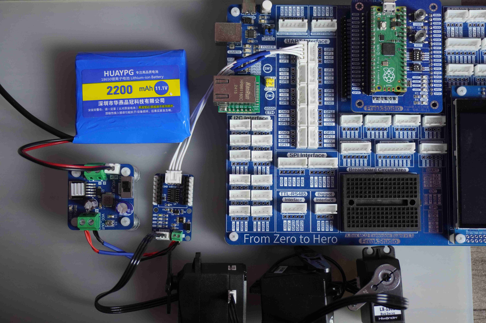
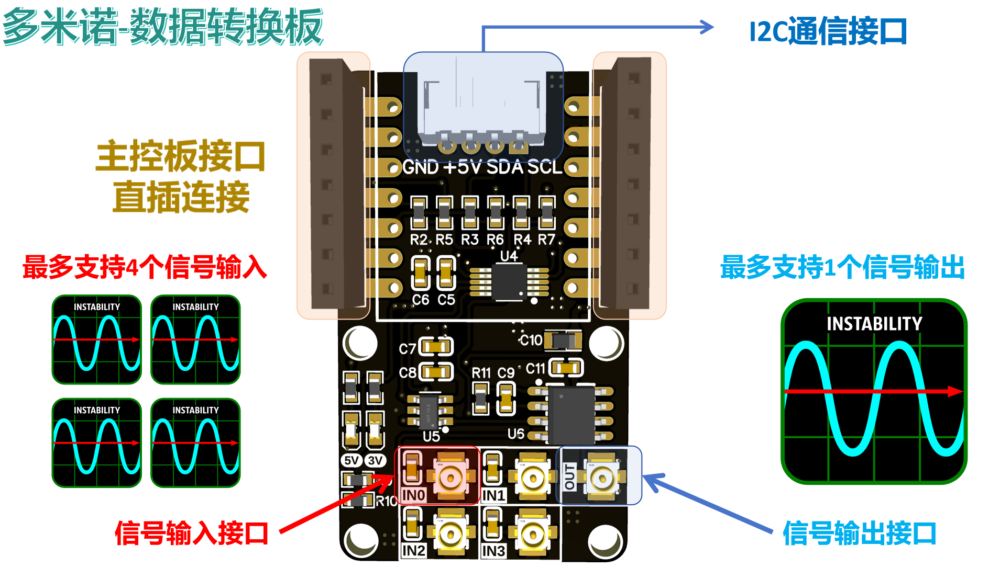
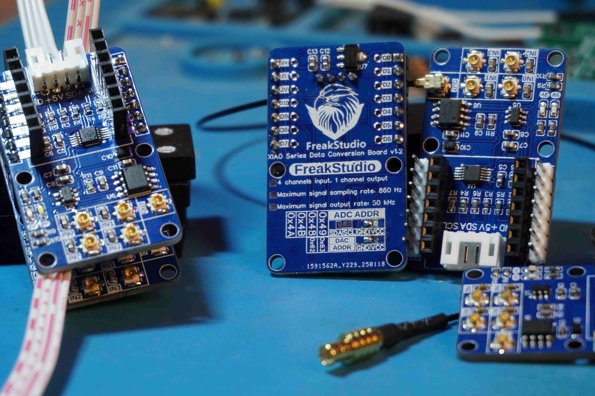
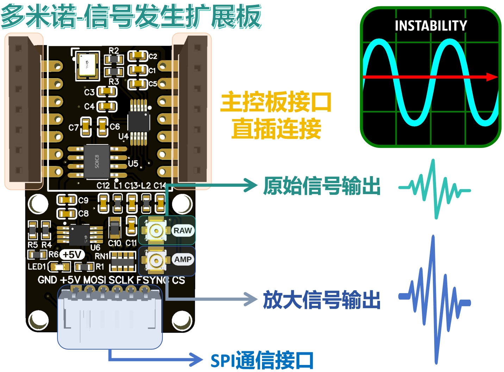
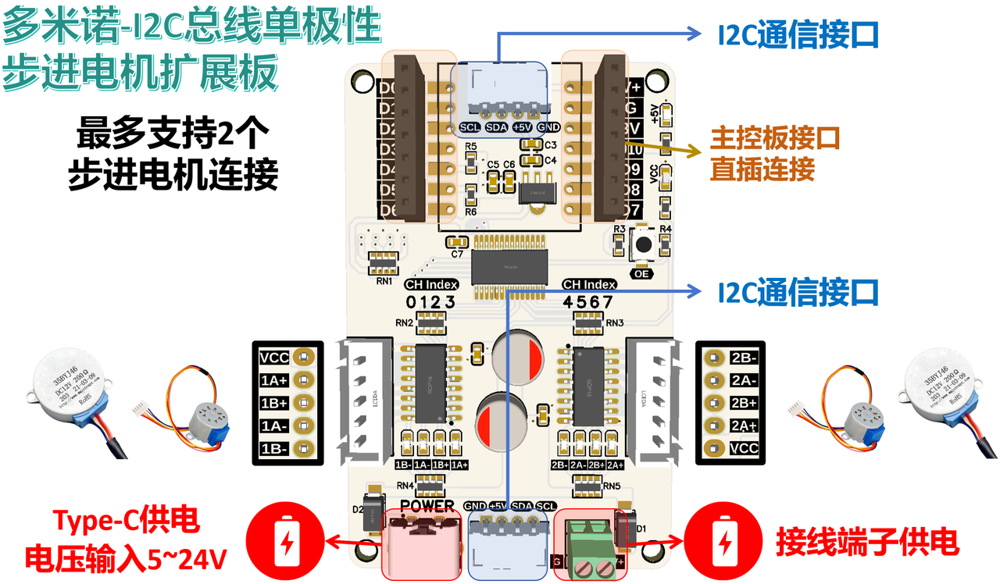

# 目录/MENU

- [中文部分](#多米诺系列扩展板介绍)
- [English Section](#Domino-Series-Expansion-Board-Introduction)

# 多米诺系列扩展板介绍📖
多米诺系列扩展板是FreakStudio专门为小尺寸主控板设计的扩展模块，既可以使用主控板直插于扩展板上，也可以作为独立模块使用PH2.0连接线与主控板的对应接口相互连接，由于其尺寸形状类似与多米诺骨牌而命名为多米诺系列，主打小尺寸、高集成度、强扩展性，同时兼具美观。

多米诺系列扩展板的对应接口参考了：**[Grove硬件接口规范](https://wiki.seeedstudio.com/cn/Grove_System/#grove--qwiicstemma-qt-interface-to-malefemale-jumper-cables)**，其硬件设计和示例代码具有以下特点：
  - 小尺寸设计，便于集成到你的原型项目中。
  - 统一硬件接口，便于接线。
  - 对MicroPython支持度最高，所有配套软件代码均做出部分优化同时提供完善注释以进行学习。
  - 每个类和方法都有详细的中文和英文注释，并提供文档注释。
  - 对输入参数进行严格的检查，确保方法调用时参数合法。

我们还将部分多米诺扩展板提供的常用功能模块化的MicroPython软件代码发布到 **[PyPi包管理平台](https://pypi.org/user/leeqingshui/)**。

目前支持的主控板包括：
* [Seeed Studio XIAO 拇指开发板](https://wiki.seeedstudio.com/cn/SeeedStudio_XIAO_Series_Introduction/)

* [Adafruit QT Py 系列主控板](https://learn.adafruit.com/adafruit-qt-py/pinouts)

详细描述可以查看飞书云文档链接：**[Freak嵌入式工作室-多米诺系列开发板-飞书云](https://f1829ryac0m.feishu.cn/docx/ZzA5dIsdyowLUKxJr0fcwYInnhd?from=from_copylink)**。

# 类别📂
## 总线直流电机扩展板⚙️

[**总线直流电机扩展板**](https://github.com/leezisheng/Domino-Series-Expansion-Board/tree/main/Bus-Motor-Expansion-Board)设计用于通过I2C接口控制最多四个直流电机，具有以下主要特点：
- **小尺寸设计**：可以与XIAO系列主控板直接连接，也可以作为独立模块使用。
- **I2C接口**：提供I2C总线接口进行堆叠式级联，最多支持16个电机驱动扩展板，且提供4个地址位可供选择。
- **PWM输出引脚**：PWM扩展芯片的输出引脚连接有保护电阻，同时使用的电机驱动芯片自带过流和过热保护功能。
- **按键控制芯片使能/失能**：PWM扩展芯片的使能引脚通过按键引出，使用时可通过按键失能芯片。
- **电机驱动芯片可更换**：根据需要，可将RZ7899芯片替换为TMI8260、AM2837或SS6285L芯片。
- **电源指示灯**：板载电源指示灯显示电机供电状态和PWM扩展芯片供电状态。
- **多种电源输入方式**：支持接线端子和Type-C接口供电，具有防反接设计。
- **支持6V至18V供电的电机**：整个扩展板最大电流为5A，若只使用两个电机通道，单通道峰值电流支持最大4A。
- **高频低阻电解电容供电**：使用四颗220μF高频低阻电解电容或固态电解电容进行供电，固态电解电容相比铝电解电容具有更低的ESR、较高的工作频率和更长的使用寿命。
- **散热设计**：扩展板背面的VCC区域采用开窗设计，通过焊锡增大散热效果。

该扩展板提供了优越的电机保护和电源管理功能，适用于各种电机控制应用，我们提供了MicroPython和Arduino例程。

## 总线舵机扩展板🤖

[**总线舵机扩展板**](https://github.com/leezisheng/Domino-Series-Expansion-Board/tree/main/Serial-Servo-Driver-Board)是一种用于通过串行通信接口UART来控制多个舵机的扩展模块，具有以下主要特点：
- **小尺寸设计**：可以与XIAO系列主控板直接连接，也可以作为独立模块使用。
- **UART接口**：提供I2C总线接口进行堆叠式级联，最多支持4个电机驱动扩展板
- **全双工转半双工电路设计**：使用三态缓冲器和反相器实现串口通信全双工转半双工设计，一根信号线兼具串口收发功能
- **多个供电指示灯**：板载电源指示灯显示舵机供电状态、芯片供电状态和通信状态。
- **供电保护设计**：使用二极管防止电源反接，保险丝防止舵机堵转过流，支持7V到12V供电。
- **稳定供电**：采用大容量钽电容，保证舵机供电稳定。

总线舵机扩展板通过UART接口控制多个舵机，支持堆叠式级联，具备小尺寸设计、供电保护、全双工转半双工通信、稳定供电等特点，适用于多舵机控制系统，支持幻尔科技旗下所有总线舵机。

我们提供了MicroPython和Arduino的示例代码，并且是**全网首个开源的、基于28条指令实现**的程序。

## 数据转换扩展板📡

[**数据转换板**](https://github.com/leezisheng/Domino-Series-Expansion-Board/tree/main/Data-Conversion-Board)是一种用于通过串行通信I2C接口来采集信号波形或输出信号的扩展模块，具有以下主要特点：
- **小尺寸设计**：可以与XIAO系列主控板直接连接，也可以作为独立模块使用；使用IPEX1接口作为信号输入和输出，尺寸小。
- **I2C接口**：提供I2C总线接口进行堆叠式级联，最多支持4个扩展板连接，支持高达16通道的信号输入和2通道的信号输出。
- **信号输入与输出**：输入信号采样率高达860Hz，输出信号最高频率为50KHz，单个扩展板支持4通道信号输入和1通道信号输出，，板载16位高精度ADC和12位DAC芯片，可应用于信号精确采集场景。
- **信号输入滤波**：信号输入部分使用了小滤波电容，用于滤除高频噪声，确保输入信号更加平滑。
- **信号输出缓冲隔离**：在信号输出端放置了电压跟随器，提高输出信号的驱动能力，同时隔离电路前后级。
- **稳定供电**：在运放部分加入钽电容进行滤波，保证供电稳定。

我们提供了MicroPython和Arduino的示例代码，并且**优化了参考代码中触发采样相关代码**，使用更加便利。

## 信号发生扩展板🎶

信号发生扩展板是一种用于产生可调频率和幅度的不同波形的扩展板，具有以下主要特点：
- **小尺寸设计**：可以与XIAO系列主控板直接连接，也可以作为独立模块使用；使用IPEX1接口作为信号输入和输出，尺寸小。
- **SPI接口**：提供SPI总线接口进行通信，也可进行堆叠式放置。
- **信号频率和波形**：支持输出频率小于1MHz的正弦波、方波和三角波，且无负波形输出。
- **幅度调节**：板载数字电位器作为分压器，可通过程序调节信号的幅度。
- **输出接口**：提供原始波形输出和6倍同相放大输出接口，并可根据需要连接，增强信号幅度。
- **低通滤波和噪声抑制**：配备5阶低通滤波器，截止频率为5.43 MHz，有效减少高频噪声，平滑输出波形。
- **稳定性与噪声过滤**：使用补偿电阻优化同相放大器性能，减少寄生效应，且运算放大器供电采用钽电容滤波，平滑电源噪声，确保高频稳定性。

我们提供了MicroPython和Arduino的示例代码，并且**对参考代码中通信部分进行优化，改进了其指令切换卡顿问题**，确保通信无误。

## 单极性步进电机驱动板⚙️

[总线单极性步进电机扩展板](https://github.com/leezisheng/Domino-Series-Expansion-Board/tree/main/Bus-StepMotor-Expansion-Board)是一种用于通过串行通信接口I2C来控制多个单极性步进电机（例如28BYJ48、35BYJ46、35BY412L等五线四相步进电机）的扩展模块，具有以下主要特点：
- **小尺寸设计：** 可以与XIAO系列主控板、Adafruit Qt Py系列主控直接连接，也可以作为独立模块使用。
- **I2C接口：** 提供I2C总线接口，可堆叠式进行级联，同时4个地址位可选择，理论上可级联16个步进电机驱动扩展板。
- **板载供电指示灯：** 电机供电和PWM扩展芯片供电。
- **供电保护设计：** 支持接线端子和Type-C接口供电，防反接设计。
- **可靠供电稳压：** 使用2颗220UF 固态电解电容供电稳压，相比于铝电解电容，固态电解电容具有更低的ESR（等效串联电阻）、更高的工作频率和更长的使用寿命。
- **支持多种单极性步进电机：** 可用于驱动不同外径、减速比、供电电压的5线4相单极性步进电机（例如28BYJ-48），电压范围支持5V~24V，ULN2003达林顿管芯片每个通道的最大输出电流为 500mA，单个芯片的总电流限制为 2.5A
- **不同驱动模式支持：** 支持单步驱动、全步驱动和半步驱动方式、带有多个步进电机通道的LED指示灯。

总线单极性步进电机扩展板采用紧凑型设计，兼容XIAO系列主控板直连或独立使用，支持级联16个模块。板载ULN2003达林顿管驱动芯片（单通道500mA/整片2.5A），可适配28BYJ-48等5线4相步进电机（5-24V宽压供电），提供单步/全步/半步三种驱动模式，配备双固态电容稳压、防反接保护和可视化状态指示灯，兼具堆叠扩展能力与高可靠性。

我们提供了MicroPython的示例代码，具有完善的异常检测机制，支持多电机独立控制。

## 继电器扩展板🛎️

[继电器扩展板](https://github.com/leezisheng/Domino-Series-Expansion-Board/tree/main/Relay-Expansion-Board)用于提供单路独立继电器驱动能力，可根据应用场景选择不同类型以优化功耗、响应速度与驱动电压范围，我们做了常用的三个继电器扩展板版本：
- 磁保持低功耗版：利用 DC 马达驱动芯片驱动保持型（双稳态）继电器，实现断电记忆且静态功耗接近零；
- 高压交流版：面向中小功率 AC 负载场景，采用光耦隔离与吸合指示灯，保证高压侧安全隔离与状态可视；
- 低压直流 MOS 管版：用于高频/高效直流开关，集成光耦隔离与吸合指示灯，具备低驱动功耗与高速切换。
其中，磁保持低功耗版采用双稳态继电器，继电器仅在切换瞬间通电，完成“吸合”或“复位”后断电保持状态，常态下零功耗，适用于对电池续航要求极高的场景，最高可承受125V 0.3A AC或30V 1A DC电源，镂空设计参考了Seeed的Relay Module for IoT & home automation。

低压直流 MOS 管版同样采用光耦隔离驱动，使用MOSFET作为开关元件，加装 LED 状态指示，直观显示开关状态，适合 PWM 调光、电机调速等高频直流切换场景，最高可承受40V 70A DC电源。

高压交流版使用光耦隔离驱动，配备 LED 指示，当继电器吸合时对应 LED 点亮，最高可承受250V 8A AC或30V 8A DC电源，镂空设计参考了Seeed的Relay Module for IoT & home automation。

## 锂电池充放电管理板🔌

[锂电池充放电管理板](https://github.com/leezisheng/Domino-Series-Expansion-Board/tree/main/Li-ion-BMS-Board)采用小尺寸设计，既可直接连接XIAO系列主控板使用，也可作为独立模块单独应用。核心采用SY3501D芯片，具备锂电池充放电管理与5V升压功能，提供稳定的5V/1A输出。

**板载LED指示灯清晰显示工作状态：**
- 放电时绿色灯亮，停止放电时熄灭；
- 充电时红灯闪烁，充满后红灯常亮，绿色灯熄灭。

板子支持0.7A恒流充电，具备涓流、恒流、恒压三阶段智能充电及热调节功能，充电电压预设为4.2V，精度达±1%。为安全考虑，插入USB进行充电时将自动断开输出，避免同充同放，电池需加保护板。模块还集成了过流、短路、过压、过温等多重放电保护机制，保障系统稳定运行。

## 扩展板亚克力底板📟
我们提供了扩展板的亚克力底板，包括大小两个版本：
大版本可以使用在SeeedStudio XIAO多功能扩展板上，底板部分灵感来源于PCB板上的连线和过孔：

小版本可用在小尺寸的扩展板上：

均采用3mm厚的亚克力板制成，其图标使用AutoCAD软件抠图，更厚更坚固，真材实料看得见！

🔗 获取链接：[**红蓝双色扩展板亚克力底板适配seeedstudioXIAO多功能扩展板**](https://item.taobao.com/item.htm?id=894579274204)

# Freak嵌入式工作室介绍👨‍💻🌟
Freak嵌入式工作室位以嵌入式电子套件及相关教程、成品电子模块开发、个人DIY电子作品为主要产品，致力于嵌入式教育📚和大学生创新创业比赛、电子计算机类比赛培训🧑‍💻。

**我们希望为电子DIY爱好者提供全面系统的教程和有趣的电子模块，帮助其快速完成项目相关知识学习和产品原型设计!**

💡如有任何问题或需要帮助，请通过邮件📧： 10696531183@qq.com 联系 **李清水 / Freak** 。

更多信息可在个人主页查看：  
[leezisheng](https://github.com/leezisheng/leezisheng)

# Domino-Series-Expansion-Board-Introduction📖

The Domino Series Expansion Board is a module designed by FreakStudio specifically for small-sized main control boards. It can either be directly plugged into the main control board or used as a standalone module connected to the main control board via a PH2.0 connector. The series is named "Domino" due to its size and shape, resembling a domino tile. The boards are designed with a focus on compact size, high integration, strong expandability, and aesthetics.

The corresponding interfaces of the Domino Series Expansion Boards refer to the **[Grove hardware interface specification](https://wiki.seeedstudio.com/cn/Grove_System/#grove--qwiicstemma-qt-interface-to-malefemale-jumper-cables)**. Their hardware design and example code have the following features:
  - Compact design, ideal for integration into prototype projects.
  - Unified hardware interfaces for easy wiring.
  - Excellent support for MicroPython, with optimized code and complete comments for learning.
  - Detailed Chinese and English comments for each class and method, along with document annotations.
  - Strict parameter validation to ensure method calls are valid.

We have released part of the common functionality provided by the Domino Series Expansion Boards as MicroPython software packages on the **[PyPi package management platform](https://pypi.org/user/leeqingshui/)**.

Currently supported development boards include:
* [Seeed Studio XIAO Thumb-Sized Development Board](https://wiki.seeedstudio.com/cn/SeeedStudio_XIAO_Series_Introduction/)  
  

* [Adafruit QT Py Series Microcontroller Board](https://learn.adafruit.com/adafruit-qt-py/pinouts)  
  

For more details, check the Feishu cloud document link: **[Freak Embedded Studio - Domino Series Development Boards - Feishu Cloud](https://f1829ryac0m.feishu.cn/docx/ZzA5dIsdyowLUKxJr0fcwYInnhd?from=from_copylink)**.

# Categories 📂
## Bus DC Motor Expansion Board ⚙️

[**Bus DC Motor Expansion Board**](https://github.com/leezisheng/Domino-Series-Expansion-Board/tree/main/Bus-Motor-Expansion-Board) is designed to control up to four DC motors via the I2C interface with the following main features:
- **Compact Design**: Can be directly connected to XIAO series boards or used as a standalone module.
- **I2C Interface**: Provides an I2C bus interface for stacked connection, supporting up to 16 motor driver expansion boards, with 4 address bits available for selection.
- **PWM Output Pins**: The PWM expansion chip's output pins are connected with protection resistors, and the motor driver chip has built-in overcurrent and overheat protection.
- **Button-Controlled Chip Enable/Disable**: The enable pin of the PWM expansion chip is routed via a button, allowing it to be disabled when not in use.
- **Replaceable Motor Driver Chip**: The RZ7899 chip can be replaced with TMI8260, AM2837, or SS6285L chips.
- **Power Indicator Lights**: The onboard power indicator shows the motor and PWM expansion chip's power status.
- **Multiple Power Input Options**: Supports terminal blocks and Type-C connectors for power input with reverse polarity protection.
- **Supports 6V to 18V Motors**: The expansion board can handle a maximum current of 5A; when using only two motor channels, the peak current per channel can reach 4A.
- **High-Frequency Low-Resistance Electrolytic Capacitors for Power Supply**: Uses four 220μF high-frequency low-resistance electrolytic capacitors or solid-state electrolytic capacitors, which offer lower ESR, higher working frequency, and longer lifespan compared to aluminum electrolytic capacitors.
- **Heat Dissipation Design**: The VCC region at the back of the expansion board uses a window design to enhance heat dissipation via soldering.

This expansion board offers excellent motor protection and power management functions, suitable for various motor control applications. MicroPython and Arduino examples are provided.

## Bus Servo Expansion Board 🤖

[**Bus Servo Expansion Board**](https://github.com/leezisheng/Domino-Series-Expansion-Board/tree/main/Serial-Servo-Driver-Board) is an expansion module used to control multiple servos via a UART serial communication interface, with the following main features:
- **Compact Design**: Can be directly connected to XIAO series boards or used as a standalone module.
- **UART Interface**: Provides an I2C bus interface for stacked connection, supporting up to 4 motor driver expansion boards.
- **Full-Duplex to Half-Duplex Circuit Design**: Uses tri-state buffers and inverters to implement full-duplex to half-duplex conversion for serial communication, allowing a single signal line to handle both transmit and receive functions.
- **Multiple Power Indicator Lights**: Onboard power indicator lights show the servo power status, chip power status, and communication status.
- **Power Protection Design**: Diodes prevent power reverse polarity, and fuses protect the servos from overcurrent caused by blocking. Supports 7V to 12V power supply.
- **Stable Power Supply**: Uses large-capacity tantalum capacitors to ensure stable servo power.

The Bus Servo Expansion Board controls multiple servos via the UART interface and supports stacked connections. It features a compact design, power protection, full-duplex to half-duplex communication, and stable power supply. It is compatible with all servos from Faner Technology.

We provide both MicroPython and Arduino example code and offer **the first open-source program based on 28 instructions** in the market.

## Data Conversion Expansion Board 📡

[**Data Conversion Board**](https://github.com/leezisheng/Domino-Series-Expansion-Board/tree/main/Data-Conversion-Board) is an expansion module used for signal waveform acquisition or output via the I2C interface, with the following main features:
- **Compact Design**: Can be directly connected to XIAO series boards or used as a standalone module; uses an IPEX1 interface for signal input and output, compact in size.
- **I2C Interface**: Provides an I2C bus interface for stacked connection, supporting up to 4 expansion boards with up to 16 input channels and 2 output channels.
- **Signal Input and Output**: The signal input sampling rate is up to 860Hz, with an output frequency up to 50KHz. A single expansion board supports 4 input channels and 1 output channel.It features an onboard 16-bit high-precision ADC and a 12-bit DAC chip, making it suitable for precise signal acquisition applications.
- **Signal Input Filtering**: The signal input part uses small filtering capacitors to remove high-frequency noise and ensure smoother input signals.
- **Signal Output Buffer Isolation**: Voltage followers are used at the output end to improve the drive capability of the output signal and isolate the front and rear circuits.
- **Stable Power Supply**: Tantalum capacitors are added to the op-amp section for filtering, ensuring stable power supply.

We provide both MicroPython and Arduino example code, with optimized reference code for more convenient sampling triggering.

## Signal Generator Expansion Board 🎶

The Signal Generator Expansion Board is used to generate adjustable frequency and amplitude waveforms, with the following main features:
- **Compact Design**: Can be directly connected to XIAO series boards or used as a standalone module; uses an IPEX1 interface for signal input and output, compact in size.
- **SPI Interface**: Provides an SPI bus interface for communication and can be stacked for easy installation.
- **Signal Frequency and Waveforms**: Supports output frequencies for sine, square, and triangle waves with frequencies less than 1MHz, with no negative waveform output.
- **Amplitude Adjustment**: Onboard digital potentiometers as voltage dividers allow for program-controlled signal amplitude adjustment.
- **Output Interface**: Provides raw waveform output and 6x in-phase amplified output, which can be connected as needed to enhance signal amplitude.
- **Low-Pass Filtering and Noise Suppression**: Equipped with a 5th-order low-pass filter with a cutoff frequency of 5.43 MHz, effectively reducing high-frequency noise and smoothing the output waveform.
- **Stability and Noise Filtering**: Compensation resistors optimize the performance of the in-phase amplifier to reduce parasitic effects. Tantalum capacitors are used to filter the op-amp power supply, ensuring high-frequency stability.

We provide both MicroPython and Arduino example code, with **improved communication code to resolve instruction switching lag** and ensure smooth communication.

## Bus Unipolar Stepper Motor Expansion Board ⚙️

The [Bus Unipolar Stepper Motor Expansion Board](https://github.com/leezisheng/Domino-Series-Expansion-Board/tree/main/Bus-StepMotor-Expansion-Board) is a module designed to control multiple unipolar stepper motors (e.g., 5-wire 4-phase stepper motors like 28BYJ48, 35BYJ46, 35BY412L) via the I2C serial communication interface. Key features include:  
- **Compact Design:** Compatible with XIAO series and Adafruit Qt Py series main control boards, or usable as a standalone module.  
- **I2C Interface:** Supports daisy-chaining with stackable expansion. Four address bits allow theoretical cascading of up to 16 driver boards.  
- **Onboard Power Indicators:** LEDs for motor power and PWM expansion chip power.  
- **Power Protection:** Supports power input via terminal blocks or Type-C port with reverse-polarity protection.  
- **Stable Power Regulation:** Utilizes two 220μF solid-state capacitors for lower ESR, higher frequency performance, and longer lifespan compared to aluminum electrolytic capacitors.  
- **Broad Compatibility:** Drives various 5-wire 4-phase unipolar stepper motors (e.g., 28BYJ-48) at 5V–24V. ULN2003 Darlington array provides 500mA per channel (2.5A total per chip).  
- **Multiple Driving Modes:** Supports single-step, full-step, and half-step modes, with per-channel LED indicators.  

This expansion board combines a compact footprint (directly attachable to XIAO mainboards or standalone use) with ULN2003 drivers (500mA/channel, 2.5A total) for 5-wire 4-phase steppers (5–24V input). Dual solid capacitors ensure stable power, while reverse-polarity protection and visual status LEDs enhance reliability in stacked configurations.  

We provide MicroPython sample code with robust error handling for multi-motor independent control.  

## Relay Expansion Board 🛎️  
  
  

The [Relay Expansion Board](https://github.com/leezisheng/Domino-Series-Expansion-Board/tree/main/Relay-Expansion-Board) provides single-channel independent relay driving capabilities. Three optimized versions are available for different application scenarios:  
- **Magnetic Latching Low-Power Version**: Uses a DC motor driver chip to control a bistable relay, achieving zero static power consumption and power-off state memory.  
- **High-Voltage AC Version**: Designed for AC loads with optocoupler isolation and status LEDs, ensuring safe isolation and visual state indication.  
- **Low-Voltage DC MOSFET Version**: Optimized for high-frequency DC switching with MOSFETs, featuring optocoupler isolation and LED indicators.  

### Magnetic Latching Low-Power Version  
Employs a bistable relay that only consumes power during state transitions ("latch" or "release"). Ideal for battery-powered scenarios requiring zero standby power. Supports up to **125V 0.3A AC** or **30V 1A DC**. PCB design references Seeed's Relay Module for IoT & home automation.  
  

### Low-Voltage DC MOSFET Version  
Uses MOSFETs for efficient switching with optocoupler isolation and LED status indicators. Suitable for PWM dimming, motor control, and other DC applications. Supports up to **40V 70A DC**.  
  

### High-Voltage AC Version  
Features optocoupler isolation and LEDs (lit when relay is engaged). Supports up to **250V 8A AC** or **30V 8A DC**. PCB design references Seeed's Relay Module for IoT & home automation.  
  

## Li-ion-BMS-Board🔌

The compact lithium battery management board can be directly connected to XIAO series main control boards or used as a standalone module. Featuring the SY3501D chip, it integrates lithium battery charge-discharge management and 5V boost functions, delivering stable 5V/1A output.

**Dual-color LED status indication:**
- Green light on during discharging, off when idle
- Red blinking during charging, solid red when fully charged (green light off)

Supports 0.7A constant current charging with three-stage smart charging (trickle/CC/CV) and thermal regulation. Charging voltage preset to 4.2V (±1% accuracy). Safety features include automatic output disconnection during USB charging to prevent simultaneous charge-discharge (requires battery protection circuit). Integrated protections: over-current, short-circuit, over-voltage, and over-temperature.

## Acrylic Baseplate for Expansion Board 📟

We offer acrylic baseplates for expansion boards in two sizes:  
The **large version** is designed for the SeeedStudio XIAO multifunctional expansion board, inspired by PCB traces and vias:  
  
  
  

The **small version** is suitable for compact expansion boards:  

Both versions are made of **3mm thick acrylic** with precisely cut icons using AutoCAD software. The material is **thicker and more durable**, ensuring **real quality you can see!**  

🔗 Get it here: [**Red & Blue Dual-Color Acrylic Baseplate for SeeedStudio XIAO Multifunctional Expansion Board**](https://item.taobao.com/item.htm?id=894579274204)

# FreakStudio Introduction👨‍💻🌟
Freak Embedded Studio focuses on embedded electronic kits, related tutorials, finished electronic module development, and personal DIY electronic projects. We are committed to embedded education 📚 and training for university students in innovation and entrepreneurship competitions, as well as electronic and computer-related competitions 🧑‍💻.

**We aim to provide comprehensive tutorials and interesting electronic modules for DIY electronics enthusiasts, helping them quickly learn project-related knowledge and design product prototypes!**

💡 If you have any questions or need assistance, please contact **Li Qingshui / Freak** via email 📧: 10696531183@qq.com.

For more information, visit my personal homepage:  
[leezisheng](https://github.com/leezisheng/leezisheng)