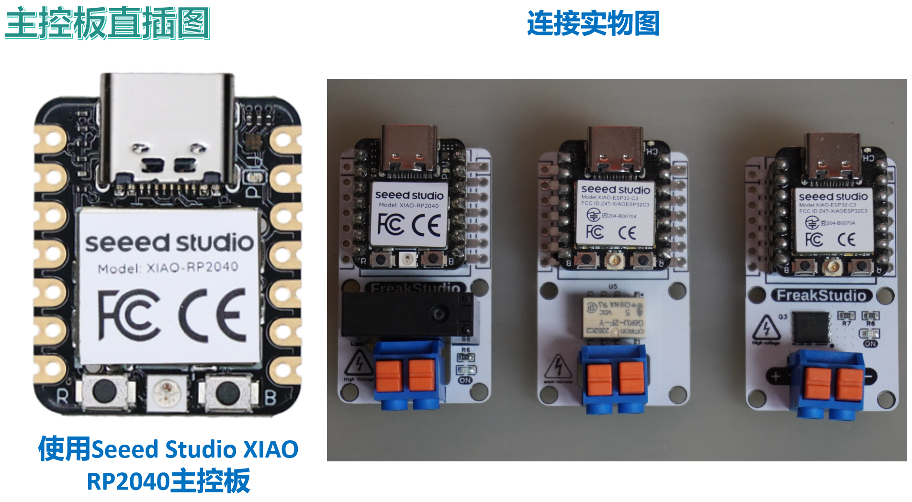
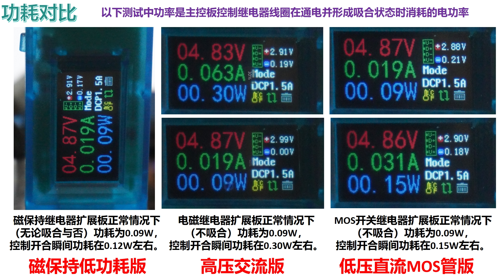

# 目录/MENU

- [中文部分](#继电器扩展板)
- [English Section](#Relay-Expansion-Board)

# 继电器扩展板
## 1.总体介绍

[继电器扩展板](https://github.com/leezisheng/Domino-Series-Expansion-Board/tree/main/Relay-Expansion-Board)用于提供单路独立继电器驱动能力，可根据应用场景选择不同类型以优化功耗、响应速度与驱动电压范围，我们做了常用的三个继电器扩展板版本：
- 磁保持低功耗版：利用 DC 马达驱动芯片驱动保持型（双稳态）继电器，实现断电记忆且静态功耗接近零；
- 高压交流版：面向中小功率 AC 负载场景，采用光耦隔离与吸合指示灯，保证高压侧安全隔离与状态可视；
- 低压直流 MOS 管版：用于高频/高效直流开关，集成光耦隔离与吸合指示灯，具备低驱动功耗与高速切换。
其中，磁保持低功耗版采用双稳态继电器，继电器仅在切换瞬间通电，完成“吸合”或“复位”后断电保持状态，常态下零功耗，适用于对电池续航要求极高的场景，最高可承受125V 0.3A AC或30V 1A DC电源，镂空设计参考了Seeed的Relay Module for IoT & home automation。

低压直流 MOS 管版同样采用光耦隔离驱动，使用MOSFET作为开关元件，加装 LED 状态指示，直观显示开关状态，适合 PWM 调光、电机调速等高频直流切换场景，最高可承受40V 70A DC电源。

高压交流版使用光耦隔离驱动，配备 LED 指示，当继电器吸合时对应 LED 点亮，最高可承受250V 8A AC或30V 8A DC电源，镂空设计参考了Seeed的Relay Module for IoT & home automation。

## 2.接口说明
该扩展板仅支持主控板直接插入到扩展板的排母接口上：

您可以将大功率负载接入到下面的 XY118 弹簧端子中：

## 3.硬件细节
### 3.1 光耦隔离
在高压交流版/低压直流MOS管版继电器扩展板上，我们配备了光耦隔离单元和外置续流二极管保护 MOSFET/继电器开关元件：

需要注意的是，高压交流版/低压直流MOS管版继电器扩展板为低电平触发继电器导通，具体原理如下图所示：

### 3.2 H桥驱动电路
在磁保持低功耗版继电器扩展板上，我们使用H桥驱动电路双向施加脉冲电压以实现继电器的“吸合”与“释放”两种状态：

### 3.3 开关指示灯
在高压交流版/低压直流MOS管版继电器扩展板上，我们配备了LED灯知识继电器吸合和释放状态：

### 3.4 弹簧式端子
我们使用 XY118 系列弹簧式端子，与传统螺丝端子相比，它具备快速无工具接线、抗振动松动、易维护重用、节省空间等优点，适合需频繁接线且要求高可靠性的应用场景：

### 3.5 功耗对比
我们还测量了三种类型继电器扩展板控制继电器线圈在通电并形成吸合状态时消耗的电功率，测试情况如下：

## 4.提供代码和使用须知
在使用烧录完程序后的主控板通过扩展板控制大负载前，务必确保接线正确，供电无误：

示例代码包括以下版本：
- MicroPython版本：**[继电器扩展板MicroPython驱动程序](https://github.com/leezisheng/Domino-Series-Expansion-Board/tree/main/Relay-Expansion-Board/code/MicroPython)**

这里，需要注意，MicroPython 相关程序经过我们的优化处理，以便更好地适配硬件，提高易用性，以第三方库形式在Github进行发布，并附带知识共享署名-非商业性使用 4.0 国际版 (CC BY-NC 4.0)许可，侵权必纠，敢线下直接来揪你！

## 5.获取链接

- **商品链接**：[[磁保持低功耗版继电器扩展板获取链接](https://item.taobao.com/item.htm?ft=t&id=924685978663)]+【[高压交流版继电器扩展板获取链接](https://item.taobao.com/item.htm?ft=t&id=924312699051)】+【[低压直流MOS管版继电器扩展板获取链接](https://item.taobao.com/item.htm?ft=t&id=925691088690)】
- **硬件开源链接**：[[硬件开源资料链接](https://github.com/leezisheng/Domino-Series-Expansion-Board/tree/main/Relay-Expansion-Board/hardware)]

# Relay-Expansion-Board
## 1. Overview
  
  
The [Relay Expansion Board](https://github.com/leezisheng/Domino-Series-Expansion-Board/tree/main/Relay-Expansion-Board) provides single-channel independent relay driving capabilities. Three common versions are available for different application scenarios to optimize power consumption, response speed, and driving voltage range:  
- **Magnetic Latching Low-Power Version**: Utilizes a DC motor driver chip to drive a bistable (latching) relay, achieving zero static power consumption and power-off state memory.  
- **High-Voltage AC Version**: Designed for medium/small AC load scenarios, featuring optocoupler isolation and status LEDs for safe isolation and visual state indication.  
- **Low-Voltage DC MOSFET Version**: Optimized for high-frequency/efficient DC switching, integrated with optocoupler isolation and status LEDs, supporting low driving power and fast switching.  

The **Magnetic Latching Low-Power Version** employs a bistable relay that only consumes power during state transitions ("latch" or "release"). It maintains its state with zero static power, ideal for battery-critical applications. It supports up to 125V 0.3A AC or 30V 1A DC loads. The PCB layout references Seeed's Relay Module for IoT & home automation.  
  

The **Low-Voltage DC MOSFET Version** uses MOSFETs as switching elements with optocoupler isolation and LED status indication. Suitable for PWM dimming, motor speed control, and other high-frequency DC switching scenarios. Supports up to 40V 70A DC loads.  
  

The **High-Voltage AC Version** features optocoupler isolation and LED indicators (lit when relay is engaged). Supports up to 250V 8A AC or 30V 8A DC loads. PCB layout references Seeed's Relay Module for IoT & home automation.  
  

## 2. Interface Description
The expansion board supports direct insertion into the main control board via female headers:  
  

High-power loads can be connected to the XY118 spring-terminals:  
  

## 3. Hardware Details
### 3.1 Optocoupler Isolation
The High-Voltage AC and Low-Voltage DC MOSFET versions include optocoupler isolation and freewheeling diodes to protect switching elements:  
  

**Note**: These versions trigger relay activation with a **low-level signal** as shown below:  
  

### 3.2 H-Bridge Drive Circuit
The Magnetic Latching Version uses an H-bridge circuit to apply bidirectional pulse voltages for relay state transitions ("latch" or "release"):  
  

### 3.3 Status LEDs
The High-Voltage AC and Low-Voltage DC MOSFET versions include LEDs to indicate relay states:  
  

### 3.4 Spring-Terminals
XY118 spring-terminals enable tool-free wiring, vibration resistance, and easy maintenance, ideal for high-reliability applications:  
  

### 3.5 Power Consumption Comparison
Power measurements during relay coil activation:  
  

## 4. Code & Usage Notes
Ensure correct wiring and power supply before controlling high-power loads. Sample code includes:  
- **MicroPython**: [Relay Expansion Board Driver](https://github.com/leezisheng/Domino-Series-Expansion-Board/tree/main/Relay-Expansion-Board/code/MicroPython)  

**License**: MicroPython code is optimized for hardware compatibility and released under [CC BY-NC 4.0](https://creativecommons.org/licenses/by-nc/4.0/). Unauthorized commercial use is prohibited.  

## 5. Purchase Links
- **Magnetic Latching Version**: [Taobao Link](https://item.taobao.com/item.htm?ft=t&id=924685978663)  
- **High-Voltage AC Version**: [Taobao Link](https://item.taobao.com/item.htm?ft=t&id=924312699051)  
- **Low-Voltage DC MOSFET Version**: [Taobao Link](https://item.taobao.com/item.htm?ft=t&id=925691088690)  
- **Open-Source Hardware**: [GitHub Repository](https://github.com/leezisheng/Domino-Series-Expansion-Board/tree/main/Relay-Expansion-Board/hardware)  

