# 目录/MENU
- [中文部分](#串口舵机驱动板)
- [English Section](#Serial-Servo-Driver-Board)

# 串口舵机驱动板
## 1.总体介绍
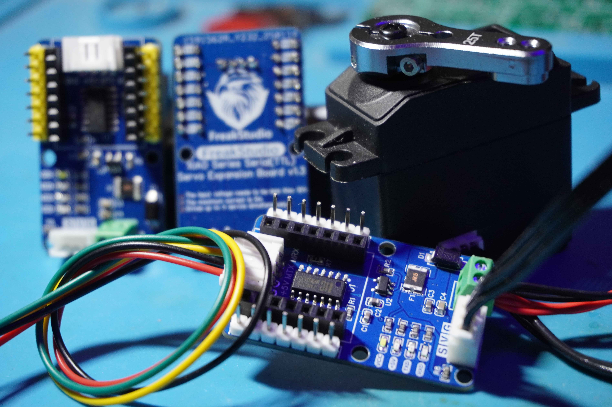
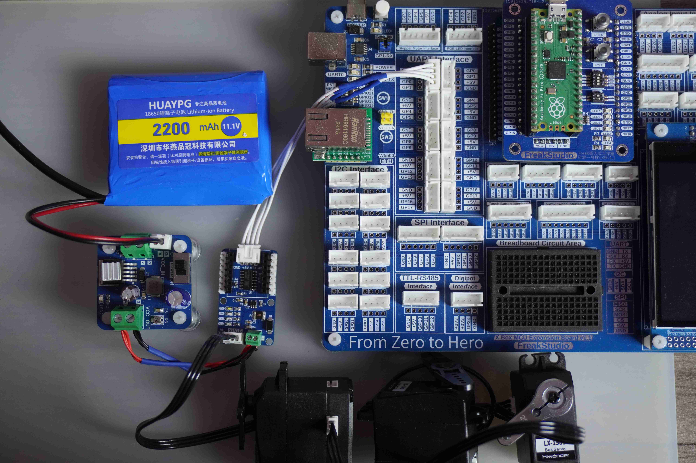

[总线舵机扩展板](https://github.com/leezisheng/Domino-Series-Expansion-Board/tree/main/Serial-Servo-Driver-Board)是一种用于通过串行通信接口UART来控制多个舵机的扩展模块，具有以下主要特点：
- **小尺寸设计**：可以与XIAO系列主控板直接连接，也可以作为独立模块使用。
- **UART接口**：提供UART接口进行连接控制，支持堆叠式级联控制更多串口舵机。
- **全双工转半双工电路设计**：使用三态缓冲器和反相器实现串口通信全双工转半双工设计，一根信号线兼具串口收发功能
- **多个供电指示灯**：板载电源指示灯显示舵机供电状态、芯片供电状态和通信状态。
- **供电保护设计**：使用二极管防止电源反接，保险丝防止舵机堵转过流，支持7V到12V供电。
- **稳定供电**：采用大容量钽电容，保证舵机供电稳定。
总线舵机扩展板通过UART接口控制多个舵机，支持堆叠式级联，具备小尺寸设计、供电保护、全双工转半双工通信、稳定供电等特点，适用于多舵机控制系统，支持幻尔科技旗下所有总线舵机。
我们提供了MicroPython和Arduino的示例代码，并且是**全网首个开源的、基于28条指令实现的程序**。
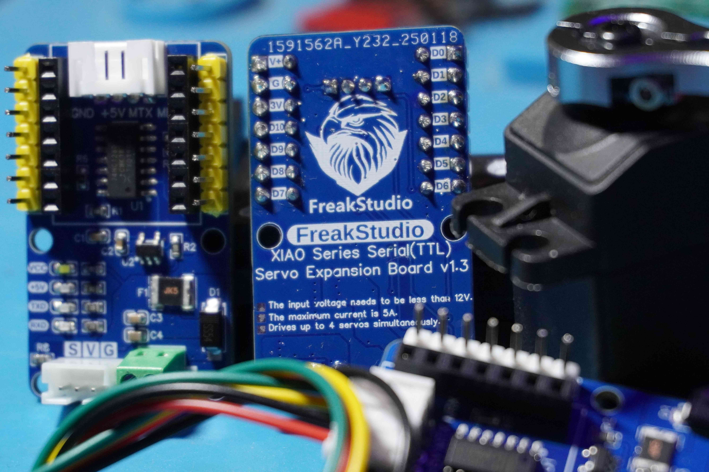
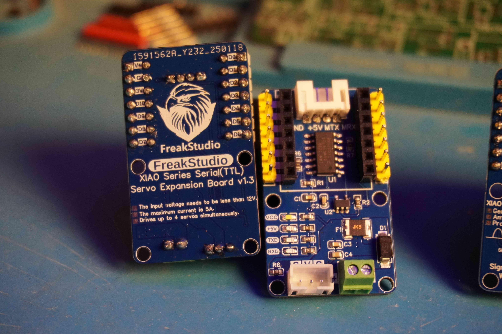

## 2.接口说明
### 2.1 通信接口
我们提供了一个UART通信接口，当作为单独模块使用时，通过PH2.0连接线连接主控模块和扩展板，如下图所示：
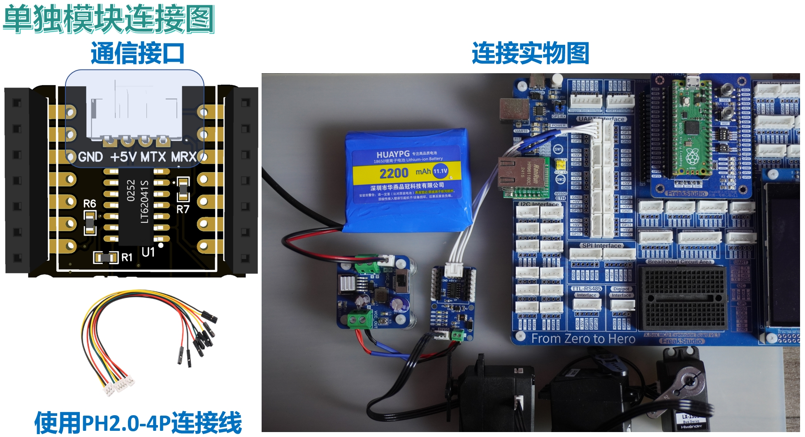
也可以使用主控板直接插入到扩展板的排母接口上：
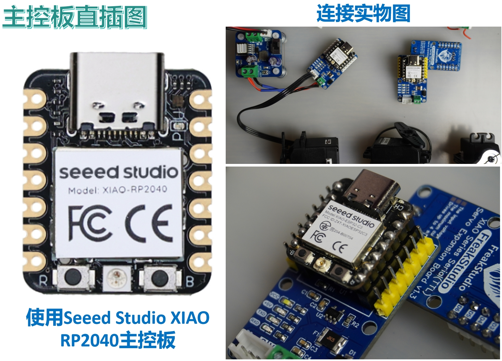
多个扩展板也可以通过更改外侧插孔中排针排母方向实现堆叠连接，此种情况主要用于驱动多路总线舵机，每路舵机支持独立供电，通过该方式可控制更多舵机：
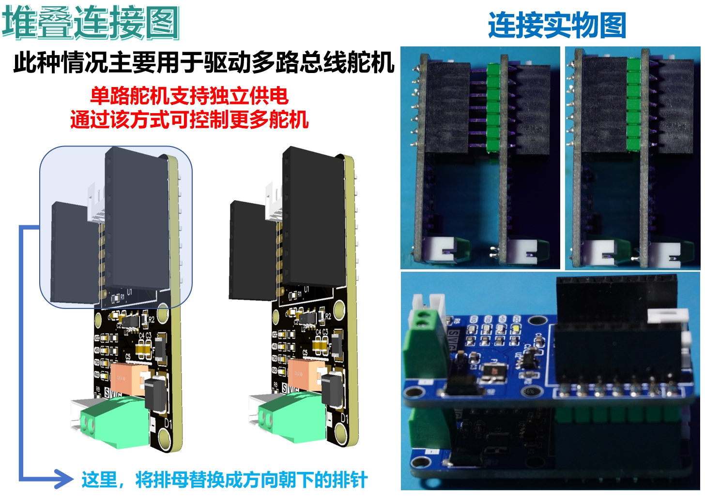

### 2.2 舵机接口
连接舵机时，将舵机连接线插入板载PH2.0-3P接口中即可，这里我们采用防呆设计，将连接线凸起部分对准母座凹槽插入即可：
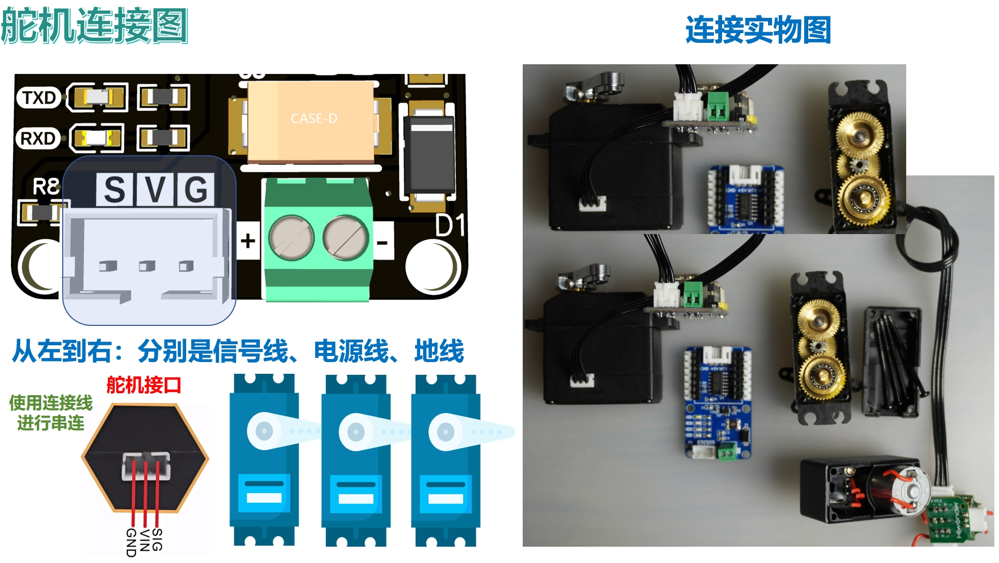

### 2.3 供电接口
这里，我们使用用接线端子供电，电源正极连接V，电源负极连接G，需要注意的是，舵机正常工作需要 1A 电流维持，堵转高达 3A，我们建议建议使用7.4V左右的电压进行供电，并且供电线用短而粗的线供电：
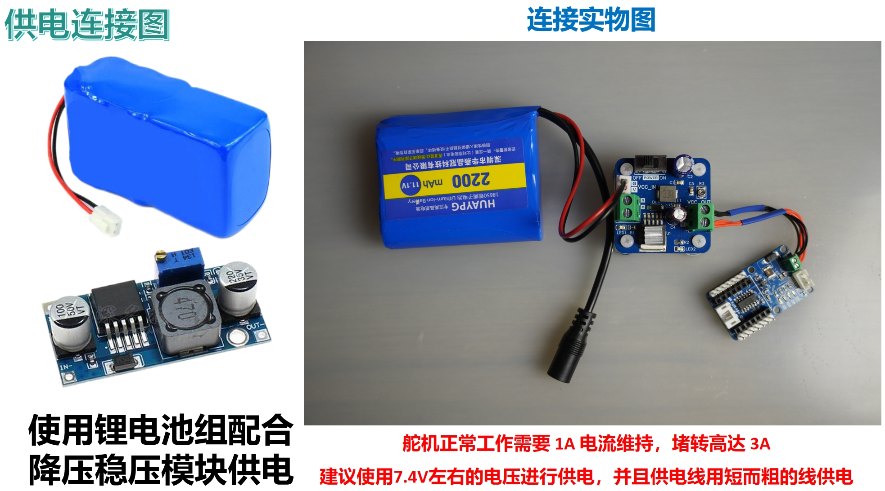

## 3.硬件细节
### 3.1供电保护
这里，我们使用220uf大电容进行电源滤波，配合小电容滤除电源高频噪声，并且通过防反接二极管避免电源反接，使用自恢复保险丝避免堵转时舵机烧坏的情况：
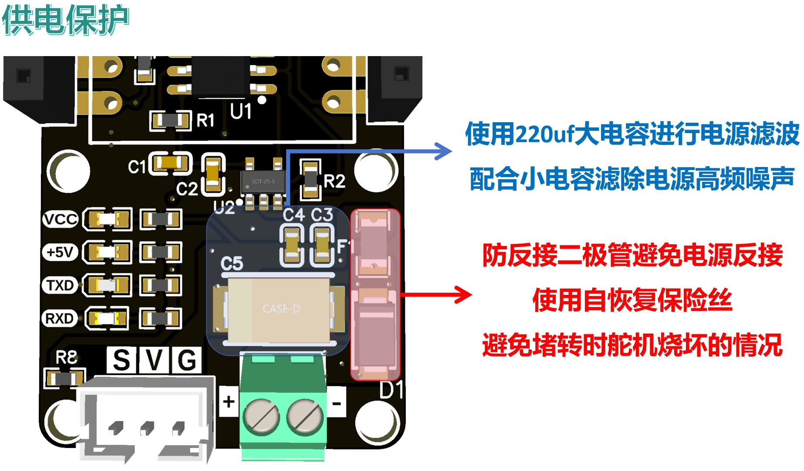

### 3.2全双工转半双工电路
其核心部件为三态缓冲器和反相器实现串口通信全双工转半双工设计：
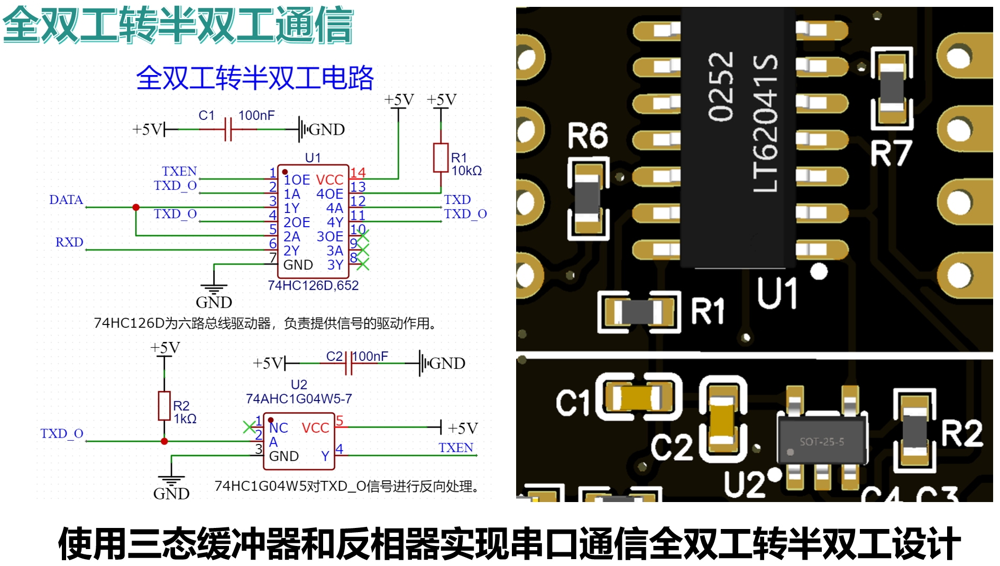

### 3.3指示灯电路
与此同时，我们提供了供电和通信指示灯，便于玩家调试：
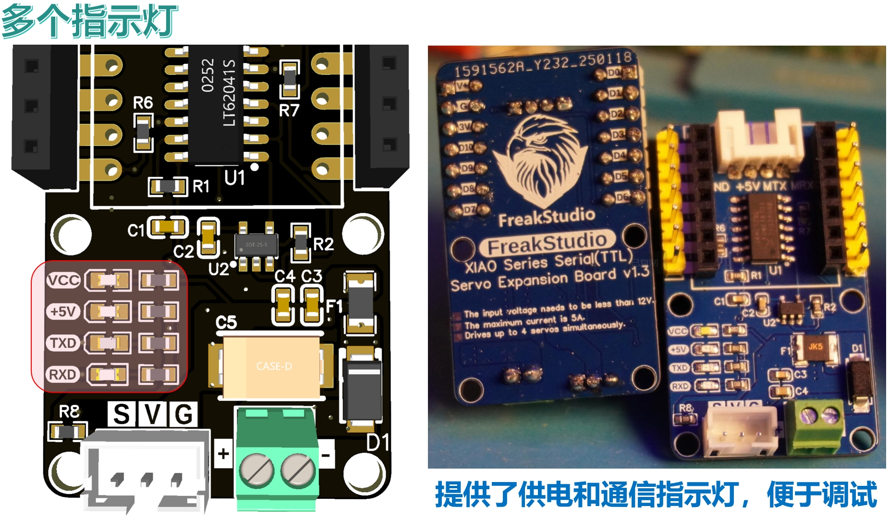

## 4.提供代码和使用须知
在使用烧录完程序后的主控板通过扩展板控制电机前，务必确保电机和通信接线正确，供电无误：
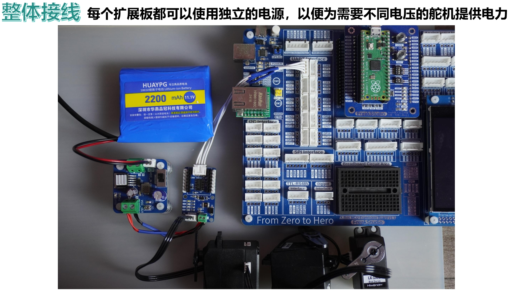
示例代码包括以下版本：
- **MicroPython版本**：[**串口舵机驱动板MicroPython示例程序**](https://github.com/leezisheng/Domino-Series-Expansion-Board/tree/main/Serial-Servo-Driver-Board/code/MicroPython)
- **Arduino版本**：[**串口舵机驱动板Arduino示例程序**](https://github.com/leezisheng/Domino-Series-Expansion-Board/tree/main/Serial-Servo-Driver-Board/code/Arduino)

## 5.获取链接

- **商品链接**：[**串口舵机驱动板购买链接**](https://item.taobao.com/item.htm?ft=t&id=884719978741&spm=a21dvs.23580594.0.0.4fee2c1bkqiSEB)
- **硬件开源链接**：[**硬件开源资料链接**](https://github.com/leezisheng/Domino-Series-Expansion-Board/tree/main/Serial-Servo-Driver-Board/hardware)

# Serial-Servo-Driver-Board

## 1. Overview

[Bus Servo Expansion Board](https://github.com/leezisheng/Domino-Series-Expansion-Board/tree/main/Serial-Servo-Driver-Board) is an expansion module used to control multiple servos via the UART serial communication interface. It has the following key features:
- **Compact Design**: Can be directly connected to XIAO series main control boards or used as an independent module.
- **UART Interface**: Provide a UART interface for connection and control, supporting stacked cascading to control more serial servos.
- **Full-Duplex to Half-Duplex Circuit Design**: Uses tri-state buffers and inverters to achieve full-duplex to half-duplex serial communication, with one signal line serving both transmit and receive functions.
- **Multiple Power Indicators**: Onboard power indicators display the servo power status, chip power status, and communication status.
- **Power Protection Design**: Uses diodes to prevent reverse power connection and fuses to prevent damage due to servo stalls, supporting 7V to 12V power supply.
- **Stable Power Supply**: Uses large-capacity tantalum capacitors to ensure stable servo power supply.

The Bus Servo Expansion Board controls multiple servos via UART, supports stacking, features compact design, power protection, full-duplex to half-duplex communication, and stable power supply. It is suitable for multi-servo control systems and supports all bus servos from Xianer Technology. 

We provide example codes for both MicroPython and Arduino, and it is **the first open-source program on the internet** that implements a 28-instruction-based approach.

## 2. Interface Description

### 2.1 Communication Interface
We provide a UART communication interface. When used as a standalone module, connect the main control module and the expansion board via a PH2.0 connector, as shown below:

Alternatively, the main control board can be directly inserted into the header socket of the expansion board:

Multiple expansion boards can also be connected via stacking by adjusting the direction of the header pins, mainly for driving multi-channel bus servos. Each servo channel supports independent power supply, allowing control of more servos:

### 2.2 Servo Interface
To connect a servo, insert the servo cable into the onboard PH2.0-3P interface. We use an anti-misconnection design, where the raised part of the cable should align with the groove of the socket:

### 2.3 Power Supply Interface
We use terminal blocks for power supply. Connect the positive terminal to V and the negative terminal to G. Note that the servo requires 1A of current to operate normally, and the stall current can reach 3A. We recommend using a voltage of around 7.4V for power supply, and use short, thick wires for power supply:

## 3. Hardware Details

### 3.1 Power Protection
We use a 220uF large capacitor for power filtering, along with a small capacitor to filter out high-frequency power noise. A diode prevents reverse power connection, and a self-resetting fuse prevents damage to the servo in case of a stall:

### 3.2 Full-Duplex to Half-Duplex Circuit
The core components of the circuit are tri-state buffers and inverters, which implement the full-duplex to half-duplex serial communication design:

### 3.3 Indicator Circuit
Additionally, we provide power and communication indicator LEDs for easier debugging:

## 4. Provided Code and Usage Notes
Before controlling the servos through the expansion board after programming the main control board, ensure that the motor and communication wiring are correct, and the power supply is properly connected:

Example code includes the following versions:
- **MicroPython Version**: [**Serial Servo Driver Board MicroPython Example Code**](https://github.com/leezisheng/Domino-Series-Expansion-Board/tree/main/Serial-Servo-Driver-Board/code/MicroPython)
- **Arduino Version**: [**Serial Servo Driver Board Arduino Example Code**](https://github.com/leezisheng/Domino-Series-Expansion-Board/tree/main/Serial-Servo-Driver-Board/code/Arduino)

## 5. Access Links

- **Product Link**: [**Serial Servo Driver Board Purchase Link**](https://item.taobao.com/item.htm?ft=t&id=884719978741&spm=a21dvs.23580594.0.0.4fee2c1bkqiSEB)
- **Hardware Open Source Link**: [**Hardware Open Source Resources Link**](https://github.com/leezisheng/Domino-Series-Expansion-Board/tree/main/Serial-Servo-Driver-Board/hardware)
