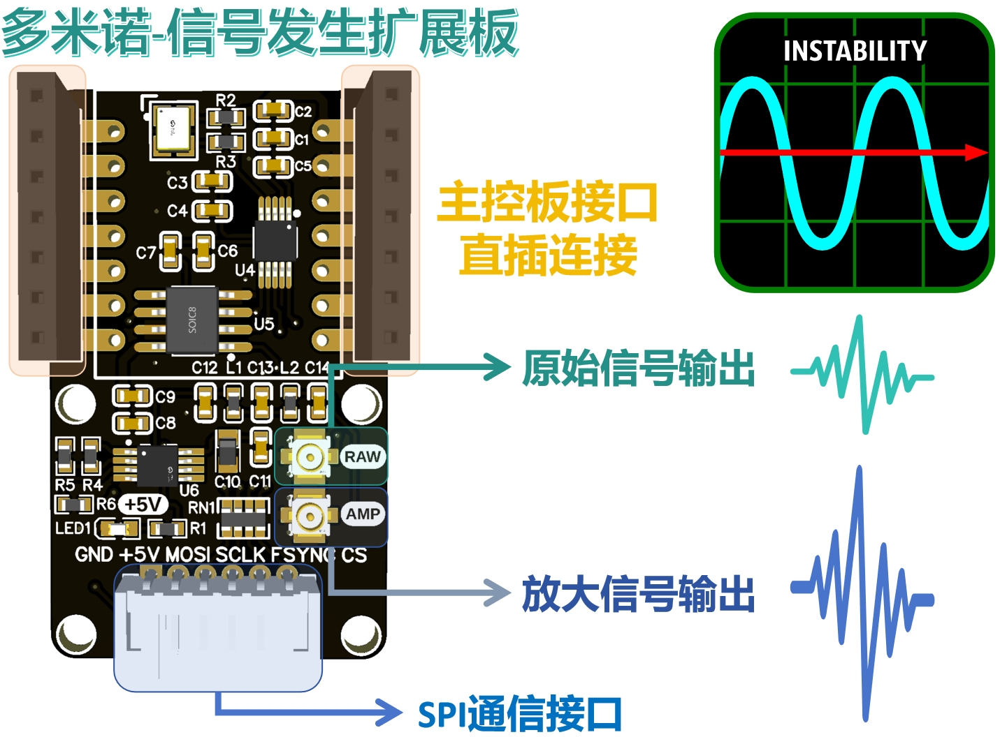
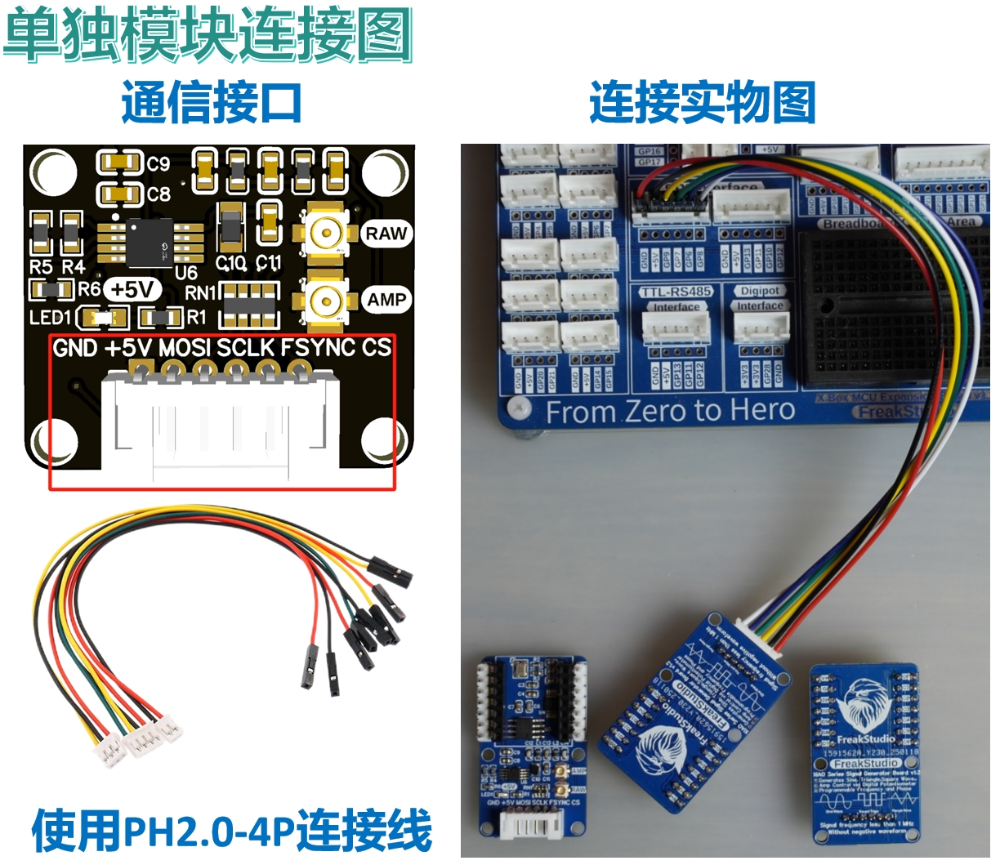
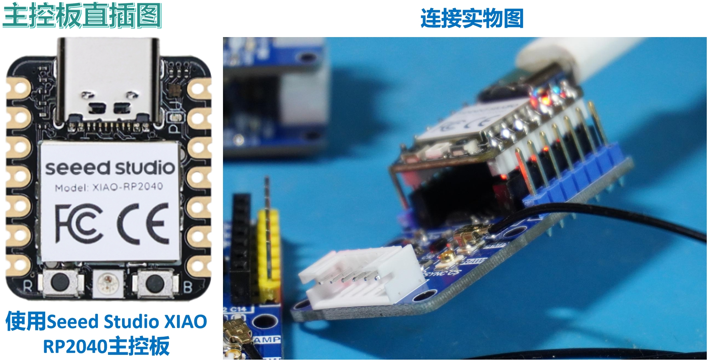
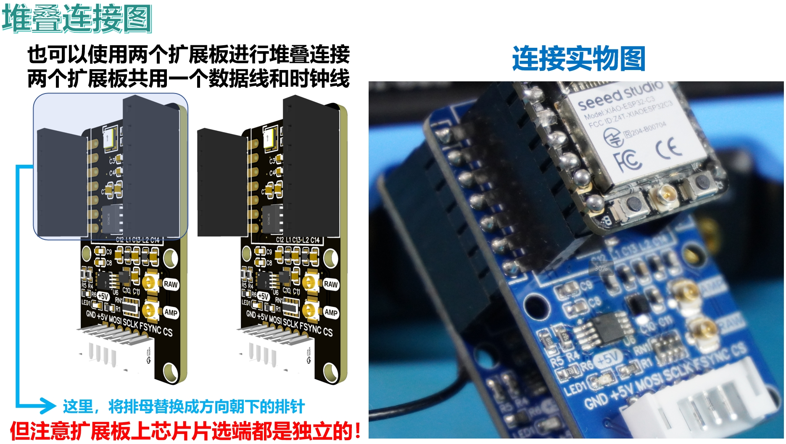
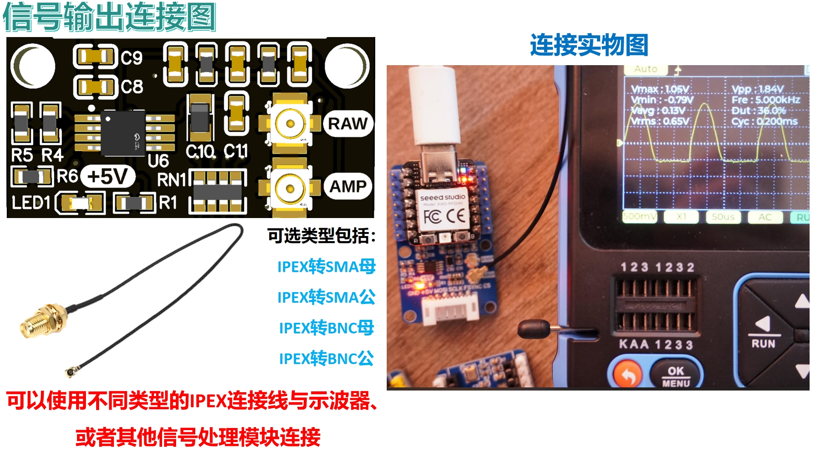
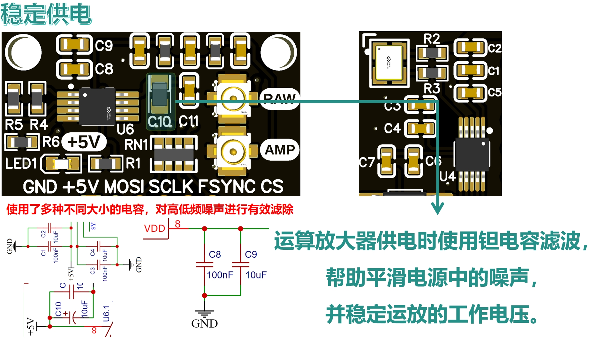
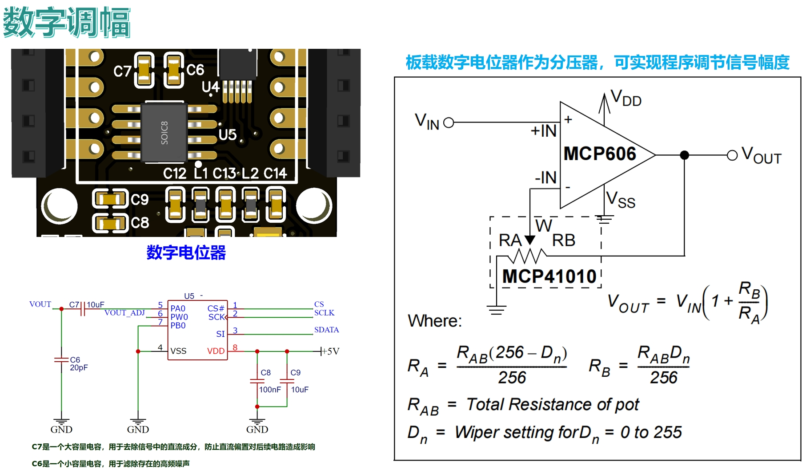
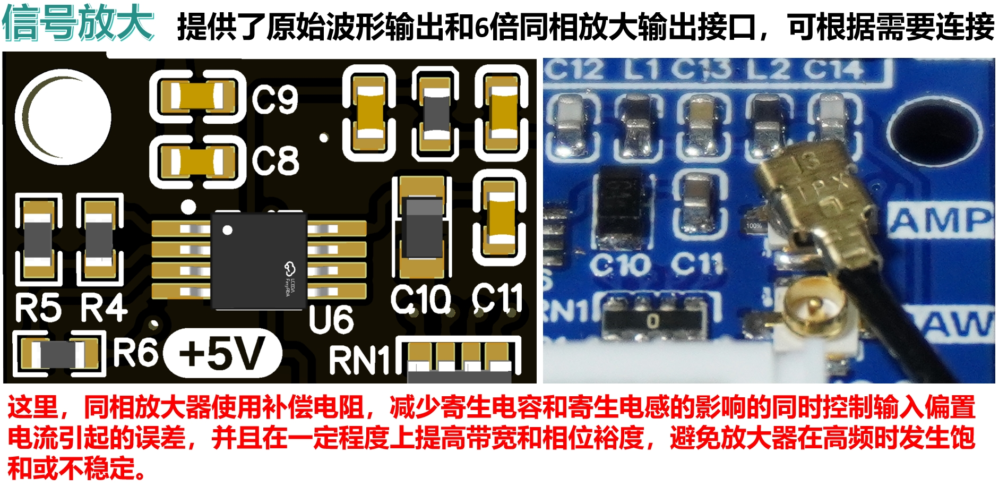
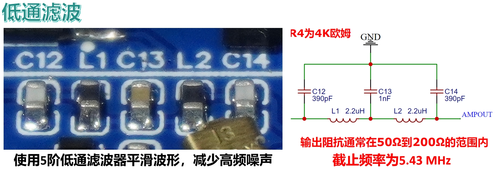

# 目录/MENU

- [中文部分](#信号发生扩展板)
- [English Section](#Signal-Generator-Board)

# 信号发生扩展板
## 1.总体介绍

[**信号发生扩展板**](https://github.com/leezisheng/Domino-Series-Expansion-Board/tree/main/Signal-Generator-Board)是一种用于产生可调频率和幅度的不同波形的扩展板，具有以下主要特点：
- **小尺寸设计**：可以与XIAO系列主控板直接连接，也可以作为独立模块使用；使用IPEX1接口作为信号输入和输出，尺寸小。
- **SPI接口**：提供SPI总线接口进行通信，也可进行堆叠式放置。
- **信号频率和波形**：支持输出频率小于1MHz的正弦波、方波和三角波，且无负波形输出。
- **幅度调节**：板载数字电位器作为分压器，可通过程序调节信号的幅度。
- **输出接口**：提供原始波形输出和6倍同相放大输出接口，并可根据需要连接，增强信号幅度。
- **低通滤波和噪声抑制**：配备5阶低通滤波器，截止频率为5.43 MHz，有效减少高频噪声，平滑输出波形。
- **稳定性与噪声过滤**：使用补偿电阻优化同相放大器性能，减少寄生效应，且运算放大器供电采用钽电容滤波，平滑电源噪声，确保高频稳定性。

## 2.接口说明
### 2.1 通信接口
我们提供了一个SPI通信接口，当作为单独模块使用时，通过PH2.0连接线连接主控模块和扩展板，如下图所示：

也可以使用主控板直接插入到扩展板的排母接口上：

多个扩展板也可以通过更改外侧插孔中排针排母方向实现堆叠连接，此种情况主要用于需要更多输入通道进行波形输出，最多可以使用两个扩展板进行堆叠连接，输出两路原始信号波形或两路放大信号波形：

### 2.2 信号接口
在信号输出部分，我们可以使用不同类型的IPEX连接线与示波器或者其他信号处理模块连接：

## 3.硬件细节
### 3.1 稳定供电
在运算放大器部分，我们使用钽电容滤波，帮助平滑电源中的噪声，并稳定运放的工作电压；在芯片供电部分，我们使用了多种不同大小的电容，对高低频噪声进行有效滤除：

### 3.2 数字调幅
板载数字电位器作为分压器，能够通过程序调节信号的幅度，提供比机械电位器更为精确和稳定的控制，避免了机械磨损和接触不良等问题，提供更高的可靠性和耐用性，同时能够实现自动化控制，便于在复杂的应用中进行精确调节和远程调控：

### 3.3 信号放大
我们提供了原始波形输出和6倍同相放大输出接口，用户可以根据需要选择连接。为了优化放大器性能，同相放大器采用了补偿电阻设计，能够有效减少寄生电容和寄生电感的影响；同时，该设计控制了输入偏置电流引起的误差，并在一定程度上提升了带宽和相位裕度，从而确保放大器在高频时不会发生饱和或不稳定现象，提供更加稳定和精确的信号输出：

### 3.4 低通滤波
在信号放大输出端，DDS信号发生扩展板配备了一个5阶低通滤波器，截止频率为5.43 MHz。该滤波器的作用是有效地减少输出信号中的高频噪声，改善信号的质量，从而使得生成的波形在对信号质量要求较高的实验和测试场合能够更好地满足高精度和低噪声的需求：

## 4.提供代码和使用须知
在使用烧录完程序后的主控板通过扩展板输入或输出信号前，务必确保示波器或其他信号调理模块和信号输出端子接线正确，供电无误：

示例代码包括以下版本：
- **MicroPython版本**：[**信号发生扩展板MicroPython示例程序**](https://github.com/leezisheng/Domino-Series-Expansion-Board/tree/main/Signal-Generator-Board/code/MicroPython)
- **Arduino版本**：[**信号发生扩展板Arduino示例程序**](https://github.com/leezisheng/Domino-Series-Expansion-Board/tree/main/Signal-Generator-Board/code/Arduino)

## 5.获取链接
- **商品链接**：[信号发生扩展板购买链接]
- **硬件开源链接**：[硬件开源资料链接]

# Signal-Generator-Board

## 1. Overview

[**Signal Generator Expansion Board**](https://github.com/leezisheng/Domino-Series-Expansion-Board/tree/main/Signal-Generator-Board) is an expansion board used to generate adjustable frequency and amplitude waveforms. It has the following key features:
- **Compact Design**: Can be directly connected to the XIAO series main control board or used as an independent module; uses IPEX1 interface for signal input and output, compact size.
- **SPI Interface**: Provides an SPI bus interface for communication and can be stacked.
- **Signal Frequency and Waveforms**: Supports output frequencies of less than 1MHz for sine, square, and triangle waves, with no negative waveform output.
- **Amplitude Adjustment**: Onboard digital potentiometer as a voltage divider, allowing amplitude adjustment via program control.
- **Output Interfaces**: Provides both raw waveform output and 6x in-phase amplified output interfaces, which can be connected as needed to enhance the signal amplitude.
- **Low-pass Filtering and Noise Suppression**: Equipped with a 5th-order low-pass filter with a cutoff frequency of 5.43 MHz to effectively reduce high-frequency noise and smooth the output waveform.
- **Stability and Noise Filtering**: Uses compensation resistors to optimize the in-phase amplifier performance, reducing parasitic effects, and the op-amp power supply uses tantalum capacitors to filter noise, ensuring high-frequency stability.

## 2. Interface Description
### 2.1 Communication Interface
We provide an SPI communication interface. When used as an independent module, it connects to the main control board via a PH2.0 connecting cable as shown below:

It can also be directly inserted into the expansion board’s female header interface:

Multiple expansion boards can be stacked by changing the direction of the external header-pin connector, primarily used when more input channels for waveform output are needed. Up to two expansion boards can be stacked to output two raw signal waveforms or two amplified signal waveforms:

### 2.2 Signal Interface
For signal output, we can use different types of IPEX cables to connect to an oscilloscope or other signal processing modules:

## 3. Hardware Details
### 3.1 Stable Power Supply
In the operational amplifier section, we use tantalum capacitors for filtering, which helps smooth the noise in the power supply and stabilize the op-amp's working voltage. In the chip power supply section, we use a variety of capacitors to effectively filter out high and low-frequency noise:

### 3.2 Digital Amplitude Modulation
The onboard digital potentiometer as a voltage divider allows the amplitude of the signal to be adjusted programmatically. This provides more precise and stable control compared to mechanical potentiometers, avoiding mechanical wear and contact issues, offering higher reliability and durability. It also supports automated control, making it easier to achieve precise adjustments and remote control in complex applications:

### 3.3 Signal Amplification
We provide both raw waveform output and 6x in-phase amplified output interfaces for user selection. To optimize the amplifier's performance, the in-phase amplifier uses a compensation resistor design to effectively reduce parasitic capacitance and inductance. This design also controls errors caused by input bias current, improving bandwidth and phase margin to prevent saturation or instability of the amplifier at high frequencies, ensuring more stable and accurate signal output:

### 3.4 Low-pass Filtering
At the signal amplification output, the DDS signal generator expansion board is equipped with a 5th-order low-pass filter with a cutoff frequency of 5.43 MHz. The purpose of this filter is to effectively reduce high-frequency noise in the output signal and improve signal quality, making the generated waveform better suited for applications that require high precision and low noise, such as experiments and testing scenarios:

## 4. Code and Usage Instructions
Before inputting or outputting signals from the expansion board after programming, ensure that the oscilloscope or other signal conditioning modules are properly connected to the signal output terminals and that the power supply is correct:

Sample code is available for the following versions:
- **MicroPython Version**: [**Signal Generator Expansion Board MicroPython Example Program**](https://github.com/leezisheng/Domino-Series-Expansion-Board/tree/main/Signal-Generator-Board/code/MicroPython)
- **Arduino Version**: [**Signal Generator Expansion Board Arduino Example Program**](https://github.com/leezisheng/Domino-Series-Expansion-Board/tree/main/Signal-Generator-Board/code/Arduino)

## 5. Links
- **Product Link**: [Signal Generator Expansion Board Purchase Link]
- **Hardware Open Source Link**: [Hardware Open Source Materials Link]
