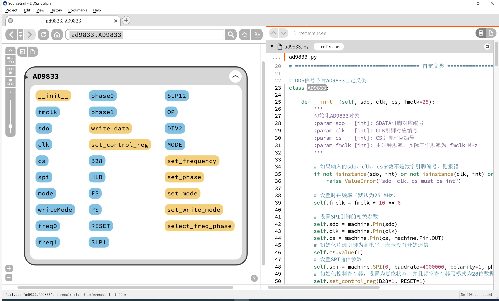
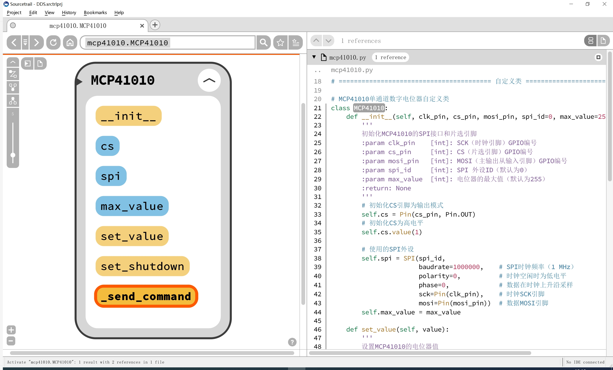
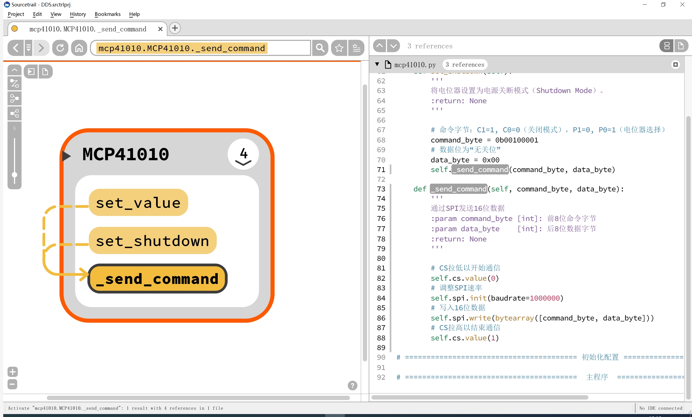

# 目录/MENU
- [中文部分](#信号发生扩展板（FreakStudio-多米诺系列）示例程序-MicroPython版本)
- [English Section](#Signal-Generator-Expansion-Board-(FreakStudio-Domino-Series)-Example-Program-MicroPython-Version)

# **信号发生扩展板（FreakStudio-多米诺系列）示例程序-MicroPython版本**

该示例程序适配于一款基于数字信号合成（DDS）技术的信号发生器模块，旨在提供可调频率、幅度和波形类型的输出信号，
通过使用 `MCP41010` 数字电位器和 `AD9833` 波形发生器芯片，用户可以方便地调节输出信号的幅度和频率。
该模块适用于各种需要高精度、可调信号的实验和应用场景。

该软件必须在提供的信号发生扩展板（由FreakStudio开发设计的多米诺系列扩展板）上运行，才能确保其正常工作。请参阅硬件开源链接和商品链接获取详细信息。
- **商品链接**：[**信号发生扩展板购买链接**](https://item.taobao.com/item.htm?ft=t&id=884483819766&spm=a21dvs.23580594.0.0.3c3a2c1bdZhxfZ)
- **硬件开源链接**：[**硬件开源资料链接**](https://github.com/leezisheng/Domino-Series-Expansion-Board/tree/main/Signal-Generator-Board/hardware)

## **主要特性**

- DDS信号发生支持多种波形输出，可控制频率和相位，并支持设置不同的频率写入模式。
- 通过 SPI 协议控制电位器的阻值，适合在低功耗系统中使用。
- 完整的异常捕获机制，对入口参数进行详细检查。
- 注释完善，所有方法和类均提供了类型注解。

## **文件说明**
`mcp41010.py` 文件是针对 MCP41010 数字电位器芯片的驱动程序，`ad9833.py` 文件是针对 AD9833 波形发生器芯片的驱动程序

### AD9833类
AD9833 类用于控制 DDS（数字直接合成）信号芯片 AD9833，该类包含多个方法，可以设置输出频率、相位以及波形类型，同时支持 SPI 通信接口与控制寄存器配置。

AD9833 类方法如下所示：

- `__init__(self, sdo: int, clk: int, cs: int, fmclk: int = 25, spi_id: int = 0) -> None`：初始化AD9833实例并设置SPI通信对象和主时钟频率。
- `set_control_reg(self, **kwargs) -> None`：设置AD9833的控制寄存器，控制芯片的工作模式，如复位、波形类型等。
- `write_data(self, data: int) -> None`：向AD9833写入指定的数据。
- `set_frequency(self, reg: int, freq: int) -> None`：设置AD9833的频率寄存器，控制输出波形的频率。
- `set_phase(self, reg: int, phase: int) -> None`：设置AD9833的相位寄存器，控制输出波形的相位。
- `reset(self) -> None`：复位AD9833，重新初始化所有寄存器和设置。



### MCP41010类
MCP41010 类用于通过 SPI 接口控制 MCP41010 数字电位器芯片。



MCP41010 类方法如下所示：

- `__init__(self, clk_pin: int, cs_pin: int, mosi_pin: int, spi_id: int = 0, max_value: int = 255) -> None`：初始化MCP41010实例，配置SPI接口及电位器最大值。
- `set_value(self, value: int) -> None`：设置MCP41010电位器的值，范围为0到max_value。
- `set_shutdown(self) -> None`：将MCP41010电位器设置为电源关断模式（Shutdown Mode），以减少功耗。
- `_send_command(self, command_byte: int, data_byte: int) -> None`：通过SPI发送16位数据，执行MCP41010的操作（如设置电位器值、关断模式等）。

核心方法为 _`send_command` 方法， 用于通过 SPI 发送 16 位命令和数据字节，它在通信前拉低片选引脚，传输数据后恢复片选引脚，确保 SPI 通信的正确进行；`set_shutdown` 方法和 `set_value` 方法通过调用 _`send_command` 方法实现设置电位器的输出值和设置为关闭模式。



## 如何使用

### 安装依赖
在运行示例程序之前，确保你的环境中安装了`machine`和`time`等模块。你可以通过MicroPython的包管理器安装依赖。

1. 将该程序文件保存到主文件所在文件夹中。
2. 确保使用的主控板通过信号发生扩展板和IPEX1转接线已连接好了示波器，接线供电无异常。
3. 在MicroPython环境中，通过`from mcp41010 import MCP41010`和`from ad9833 import AD9833`导入两个模块。

### 使用示例

```python
# Python env   : MicroPython v1.23.0 on Raspberry Pi Pico
# -*- coding: utf-8 -*-        
# @Time    : 2025/1/19 上午10:57   
# @Author  : 李清水            
# @File    : main.py       
# @Description : 幅度可调DDS信号发生模块测试程序

# ======================================== 导入相关模块 =========================================

# 导入DDS信号发生AD9833类
from ad9833 import AD9833
# 导入数字电位器MCP41010类
from mcp41010 import MCP41010
# 导入时间相关模块
import time

# ======================================== 全局变量 ============================================

# ======================================== 功能函数 ============================================

# ======================================== 自定义类 ============================================

# ======================================== 初始化配置 ==========================================

# 上电延时3s
time.sleep(3)
# 打印调试消息
print("FreakStudio: Using AD9833 and MCP41010 to implement DDS signal generator")

# # 创建AD9833芯片实例，使用SPI0外设：MOSI-GP3、SCLK-GP2、CS-GP27
ad9833 = AD9833(sdo=3, clk=2, cs=27, fmclk=25, spi_id=0)
# # 创建MCP41010芯片实例，使用SPI0外设：MOSI-GP3、SCLK-GP2、CS-GP26
mcp41010 = MCP41010(clk_pin=2, cs_pin=26, mosi_pin=3, spi_id=0, max_value=255)

# ========================================  主程序  ===========================================

# 设置AD9833芯片的频率和相位
# 设置频率寄存器0和相位寄存器0的数据
ad9833.set_frequency(5000,0)
ad9833.set_phase(0, 0, rads = False)
# 设置频率寄存器1和相位寄存器1的数据
ad9833.set_frequency(1300, 1)
ad9833.set_phase(180, 1, rads = False)
# 选择AD9833芯片的频率和相位
ad9833.select_freq_phase(0, 0)

# 设置MCP41010芯片的电位器值
mcp41010.set_value(125)

# 选择频率寄存器0和相位寄存器0，设置DDS信号发生器的输出模式为正弦波
ad9833.select_freq_phase(0,0)
ad9833.set_mode('SIN')

# # 调节电位器值，观察DDS信号发生器的输出波形
# mcp41010.set_value(20)
#
# # 选择频率寄存器0和相位寄存器0，设置DDS信号发生器的输出模式为方波
# ad9833.select_freq_phase(0,0)
# ad9833.set_mode('SQUARE')
#
# # 选择频率寄存器0和相位寄存器0，设置DDS信号发生器的输出模式为频率减半的方波
# ad9833.select_freq_phase(0,0)
# ad9833.set_mode('SQUARE/2')
#
# # 选择频率寄存器0和相位寄存器0，设置DDS信号发生器的输出模式为三角波
# ad9833.select_freq_phase(0,0)
# ad9833.set_mode('TRIANGLE')
#
# # 选择频率寄存器1和相位寄存器1，设置DDS信号发生器的输出模式为三角波
# ad9833.select_freq_phase(1,1)
# ad9833.set_mode('TRIANGLE')
```

## 注意事项
* **硬件连接**：主控板和扩展板接线和电源正确。
* **引脚设置**：确保使用的SPI引脚和编号正确。
* **输出波形频率和极性**：由于数字电位器芯片和DDS芯片均为正电源供电，仅能输出幅度值大于0的波形；同时由于MCP41010芯片是基于电阻网络的数字电位器，其内部分布式电容和寄生电感会限制其可支持的频率范围，输出波形频率不要超过 1 MHz。
* **AD9833芯片复位**：如果系统出现异常，可以使用`reset()`方法复位AD9833芯片，重新初始化所有寄存器。
* **通信速率**：AD9833芯片和MCP41010芯片通信速率不同，AD9833芯片使用 4 MHz，而MCP41010芯片使用 1 M Hz，但二者使用同一个通信总线，在`AD9833.write_data()`方法和`MCP41010._send_command`方法中，均有一条`self.spi.init()`语句用于动态调整SPI速率，如果需要修改通信速率，则需要修改两个方法中通信速率语句。
* **省电模式**：当不需要频繁调整电位器时，可以通过`set_shutdown()`方法将电位器置于关断模式，以减少功耗。
* **方波调幅**：由于AD9833的方波输出信号幅度为5V，因此电位器的调节值在0~33之间时，输出幅度是线性变化的；超过33以后，运算放大器进入饱和状态，输出幅度将不再变化。

## 结语
AD9833和MCP41010类都通过SPI接口与主控芯片进行通信，实现了对波形发生器和数字电位器的精确控制，通过这些类的功能，可以灵活地设置波形参数、频率、相位以及电位器的电压值。在使用时，请遵循硬件连接和引脚设置的要求，确保系统稳定运行。

## 联系开发者
- 如有任何问题或需要帮助，请通过 [10696531183@qq.com](mailto:10696531183@qq.com) 联系开发者。
  

## 许可协议
本项目中的部分代码由以下开发者提供，并且使用相应的开源协议：

* **mcp41010.py**：该部分代码由 **leeqingshui** 开发，采用 **[知识共享署名-非商业性使用 4.0 国际版 (CC BY-NC 4.0)](https://creativecommons.org/licenses/by-nc/4.0/)** 许可协议。
* **ad9833.py**：该部分代码由 [owainm713](https://github.com/owainm713) 开发，采用 [GNU 通用公共许可证 v3.0 (GPL-3.0)](https://www.gnu.org/licenses/gpl-3.0) 协议发布。[AD9833 GitHub 仓库](https://github.com/owainm713/AD9833-MicroPython-Module/blob/main/AD9833example.py#L54)。


# Signal-Generator-Expansion-Board-(FreakStudio-Domino-Series)-Example-Program-MicroPython-Version

This example program is designed for a signal generator module based on Digital Signal Synthesis (DDS) technology. It provides adjustable frequency, amplitude, and waveform type output signals. By using the MCP41010 digital potentiometer and AD9833 waveform generator chip, users can easily adjust the amplitude and frequency of the output signal. This module is suitable for various experimental and application scenarios requiring high precision and adjustable signals.

The software must be run on the provided signal generator expansion board (Domino Series designed by FreakStudio) to ensure proper operation. Please refer to the hardware open-source links and product links for more detailed information.
- **Product Link**: [**Signal Generator Expansion Board Purchase Link**](https://item.taobao.com/item.htm?ft=t&id=884483819766&spm=a21dvs.23580594.0.0.3c3a2c1bdZhxfZ)
- **Hardware Open Source Link**: [**Hardware Open Source Materials Link**](https://github.com/leezisheng/Domino-Series-Expansion-Board/tree/main/Signal-Generator-Board/hardware)


## **Main Features**

- DDS signal generation supports multiple waveform outputs, controlling frequency and phase, and supports different frequency write modes.
- Controls the potentiometer resistance via SPI protocol, suitable for low-power systems.
- Complete exception capture mechanism with detailed input parameter checks.
- Fully commented with type annotations for all methods and classes.

## **File Description**
The `mcp41010.py` file is the driver program for the MCP41010 digital potentiometer chip, while the `ad9833.py` file is the driver program for the AD9833 waveform generator chip.

### AD9833 Class
The AD9833 class is used to control the DDS (Direct Digital Synthesis) signal chip AD9833. This class includes several methods that can set the output frequency, phase, and waveform type while supporting SPI communication and control register configuration.

The AD9833 class methods are as follows:

- `__init__(self, sdo: int, clk: int, cs: int, fmclk: int = 25, spi_id: int = 0) -> None`: Initializes the AD9833 instance, sets up the SPI communication object, and configures the main clock frequency.
- `set_control_reg(self, **kwargs) -> None`: Sets the AD9833 control register to configure the chip’s operating mode, such as reset and waveform type.
- `write_data(self, data: int) -> None`: Writes the specified data to the AD9833.
- `set_frequency(self, reg: int, freq: int) -> None`: Sets the frequency register of AD9833 to control the output waveform frequency.
- `set_phase(self, reg: int, phase: int) -> None`: Sets the phase register of AD9833 to control the output waveform phase.
- `reset(self) -> None`: Resets the AD9833, reinitializing all registers and settings.


### MCP41010 Class
The MCP41010 class is used to control the MCP41010 digital potentiometer chip via the SPI interface.


The MCP41010 class methods are as follows:

- `__init__(self, clk_pin: int, cs_pin: int, mosi_pin: int, spi_id: int = 0, max_value: int = 255) -> None`: Initializes the MCP41010 instance, configures the SPI interface, and sets the potentiometer's maximum value.
- `set_value(self, value: int) -> None`: Sets the value of the MCP41010 potentiometer, within a range of 0 to `max_value`.
- `set_shutdown(self) -> None`: Sets the MCP41010 potentiometer to shutdown mode, reducing power consumption.
- `_send_command(self, command_byte: int, data_byte: int) -> None`: Sends 16-bit data via SPI to execute operations (e.g., setting the potentiometer value or shutting down).

The core method `_send_command` is used to send 16-bit command and data bytes via SPI. It pulls the chip select (CS) pin low before communication and pulls it high afterward to ensure correct SPI communication. The `set_shutdown` and `set_value` methods rely on `_send_command` to configure the potentiometer's output value and set it to shutdown mode.


## Usage

### Install Dependencies

Before running the example program, ensure that the `machine` and `time` modules are installed in your environment. You can install dependencies via MicroPython’s package manager.

1. Save the program files to the same folder as your main file.
2. Ensure the main board is correctly connected to the signal generator expansion board, and the oscilloscope is connected via the IPEX1 jumper wire, with proper power supply and no issues.
3. In the MicroPython environment, import the two modules with `from mcp41010 import MCP41010` and `from ad9833 import AD9833`.


### Usage Example

```python
# Python env   : MicroPython v1.23.0 on Raspberry Pi Pico
# -*- coding: utf-8 -*-        
# @Time    : 2025/1/19 上午10:57   
# @Author  : 李清水            
# @File    : main.py       
# @Description : 幅度可调DDS信号发生模块测试程序

# ======================================== 导入相关模块 =========================================

# 导入DDS信号发生AD9833类
from ad9833 import AD9833
# 导入数字电位器MCP41010类
from mcp41010 import MCP41010
# 导入时间相关模块
import time

# ======================================== 全局变量 ============================================

# ======================================== 功能函数 ============================================

# ======================================== 自定义类 ============================================

# ======================================== 初始化配置 ==========================================

# 上电延时3s
time.sleep(3)
# 打印调试消息
print("FreakStudio: Using AD9833 and MCP41010 to implement DDS signal generator")

# # 创建AD9833芯片实例，使用SPI0外设：MOSI-GP3、SCLK-GP2、CS-GP27
ad9833 = AD9833(sdo=3, clk=2, cs=27, fmclk=25, spi_id=0)
# # 创建MCP41010芯片实例，使用SPI0外设：MOSI-GP3、SCLK-GP2、CS-GP26
mcp41010 = MCP41010(clk_pin=2, cs_pin=26, mosi_pin=3, spi_id=0, max_value=255)

# ========================================  主程序  ===========================================

# 设置AD9833芯片的频率和相位
# 设置频率寄存器0和相位寄存器0的数据
ad9833.set_frequency(5000,0)
ad9833.set_phase(0, 0, rads = False)
# 设置频率寄存器1和相位寄存器1的数据
ad9833.set_frequency(1300, 1)
ad9833.set_phase(180, 1, rads = False)
# 选择AD9833芯片的频率和相位
ad9833.select_freq_phase(0, 0)

# 设置MCP41010芯片的电位器值
mcp41010.set_value(125)

# 选择频率寄存器0和相位寄存器0，设置DDS信号发生器的输出模式为正弦波
ad9833.select_freq_phase(0,0)
ad9833.set_mode('SIN')

# # 调节电位器值，观察DDS信号发生器的输出波形
# mcp41010.set_value(20)
#
# # 选择频率寄存器0和相位寄存器0，设置DDS信号发生器的输出模式为方波
# ad9833.select_freq_phase(0,0)
# ad9833.set_mode('SQUARE')
#
# # 选择频率寄存器0和相位寄存器0，设置DDS信号发生器的输出模式为频率减半的方波
# ad9833.select_freq_phase(0,0)
# ad9833.set_mode('SQUARE/2')
#
# # 选择频率寄存器0和相位寄存器0，设置DDS信号发生器的输出模式为三角波
# ad9833.select_freq_phase(0,0)
# ad9833.set_mode('TRIANGLE')
#
# # 选择频率寄存器1和相位寄存器1，设置DDS信号发生器的输出模式为三角波
# ad9833.select_freq_phase(1,1)
# ad9833.set_mode('TRIANGLE')
```

## Notes
* **Hardware Connection**: Ensure correct wiring and power supply between the main control board and the expansion board.
* **Pin Configuration**: Ensure the correct SPI pins and numbers are used.
* **Output Waveform Frequency and Polarity**: As both the digital potentiometer chip and DDS chip are powered by positive voltage, only positive-amplitude waveforms can be output. Additionally, since the MCP41010 chip is based on a resistor network digital potentiometer, its internal distributed capacitance and parasitic inductance limit the frequency range. Do not exceed 1 MHz for the output waveform frequency.
* **AD9833 Chip Reset**: If the system encounters errors, you can reset the AD9833 chip using the `reset()` method to reinitialize all registers.
* **Communication Speed**: The AD9833 chip communicates at 4 MHz, while the MCP41010 chip communicates at 1 MHz. Both chips share the same communication bus. The `AD9833.write_data()` and `MCP41010._send_command` methods both include `self.spi.init()` statements to dynamically adjust the SPI speed. If you need to modify the communication speed, adjust the settings in both methods.
* **Power Saving Mode**: When the potentiometer does not need frequent adjustments, you can use the `set_shutdown()` method to put the potentiometer in shutdown mode to reduce power consumption.
* **Square Wave Amplitude Modulation**: Since the output amplitude of the AD9833 square wave signal is 5V, the potentiometer adjustment value varies linearly between 0 and 33. Beyond 33, the operational amplifier enters saturation, and the output amplitude will no longer change.

## Conclusion
Both the AD9833 and MCP41010 classes communicate with the main controller via SPI to enable precise control over the waveform generator and digital potentiometer. Through these classes' functionality, you can flexibly adjust waveform parameters, frequency, phase, and the potentiometer’s output value. When using these methods, ensure proper hardware connections and pin configurations to maintain system stability.

## Contact the Developer
- For any inquiries or assistance, feel free to contact the developer at [10696531183@qq.com](mailto:10696531183@qq.com).
  

## License

Some parts of this project are provided by the following developers and are released under the respective open-source licenses:

* **mcp41010.py**: This part of the code was developed by **leeqingshui** and is released under the **[Creative Commons Attribution-NonCommercial 4.0 International (CC BY-NC 4.0)](https://creativecommons.org/licenses/by-nc/4.0/)** license.
* **ad9833.py**: This part of the code was developed by [owainm713](https://github.com/owainm713) and is released under the [GNU General Public License v3.0 (GPL-3.0)](https://www.gnu.org/licenses/gpl-3.0). [AD9833 GitHub Repository](https://github.com/owainm713/AD9833-MicroPython-Module/blob/main/AD9833example.py#L54).